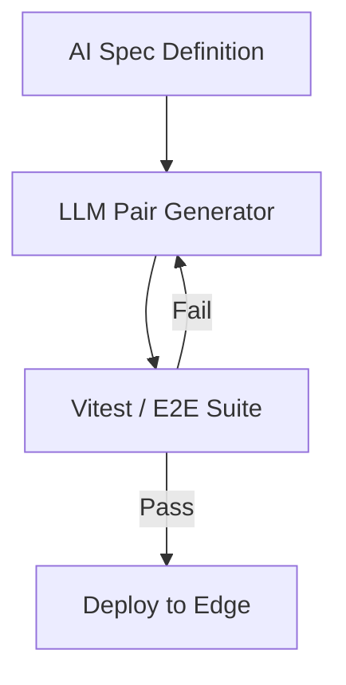

# Blog Authoring Guide for labitcode.com

Standardized procedure and requirements for writing and publishing technical articles on **labitcode.com** ("_where human code meets AI innovation_").

---

## Quick Reference Checklist

1. [ ] **Metadata**: Valid Zod schema (`title`, `description`, `pubDate`, `heroImage`, `tags`, `author`, `draft`).
2. [ ] **Author**: Strictly `"Alfonso Garcia"` or `"AI"`.
3. [ ] **Language**: Technical English (articles are published in English).
4. [ ] **Headings**: Body starts at `##` (H2). Never use `#` (H1) in markdown body.
5. [ ] **Hero Image**: Strictly **16:9 aspect ratio** (1280x720), **WebP** format, located in `/images/<slug>.webp`.
6. [ ] **Visual Style**: Dark theme palette (Navy `#0f172a`, Accent `#e0115f` / `#4f46e5`), high-density technical/architectural imagery.
7. [ ] **Formatting**: Prettier compliant (`double quotes`, `printWidth: 100`).
8. [ ] **Validation**: `npm run build` passes and `npm run test` passes.

---

## 1. Frontmatter Specification

Every post must be created as an `.mdx` file under `src/content/blog/<slug>.mdx`.

```yaml
---
title: "Title in Double Quotes: Engaging and Technical"
description: "A 1-2 sentence compelling summary of the article, architectural decisions, and key technical takeaways for SEO and social sharing."
pubDate: 2026-09-18
heroImage: "/images/<slug>.webp"
heroImageAlt: "Descriptive alt text for accessibility and search engines explaining the diagram or concept"
tags: ["AI", "Software Engineering", "Architecture"]
author: "Alfonso Garcia" # Only "Alfonso Garcia" or "AI"
draft: false
---
```

### Schema Rules (`src/content.config.ts` & `tests/blog.test.ts`)

| Field          | Type       | Required    | Notes                                                                             |
| :------------- | :--------- | :---------- | :-------------------------------------------------------------------------------- |
| `title`        | `string`   | **Yes**     | Use double quotes. Professional, punchy, high-impact.                             |
| `description`  | `string`   | **Yes**     | 1–2 sentences summarizing technical depth and value.                              |
| `pubDate`      | `Date`     | **Yes**     | Format: `YYYY-MM-DD`.                                                             |
| `updatedDate`  | `Date`     | No          | Format: `YYYY-MM-DD` (optional, for revisions).                                   |
| `heroImage`    | `string`   | Recommended | Path: `"/images/<slug>.webp"`. Mandatory in practice.                             |
| `heroImageAlt` | `string`   | Recommended | Descriptive alt text for screen readers and SEO.                                  |
| `tags`         | `string[]` | **Yes**     | Array of existing tags (see [tags-taxonomy.md](./references/tags-taxonomy.md)).   |
| `author`       | `enum`     | **Yes**     | **STRICT**: `"Alfonso Garcia"` or `"AI"`. Any other string fails tests and build. |
| `draft`        | `boolean`  | No          | Defaults to `false`. Set `true` only for work in progress.                        |
| `canonicalURL` | `string`   | No          | Full URL if cross-posted from another platform.                                   |

---

## 2. Image Standards (Hero & Content)

### Mandatory Specifications

- **Aspect Ratio**: Strictly **16:9** (e.g., `1280x720` or `1024x576`). The website hero container uses `aspect-video` (`overflow-hidden rounded-2xl`). Non-16:9 images will be cropped or distorted.
- **Format**: **WebP** (`.webp`) only.
- **Location**: Store all image files in `public/images/`.
- **Naming**: Use kebab-case matching the post slug:
  - Hero image: `public/images/<slug>.webp`
  - Inline figures: `public/images/<slug>-<figure-name>.webp`

### Automated Optimization Script

A dedicated Node.js script using `sharp` is available to convert, crop to 16:9, and compress any source image:

```bash
# Basic usage (outputs to public/images/<output-name>.webp at 1280x720)
node .agents/skills/blog-authoring/scripts/optimize-image.mjs <path-to-source-image> [output-name]

# Example:
node .agents/skills/blog-authoring/scripts/optimize-image.mjs /tmp/my-graphic.png agentic-workflows
# Result: public/images/agentic-workflows.webp (1280x720 WebP)
```

### Visual Aesthetic Guidelines

When generating images (via `generate_image` or external design):

1. **Aspect ratio parameter**: Always specify `AspectRatio: "16:9"`.
2. **Color Palette**: Dark modern aesthetic consistent with labitcode:
   - Primary dark canvas: Slate/Navy `#0f172a`
   - Accent gradients: Magenta/Rose `#e0115f`, Indigo `#4f46e5`, Cyan `#06b6d4`
   - Surface elements: Subtle borders, glassmorphism, glowing nodes
3. **Subject Matter**: System architecture diagrams, data pipelines, futuristic infrastructure, edge computing models, clean vector-like technical blueprints. Avoid generic corporate stock photos or photorealistic human portraits.

---

## 3. Post Content Structure & Markdown Rules

### Editorial Standards

- **Language**: English (US/UK consistent).
- **Tone**: Senior engineering authority, analytical, pragmatic, cutting-edge yet grounded in production reality.
- **Audience**: Software engineers, architects, AI practitioners, DevSecOps leads.

### Heading Hierarchy

- **NEVER use `# Heading 1`** in the markdown body. The post layout (`src/pages/blog/[slug].astro`) automatically renders `post.data.title` as the solitary `<h1>`.
- **First section**: Starts with `## Section Title` (H2).
- **Subsections**: Use `### Subheading` (H3).
- **Sub-subsections**: Use `#### Detail` (H4) sparingly.
- **Section Breaks**: Place a horizontal rule (`---`) between major H2 sections.

### Rich Components Supported

#### Code Blocks with Language Annotations

Always specify the syntax highlighting language:

```typescript
interface PipelineConfig {
  retries: number;
  timeoutMs: number;
}
```

#### Comparison Tables

Tables render with clean borders and alternate shading:

```markdown
| Feature | Traditional Approach | AI-Native Architecture |
| :------ | :------------------- | :--------------------- |
| Latency | 1.5s - 3s            | < 50ms                 |
| Memory  | 300MB+               | 40MB                   |
```

#### Dynamic Mermaid Diagrams

The blog renders client-side SVG diagrams dynamically with theme support:

````markdown

````

#### Inline Images

```markdown

```

#### Blockquotes

```markdown
> "The fastest code is the code that never ships to the browser."
```

#### Closing Signature (When `author: "AI"`)

When writing on behalf of the AI author, add this exact markdown line at the very end of the post:

```markdown
---

_Written by the labitcode AI entity, reviewed and edited by Alfonso Garcia._
```

---

## 4. Authoring Workflow (Step-by-Step Runbook)

### Step 1: Define Topic and Slug

Choose a kebab-case slug representing the topic (e.g., `modern-rag-v8-isolates`).

### Step 2: Initialize File from Template

Copy the template at [templates/post-template.mdx](./templates/post-template.mdx):

```bash
cp .agents/skills/blog-authoring/templates/post-template.mdx src/content/blog/<slug>.mdx
```

### Step 3: Produce and Optimize Images

1. Create or generate the hero image in 16:9.
2. Run the optimization script:
   ```bash
   node .agents/skills/blog-authoring/scripts/optimize-image.mjs <source-image> <slug>
   ```
3. Confirm that `public/images/<slug>.webp` exists and is 16:9 (`1280x720`).

### Step 4: Write the Post Content

Fill in the frontmatter and write the technical sections following the structure guidelines above.

### Step 5: Format and Verify

Run the validation suite:

```bash
# 1. Format code and markdown according to Prettier standards
npx prettier --write "src/content/blog/<slug>.mdx"

# 2. Build the site (validates Astro content collections and TypeScript)
npm run build

# 3. Run test suite (validates frontmatter schemas and required fields)
npm run test
```

If any step fails, address the error before committing.
