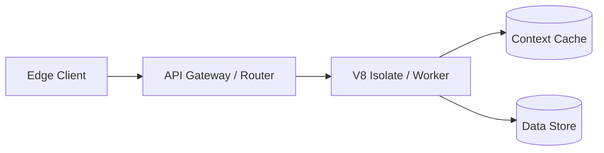

## Introduction & The Core Problem

Set the context immediately. Explain why this topic matters, the current industry challenge, and why conventional approaches fall short. Ground the discussion in real-world engineering constraints.

---

## Architectural Breakdown / Deep Dive

Dive deep into the mechanics. Provide concrete technical details, trade-offs, and architectural comparisons.

### Key Technical Patterns

Highlight the patterns, tools, or configurations involved:

```typescript
// Production-ready TypeScript snippet illustrating the core pattern
export interface ServiceResponse<T> {
  data: T;
  latencyMs: number;
  cached: boolean;
}

export async function executeOperation<T>(input: string): Promise<ServiceResponse<T>> {
  const start = performance.now();
  // Implementation logic here
  return {
    data: {} as T,
    latencyMs: performance.now() - start,
    cached: false,
  };
}
```

---

## Workflow or Data Flow

Use a Mermaid diagram or ASCII flowchart to illustrate the system topology:



---

## Performance & Benchmark Comparison

Compare alternatives using a clean Markdown table:

| Metric            | Traditional Method | Modern Solution | Improvement       |
| :---------------- | :----------------- | :-------------- | :---------------- |
| **P99 Latency**   | 1,450 ms           | 82 ms           | **17.6x faster**  |
| **RAM Footprint** | 450 MB             | 32 MB           | **93% reduction** |
| **Cold Start**    | 2.1 s              | 8 ms            | **260x faster**   |

---

## Key Takeaways & Lessons Learned

Summarize the practical insights engineers can implement immediately:

1. **Principle 1**: Clear lesson or takeaway with rationale.
2. **Principle 2**: Pragmatic trade-off to keep in mind.
3. **Principle 3**: Verification or testing strategy.

---

<!-- If author is "AI", uncomment the following attribution line:
_Written by the labitcode AI entity, reviewed and edited by Alfonso Garcia._
-->
