For decades, the primary constraint of software development was engineering execution. Building a prototype required weeks of coding, setting up databases, designing interfaces, and writing boilerplate. If a feature was poorly conceived, the cost of that mistake was measured in months of wasted developer hours.

Today, AI-agent coding tools like Claude Code have fundamentally flipped this equation.

At the _Code with Claude_ conference, **Dan Carey**, a Product Manager at **Anthropic Labs**, shared a profound talk: _"Designing with Claude: From prompt to production"_ ([watch on YouTube](https://www.youtube.com/watch?v=Uvl-tRga98g)). His core thesis is simple yet disruptive: **the engineering bottleneck is gone. The new bottleneck is deciding what to build.**

In this guide, we break down the AI-native product development playbooks shared in the presentation, examining how small teams can build production-grade features in weeks by replacing legacy processes with rapid prototyping.

---

## 1. The Shifting Bottleneck

In traditional product development, teams spend weeks writing detailed **Product Requirement Documents (PRDs)**, aligning stakeholder interests in meetings, and drawing high-fidelity designs. The goal of this extensive preparation was to avoid making mistakes during the most expensive phase of the project: engineering execution.

```mermaid
graph TD
    subgraph Traditional Workflow
        A[Vague Idea] --> B[Write Heavy PRD]
        B --> C[Design Mockups]
        C --> D[Long Alignment Meetings]
        D --> E[Months of Coding]
        E --> F[Deploy to Users]
    end

    subgraph AI-Native Workflow
        G[Vague Idea] --> H[Transcribe Discussion]
        H --> I[Prompt Prototype]
        I --> J[User Feedback]
        J --> K[Code Generation & Ship]
        K --> L[Continuous Iteration]
    end
```



By leveraging Claude, the cost of writing code drops to near zero. A developer can spin up a fully functional UI or write a complex backend route in minutes. Because code is cheap:

- **Mockups are obsolete:** Why design static wireframes when you can build a live, interactive prototype in the same amount of time?
- **PRDs are useless:** Detailed specification sheets are often misinterpreted by developers. A live prototype is the ultimate spec—it removes ambiguity because stakeholders can actually click it.
- **The constraint is now discovery:** The challenge is no longer _how_ to build, but _what_ is actually worth building to solve real user problems.

---

## 2. Case Study: Shipping "Claude Design" in 10 Weeks

To illustrate this new reality, Dan Carey shared how a tiny **three-person team** at Anthropic Labs designed, built, and shipped **Claude Design** (a feature that lets users generate visual prototypes and designs via natural language) in just **ten weeks**.

Instead of following a rigid, linear timeline, the team operated on a hyper-fast loop:

```
Talk to Users ➡️ Prompt Prototype ➡️ Ship to Production ➡️ Gather Data
```

By running **50 to 100 of these iteration loops** over the course of ten weeks, they built a highly polished, user-validated product. They didn't start with a massive master plan; they let user feedback and data drive the evolution of the software on a daily basis.

---

## 3. The "Bet Factory" Mindset

Anthropic Labs acts as a small "Bet Factory" within the larger organization. They treat every product and feature as an experimental bet. Key tenets of this mindset include:

### Rapid Loop Cycles

If a loop cycle takes two weeks, a team can only run 26 iterations a year. If a loop cycle takes 24 hours, the team runs 365 iterations. The team that iterates faster wins, regardless of initial direction.

### Detachment from Features

When code is fast to generate, it is also cheap to throw away. The team at Anthropic Labs regularly scraps features—even ones power users like—if metrics indicate they don't solve the core problem for the broader audience. There is no emotional attachment to code.

### Focusing on "Hint of Magic"

When building prototypes, do not wait for the model to be perfect. The Labs team targets the **"hint of magic"**—building user flows that _almost_ work flawlessly today, betting that the next generation of Claude models will naturally close the remaining logic and reliability gaps.

---

## 4. Playbooks to Kill Legacy Processes

If your team is still operating with spreadsheets, JIRA queues, and heavy alignment processes, Carey recommends three immediate changes:

### A. "Design by Talking" (No more PRDs)

Instead of writing a 10-page specification document:

1.  Sit down with a colleague and discuss the problem and potential solutions out loud.
2.  Record the conversation and transcribe it.
3.  Feed the raw transcript to Claude with a prompt like:

    ```xml
    <context>
    You are a principal engineer. We just discussed a product idea. Here is the raw transcript:
    <transcript>
    [Insert transcript here]
    </transcript>
    </context>

    <instructions>
    Based on our discussion, generate a functional React/Astro prototype representing the main interactive flow. Prioritize clean structure and basic layouts.
    </instructions>
    ```

### B. Build "Afternoon Tools"

If your team is complaining about a manual task or a missing utility, don't put it on the roadmap for next quarter. Task a single developer to build a functional internal tool with Claude in a single afternoon. If it works, keep it. If it doesn't, throw it away. The cost of trying is negligible.

### C. The 24-Hour Turnaround Challenge

To identify where your organizational processes are slow:

1.  Take a real user request or bug report.
2.  Commit to delivering a functional, viewable version to that user within **24 hours**.
3.  Document where the delay happens. Is it code review? CI/CD pipelines? Security sign-offs?
    This challenge highlights the real friction points in your deployment pipeline rather than your coding speed.

---

## Summary of the AI-Native Era

The lesson from Anthropic Labs is clear: **in the AI era, speed is the ultimate product strategy**.

By shifting focus from writing code to rapid prototyping, product managers, designers, and engineers can collaborate as "full-stack builders," transforming ambiguous ideas into concrete, testable code in hours rather than months.

### Actionable Next Steps

- [ ] Record your next product discussion, transcribe it, and prompt a prototype.
- [ ] Scrap one underperforming feature this week to practice code detachment.
- [ ] Build a small internal tool in one afternoon to automate a repetitive task.
- [ ] Run a 24-hour turnaround challenge to locate deployment pipeline friction.

---

_Built with technical precision and artificial intelligence at labitcode._
