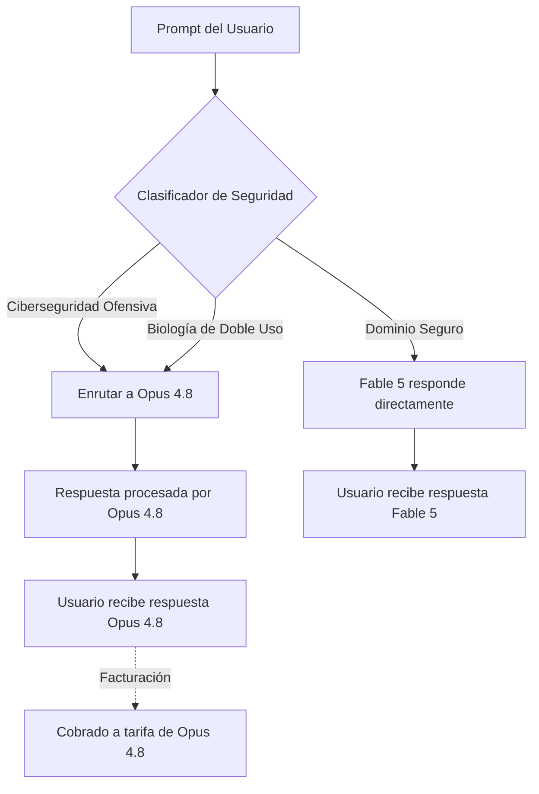

El 9 de junio de 2026, Anthropic cruzó un umbral que muchos en la industria creían postergado al menos un año más: liberaron un **modelo de clase Mythos para el público general**. Se llama **Claude Fable 5** y representa el modelo de inteligencia artificial más potente puesto a disposición masiva hasta la fecha.

No se trata de una actualización incremental. Es un compromiso de ingeniería meticuloso entre capacidad bruta y seguridad pública: una versión del sistema confidencial Mythos envuelta en una nueva categoría de salvaguardas arquitectónicas.

En este análisis desgranamos todo lo que ingenieros de software y profesionales de la IA deben conocer sobre Fable 5: benchmarks, arquitectura, precios, mecanismos de seguridad y su impacto en el desarrollo de software agéntico.

---

## ¿Qué es un Modelo de "Clase Mythos"?

Para comprender Fable 5, conviene revisar la jerarquía de modelos que Anthropic ha estructurado:

| Nivel      | Modelos                  | Descripción                                             |
| :--------- | :----------------------- | :------------------------------------------------------ |
| **Haiku**  | Haiku 4.5                | Rápido, ligero y ultraeconómico                         |
| **Sonnet** | Sonnet 4.6               | Relación equilibrada calidad/precio                     |
| **Opus**   | Opus 4.7 / 4.8           | Máxima capacidad general, programación agéntica         |
| **Mythos** | Mythos Preview, Mythos 5 | Frontera extrema de razonamiento, solo bajo invitación  |
| **Fable**  | **Fable 5**              | Capacidad Mythos, disponibilidad pública con contención |

La categoría Mythos emergió en abril de 2026 cuando Anthropic reveló que su sistema interno más avanzado —por entonces reservado a socios selectos de investigación— había descubierto de forma autónoma **miles de vulnerabilidades de día cero (zero-day)**, incluidos fallos críticos en OpenBSD que habían pasado inadvertidos durante 27 años.

Fable 5 responde a una cuestión ineludible: _"Si Mythos es tan demoledor, ¿cómo se publica con seguridad?"_

---

## Ficha Técnica Resumida

```yaml
ID del Modelo: claude-fable-5
Ventana de Contexto: 1.000.000 de tokens (1M)
Razonamiento Extendido: Hasta 64.000 tokens
Razonamiento Adaptativo: Sí (siempre activo)
Modalidades de Entrada: Texto + Imagen
Salida: Solo texto
API: Messages API (v1/messages)
Proveedores Cloud: AWS Bedrock, Vertex AI, Microsoft Foundry
```

### Ventana de Contexto de 1 Millón de Tokens

Fable 5 puede ingerir cerca de **750.000 palabras** en un único prompt: suficiente para albergar repositorios enteros, cientos de artículos científicos o años de jurisprudencia legal. Para los ingenieros, esto significa alimentar un monorepo completo y pedirle rastrear una anomalía distribuida entre decenas de microservicios en una sola pasada.

### Razonamiento Adaptativo (Siempre Activo)

A diferencia de los modelos Opus, donde se gestiona el presupuesto con `thinking.budget_tokens`, Fable 5 incorpora **Adaptive Thinking**: decide dinámicamente cuánta capacidad de cálculo dedicar a cada petición mediante un parámetro simplificado:

- `low`: Respuestas ágiles, razonamiento básico.
- `medium`: Equilibrado (por defecto para tareas comunes).
- `high`: Razonamiento profundo para código complejo e investigación.
- `xhigh`: Capacidad máxima para problemas extremos.

---

## Benchmarks: El Dominio de Fable 5

Las métricas oficiales publicadas por Anthropic frente a GPT-5.5 demuestran un salto notable:

| Benchmark                                 | Claude Fable 5 | GPT-5.5 | Diferencia |
| :---------------------------------------- | :------------- | :------ | :--------- |
| **SWE-Bench Pro** (programación agéntica) | **80.3%**      | 58.6%   | +21.7%     |
| **GDPval-AA** (trabajo de conocimiento)   | **1.932**      | 1.769   | +163 pts   |
| **Computer Use** (uso de PC)              | **85.0%**      | 78.7%   | +6.3%      |
| **Razonamiento Legal**                    | **Líder**      | —       | —          |
| **Uso de Herramientas (Tool use)**        | **Líder**      | —       | —          |
| **Razonamiento Multidisciplinar**         | **Líder**      | —       | —          |

La brecha de **+21.7% en SWE-Bench Pro** es especialmente reveladora: Fable 5 resuelve issues reales de GitHub de forma autónoma (redactando parches, ejecutando pruebas e iterando ante fallos) con un 80.3% de éxito. Para contextualizar, Opus 4.8 rondaba el 72.5%, lo que sitúa a Fable 5 en un escalón cualitativo superior.

---

## La Arquitectura de Seguridad: El Rasgo Definitorio de Fable 5

Lo verdaderamente revolucionario de Fable 5 es su arquitectura: **es el primer modelo que restringe activamente sus propias capacidades en dominios de alto riesgo mediante enrutamiento transparente.**

Anthropic implementó un clasificador de seguridad en dos fases que analiza cada consulta:



### Los Dos Dominios Restringidos

1. **Ciberseguridad Ofensiva**: Peticiones para explotar vulnerabilidades, generar malware o ejecutar intrusión ofensiva se interceptan. La investigación legítima sigue funcionando, pero es delegada a Opus 4.8.
2. **Biología de Doble Uso**: Consultas sobre síntesis de patógenos o diseño biológico peligroso se reconducen automáticamente.

### Alineación de Incentivos Económicos

Cuando una consulta se desvía a Opus 4.8, **se factura a precio de Opus 4.8, no de Fable 5**. Esto neutraliza el incentivo de Anthropic para generar falsos positivos: pierden ingresos ante cada intervención del filtro. Es un caso infrecuente donde la seguridad técnica y los incentivos de negocio coinciden.

---

## Precios y Planes de Acceso

| Plan                       | Acceso                        | Condiciones                             |
| :------------------------- | :---------------------------- | :-------------------------------------- |
| **Pro** ($20/mes)          | Incluido hasta el 22 de junio | Requerirá créditos desde el 23 de junio |
| **Max** ($100/mes)         | Incluido hasta el 22 de junio | Límites de tasa superiores              |
| **Team** ($25/usuario/mes) | Incluido hasta el 22 de junio | Cuotas compartidas                      |
| **API**                    | Pago por token                | Identificador `claude-fable-5`          |

### Tarifas de API

| Tipo de Token          | Precio (por 1M de tokens) |
| :--------------------- | :------------------------ |
| **Entrada (Input)**    | $10.00                    |
| **Salida (Output)**    | $50.00                    |
| **Escritura en Caché** | $12.50                    |
| **Lectura en Caché**   | $1.00                     |

A $50 por millón de tokens de salida, Fable 5 tiene un coste elevado (aproximadamente **el doble que Opus 4.8** y el triple que Sonnet 4.6). Sin embargo, al reducir drásticamente los bucles de reintento en problemas complejos, el coste neto por tarea resuelta puede resultar inferior.

---

## Comparativa Práctica: ¿Cuándo Usar Fable 5?

- **Fable 5 vs. GPT-5.5**: En tareas de programación pura y ejecución agéntica autónoma, Fable 5 supera con claridad a GPT-5.5.
- **Fable 5 vs. Opus 4.8**: Emplea Fable 5 en flujos multi-agente complejos que requieran autonomía prolongada y razonamiento extremo; mantén Opus 4.8 para tareas donde la latencia o el coste por token sean factores críticos.
- **Fable 5 vs. Sonnet 4.6**: Sonnet 4.6 sigue siendo la elección idónea para el 80% del trabajo diario por su velocidad y bajo precio. Reserva Fable 5 para el 20% de retos donde la calidad de razonamiento determine el éxito o fracaso del proyecto.

---

## Conclusiones para Desarrolladores

1. **Fable 5 es una realidad operativa hoy.** Representa el modelo público más avanzado disponible en el mercado.
2. **El contexto de 1M sumado al razonamiento adaptativo transforma la arquitectura de software.** Permite razonar sobre bases de código completas sin particionar el contexto.
3. **El lanzamiento graduado con contención es el nuevo estándar.** La era de liberar modelos de frontera sin salvaguardas de dominio específico ha quedado atrás.
