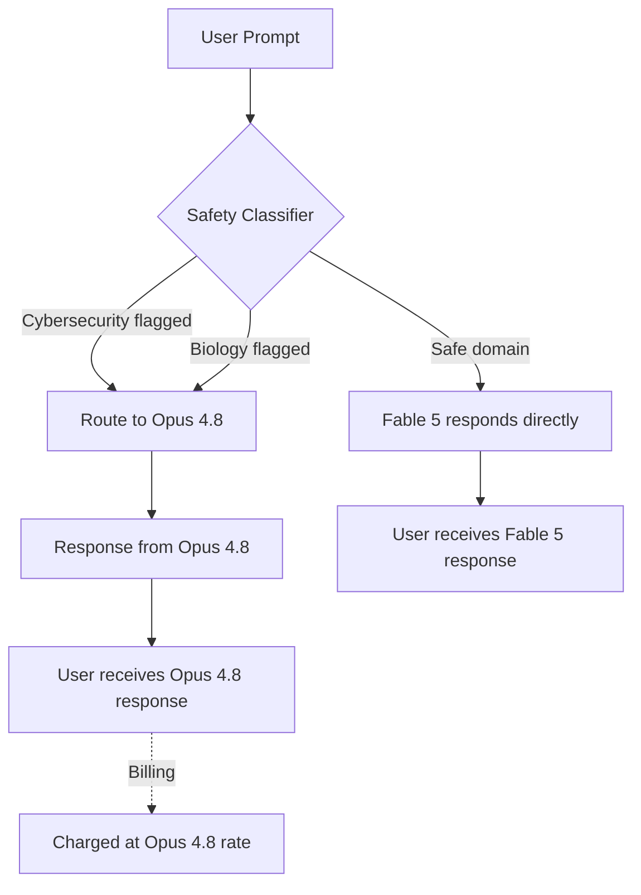

On June 9, 2026, Anthropic crossed a line that many in the AI industry thought wouldn't be crossed for another year: they released a **Mythos-class model to the general public**. It's called **Claude Fable 5**, and it represents the most capable AI model ever made widely available.

This isn't just another incremental model update. It's a carefully engineered compromise between raw capability and public safety — a version of Anthropic's invitation-only Mythos system, wrapped in a new class of safeguards.

In this deep dive, we'll unpack everything developers and AI practitioners need to know about Fable 5: benchmarks, architecture, pricing, safety, and what this means for the future of AI-driven software development.

---

## What Is a "Mythos-Class" Model?

To understand Fable 5, you first need to understand the tier system Anthropic has built over the past three years.

| Tier       | Models                   | Description                               |
| ---------- | ------------------------ | ----------------------------------------- |
| **Haiku**  | Haiku 4.5                | Fast, cost-effective, lightweight         |
| **Sonnet** | Sonnet 4.6               | Balanced price-to-performance             |
| **Opus**   | Opus 4.7 / 4.8           | Most capable general tier, agentic coding |
| **Mythos** | Mythos Preview, Mythos 5 | Frontier intelligence, invitation-only    |
| **Fable**  | **Fable 5**              | Mythos capability, general availability   |

The Mythos tier emerged in April 2026 when Anthropic revealed that its most advanced internal system — then available only to select research partners — had autonomously discovered **thousands of zero-day vulnerabilities**, including bugs in OpenBSD code that had gone unnoticed for 27 years.

Fable 5 is the answer to an obvious question: _"If Mythos is this powerful, how do you release it safely?"_

---

## Technical Specifications at a Glance

```yaml
Model ID: claude-fable-5
Context Window: 1,000,000 tokens (1M)
Extended Thinking: Up to 64,000 tokens
Adaptive Thinking: Yes (always on)
Input Modalities: Text + Image
Output: Text only
API: Messages API (v1/messages)
Cloud Providers: AWS Bedrock, Vertex AI, Microsoft Foundry
```

### 1M Token Context Window

Fable 5 can ingest the equivalent of roughly **750,000 words** in a single prompt — enough to hold entire codebases, hundreds of research papers, or multi-year legal document sets. For software engineers, this means you can feed Fable 5 your entire monorepo and ask it to trace a bug across dozens of microservices in one shot.

### Adaptive Thinking (Always On)

Unlike Opus models where you manually toggle extended thinking on/off with `thinking.budget_tokens`, Fable 5 features **Adaptive Thinking**: the model dynamically decides how much compute to allocate per request. You control it via a simpler `thinking` parameter:

- `low` — Quick responses, minimal reasoning
- `medium` — Balanced (default for most tasks)
- `high` — Deep reasoning for complex coding and research
- `xhigh` — Maximum capability for the hardest problems

Anthropic recommends `high` as the default for most workloads, reserving `xhigh` for the most capability-sensitive scenarios.

---

## Benchmarks: Where Fable 5 Dominates

Anthropic published a comprehensive benchmark table comparing Fable 5 against GPT-5.5, and the numbers are striking.

| Benchmark                          | Claude Fable 5 | GPT-5.5 | Delta    |
| ---------------------------------- | -------------- | ------- | -------- |
| **SWE-Bench Pro** (agentic coding) | **80.3%**      | 58.6%   | +21.7%   |
| **GDPval-AA** (knowledge work)     | **1,932**      | 1,769   | +163 pts |
| **Computer Use**                   | **85.0%**      | 78.7%   | +6.3%    |
| **Legal reasoning**                | **Leader**     | —       | —        |
| **Tool use**                       | **Leader**     | —       | —        |
| **Multidisciplinary reasoning**    | **Leader**     | —       | —        |

The SWE-Bench Pro gap is particularly significant: 80.3% means Fable 5 can autonomously resolve complex GitHub issues — writing patches, running tests, and iterating on failures — better than any previously available model. For context, Opus 4.8 scores ~72.5% on SWE-bench Verified, meaning Fable 5 represents roughly a **10-percentage-point leap** in a benchmark where each point is hard-won.

### What This Means for Developers

```python
# Before Fable 5: Opus 4.8 resolves ~7 out of 10 complex bugs
# With Fable 5: resolves ~8 out of 10

# But the real difference is in the *difficulty tier* —
# Fable 5 tackles bugs that previous models simply couldn't.
```

The model excels not just at isolated coding tasks, but at **multi-agent workflows** — the kind of complex, days-long autonomous engineering runs that Anthropic employees use daily in Claude Code. Fable 5 handles the orchestration, delegation, and failure recovery that previously required human intervention.

---

## The Safety Architecture: Fable 5's Defining Feature

Here's what makes Fable 5 genuinely novel: **it's the first widely-released model that actively restricts its own capabilities in high-risk domains.**

Anthropic built a two-stage safety classifier that monitors every prompt and response:



### The Two Restricted Domains

**1. Cybersecurity:** Prompts related to vulnerability exploitation, malware generation, or offensive security are automatically intercepted. You can still perform legitimate security work — the fallback model (Opus 4.8) handles these requests.

**2. Biology:** Queries involving biological agent design, synthesis pathways, or dual-use research are rerouted.

### The Economic Incentive

Here's a clever design choice: when a prompt is rerouted to Opus 4.8, **you're charged the Opus 4.8 price, not the Fable 5 price**. This eliminates any incentive for Anthropic to over-flag queries — they lose money on every false positive. It's a rare case where safety design and business incentives align.

### Why This Matters

This architecture represents a new paradigm: **graduated capability release**. Instead of withholding the entire model from public access, Anthropic segments the capability surface and gates only the highest-risk domains. If this approach works at scale, it could become the template for releasing increasingly powerful AI systems.

---

## Pricing and Availability

| Plan                   | Access                   | Notes                               |
| ---------------------- | ------------------------ | ----------------------------------- |
| **Pro** ($20/mo)       | Included through June 22 | Requires usage credits from June 23 |
| **Max** ($100/mo)      | Included through June 22 | Higher rate limits                  |
| **Team** ($25/user/mo) | Included through June 22 | Shared rate limits                  |
| **Enterprise**         | Included through June 22 | Custom terms                        |
| **API**                | Pay-per-token            | `claude-fable-5` model ID           |

### API Pricing

| Token Type      | Price (per 1M tokens) |
| --------------- | --------------------- |
| **Input**       | $10.00                |
| **Output**      | $50.00                |
| **Cache write** | $12.50                |
| **Cache read**  | $1.00                 |

At $50/M output tokens, Fable 5 is priced at a premium — roughly **2x Opus 4.8** ($25/M) and **~3.3x Sonnet 4.6** ($15/M). But for tasks where Fable 5's superior reasoning eliminates multiple retry loops, the effective cost per completed task may actually be lower.

### The June 22 Deadline

Fable 5 is **included at no extra cost** on Pro, Max, Team, and seat-based Enterprise plans from June 9 through **June 22, 2026**. On June 23, Anthropic will remove Fable 5 from those plans — after that date, using it requires **usage credits**, though Anthropic plans to restore it as a standard inclusion once inference capacity expands.

For API users, pricing remains at $10/$50 per million tokens regardless of the date.

---

## Fable 5 vs. The Competition

### Fable 5 vs. GPT-5.5

Fable 5 leads on every benchmark Anthropic published, but the real-world differences are nuanced:

- **Coding:** Fable 5's 80.3% SWE-Bench Pro vs. GPT-5.5's 58.6% is the widest gap — if you're building AI coding agents, Fable 5 is the clear choice today.
- **Agentic breadth:** GPT-5.5 has broader tool integrations and a more mature plugin ecosystem.
- **Multimodal:** Both handle images, but GPT-5.5 has native audio generation.

### Fable 5 vs. Opus 4.8

If you're currently using Opus 4.8, should you switch?

**Switch to Fable 5 when:**

- You're running complex multi-step agent workflows
- You need maximum coding accuracy on hard problems
- Your tasks require days-long autonomous execution
- The task is bottlenecked by reasoning quality, not speed

**Stick with Opus 4.8 when:**

- You need deterministic extended thinking (manual toggle)
- Your tasks are latency-sensitive
- You're doing straightforward API calls or RAG pipelines
- Cost is the primary constraint

### Fable 5 vs. Sonnet 4.6

Sonnet 4.6 remains the pragmatic choice for most applications. At roughly 1/3 the output cost, it handles 80% of coding tasks adequately. Reserve Fable 5 for the 20% of tasks where superior reasoning actually changes the outcome.

---

## Practical Guide: Using Fable 5 in Your Workflow

### 1. Setting Up the API

```bash
# Install the Anthropic SDK
pip install anthropic

# Set your API key
export ANTHROPIC_API_KEY="sk-ant-..."

# Basic call
python3 -c "
import anthropic
client = anthropic.Anthropic()
response = client.messages.create(
    model='claude-fable-5',
    max_tokens=4096,
    messages=[{'role': 'user', 'content': 'Explain quantum computing in one paragraph.'}]
)
print(response.content[0].text)
"
```

### 2. Controlling Thinking Depth

```python
# For complex coding tasks, use 'high' thinking
response = client.messages.create(
    model="claude-fable-5",
    max_tokens=8192,
    thinking={"type": "enabled", "effort": "high"},
    messages=[{"role": "user", "content": "..."}]
)
```

### 3. Leveraging the 1M Context Window

```python
# Feed an entire codebase for analysis
import os

files_content = ""
for root, dirs, files in os.walk("./src"):
    for f in files:
        if f.endswith((".py", ".ts", ".js")):
            path = os.path.join(root, f)
            files_content += f"\n--- {path} ---\n"
            files_content += open(path).read()

# This could be 500K+ tokens — Fable 5 handles it
response = client.messages.create(
    model="claude-fable-5",
    max_tokens=4096,
    messages=[{
        "role": "user",
        "content": f"Here is my codebase. Find all security vulnerabilities.\n\n{files_content}"
    }]
)
```

### 4. Understanding the Safety Fallback

When Fable 5 routes a query to Opus 4.8, the API response includes a special header:

```python
response = client.messages.create(...)
# Check if the response was routed to the fallback model
if response.model == "claude-opus-4-8":
    print("⚠️ Query was routed to Opus 4.8 for safety reasons")
    print("You were charged Opus 4.8 rates, not Fable 5 rates")
```

This is transparent and doesn't produce error responses — the user experience is seamless.

---

## What This Release Tells Us About the AI Industry

### 1. The Frontier Is Accelerating

Fable 5's release — just six weeks after Opus 4.8 — signals that Anthropic's model generation cycle is compressing. The gap between internal frontier models (Mythos) and public releases (Fable) is now weeks, not months.

### 2. Safety Is Becoming a Product Feature

The safety classifier architecture isn't just a research paper footnote — it's a core product differentiator. Anthropic is betting that enterprise customers will pay a premium for a model that's both more capable _and_ demonstrably safer than alternatives.

### 3. The Coding Agent Market Is the Battleground

The SWE-Bench numbers make it clear: Anthropic is targeting the developer tools market aggressively. Fable 5's coding superiority — especially in autonomous, multi-step agent workflows — positions Claude Code as the leading AI coding platform. If you're building developer tools, the Claude API is now the default choice for the reasoning layer.

### 4. Graduated Release Is the New Normal

Expect every major AI lab to adopt some version of "powerful model + domain-specific safeguards" as their go-to-market strategy. The era of releasing unrestricted frontier models is likely over.

---

## Key Takeaways for Developers

- **Fable 5 is real, it's available now, and it's the most capable public model ever released.** Start experimenting today — especially if you're on a Pro, Max, Team, or Enterprise plan where it's included at no extra cost through June 22.
- **The 1M context window + adaptive thinking is a game-changer for codebase-level reasoning.** Feed it your entire project and ask architectural questions.
- **The safety architecture is transparent and fair.** You won't accidentally pay Fable 5 prices for Opus 4.8 responses.
- **June 22 is an important date.** On June 23, Fable 5 is removed from subscription plans and requires usage credits. If you want to explore it without burning credits, do it in the next two weeks.
- **This isn't the ceiling.** Mythos Preview remains ahead of Fable 5, and Mythos 5 is invitation-only. The models available 12 months from now will make Fable 5 look ordinary.

---

## What's Next?

Anthropic has hinted that Fable 5's safety architecture is designed to be **portable** — meaning future models (Fable 6? Mythos-lite?) could inherit the same classifier infrastructure, accelerating their path to public release.

For developers, the message is clear: the tools are getting dramatically better, dramatically faster. The bottleneck is no longer what AI can do — it's how quickly we can learn to wield it.

---

_Built with technical precision and artificial intelligence at labitcode. Follow us for more deep dives into the AI tools shaping the future of software engineering._
