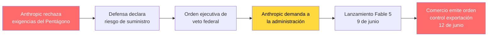

El martes, Anthropic lanzó el modelo de IA más capaz jamás puesto a disposición del público. Para la noche del viernes, el gobierno de Estados Unidos lo había cerrado.

La historia de **Claude Fable 5** —y su abrupta suspensión apenas 72 horas después de su lanzamiento— ya constituye el acontecimiento regulatorio sobre IA más trascendental de 2026. Es un relato sobre técnicas de jailbreak, controles de exportación, tensión geopolítica y una disputa de alto voltaje entre una compañía comprometida con la seguridad y una administración que la catalogó como una amenaza para la seguridad nacional.

Sin embargo, para los desarrolladores representa algo mucho más inmediato: una llamada de atención sobre el **riesgo de dependencia** en una época en la que los modelos frontera pueden apagarse de la noche a la mañana por mandato gubernamental.

---

## 1. La Cronología: 72 Horas del Lanzamiento al Cierre

A continuación se resume exactamente lo sucedido, condensado en los momentos clave:

| Fecha                      | Acontecimiento                                                                                                                                                                                                                                             |
| -------------------------- | ---------------------------------------------------------------------------------------------------------------------------------------------------------------------------------------------------------------------------------------------------------- |
| **Abr 2026**               | Anthropic presenta **Claude Mythos Preview**: un modelo accesible por invitación que descubrió de manera autónoma miles de vulnerabilidades zero-day, incluidos fallos en código de OpenBSD intacto durante 27 años.                                       |
| **1 Jun 2026**             | Anthropic presenta de forma confidencial su **borrador de S-1** ante la SEC, preparando su inminente salida a bolsa (IPO).                                                                                                                                 |
| **9 Jun 2026**             | **Lanzamiento público de Claude Fable 5**: un modelo clase Mythos dotado de clasificadores de seguridad que restringen respuestas en dominios de alto riesgo. Mythos 5 permanece reservado para socios verificados de ciberseguridad en Project Glasswing. |
| **12 Jun 2026, 17:21 ET**  | El Secretario de Comercio **Howard Lutnick** envía una carta al CEO de Anthropic **Dario Amodei**, emitiendo una directiva de control de exportación bajo facultades de seguridad nacional.                                                                |
| **12 Jun 2026, ~21:00 ET** | Anthropic comunica que ha **desactivado Fable 5 y Mythos 5 para todos sus usuarios a nivel mundial** con el fin de garantizar el cumplimiento normativo. El resto de modelos de Claude no se ve afectado.                                                  |
| **13 Jun 2026**            | La noticia estalla a escala global. Anthropic califica la directiva de **"malentendido"** y confirma que trabaja para restablecer el servicio.                                                                                                             |

La celeridad es asombrosa: un modelo pasó de su despliegue público a una suspensión global dictada por el gobierno en **menos de 80 horas**.

---

## 2. ¿Qué Son Fable 5 y Mythos 5? (Breve Repaso)

Si te perdiste nuestro [análisis exhaustivo del lanzamiento de Fable 5](/es/blog/claude-fable-5-es), este es el contexto fundamental:

- **Mythos** es el nivel frontera de Anthropic: modelos con capacidades que la propia compañía describe como merecedoras de una precaución extraordinaria. La Mythos Preview de abril demostró el hallazgo autónomo de vulnerabilidades zero-day a una escala que alarmó tanto a expertos en ciberseguridad como a las autoridades gubernamentales.

- **Fable 5** es una versión de Mythos respaldada por un clasificador de seguridad en dos fases. Cuando un usuario consulta sobre ciberseguridad ofensiva o biología, el modelo no responde directamente, sino que redirige de forma transparente la consulta a Opus 4.8, con menor capacidad ofensiva. Esta arquitectura fue diseñada expresamente para que la inteligencia de clase Mythos pudiera ser liberada al público con garantías.

- **Mythos 5** es la versión sin restricciones, disponible únicamente para socios verificados a través de **Project Glasswing**, el programa de acceso de confianza en ciberseguridad de Anthropic.

La paradoja es mayúscula: Anthropic desarrolló toda la arquitectura de salvaguardas de Fable 5 para _evitar_ con exactitud el tipo de intervención estatal que acaba de producirse.

---

## 3. La Directiva de Control de Exportaciones: Qué Dice Realmente

Anthropic difundió la noticia a través de una [publicación en X](https://x.com/AnthropicAI/status/2065597531644743999) que superó los **30 millones de visualizaciones**, convirtiéndose en uno de los comunicados de política tecnológica más vistos en la historia de la plataforma:

> "El gobierno de los Estados Unidos, invocando competencias de seguridad nacional, ha emitido una directiva de control de exportación para suspender todo acceso a Fable 5 y Mythos 5 por parte de cualquier ciudadano extranjero, ya sea dentro o fuera de los Estados Unidos, incluyendo a empleados extranjeros de Anthropic. El efecto directo de esta orden es que debemos deshabilitar abruptamente Fable 5 y Mythos 5 para todos nuestros clientes a fin de asegurar el cumplimiento. El acceso a nuestros otros modelos Claude no se ve afectado. Pedimos disculpas por esta interrupción a nuestros usuarios. Creemos que se trata de un malentendido y estamos trabajando para restaurar el acceso lo antes posible."

Examinemos detenidamente el alcance de la orden. Afecta a:

- **Ciudadanos extranjeros fuera de EE. UU.** (previsible en un control de exportaciones).
- **Ciudadanos extranjeros dentro de EE. UU.** (sin precedentes en el ámbito del software).
- **Empleados extranjeros de la propia Anthropic** (lo que significa que los propios ingenieros de la compañía no pueden acceder a los modelos que ayudaron a programar).

Ante semejante perímetro, la empresa se vio forzada: para acatar la orden de forma inmediata, tuvo que apagar los modelos para _todos los usuarios_.

### Lo Que _No_ Contiene la Directiva

Tan revelador como lo expresado es lo que la directiva **omite**:

- **Ningún detalle técnico específico** sobre la supuesta amenaza a la seguridad nacional.
- **Ninguna prueba pública** de daños o amenazas inminentes.
- **Ningún proceso formal previo**: sin audiencias, sin periodo de consulta y sin plazo de apelación.
- **Ninguna especificación técnica** de qué constituye exactamente una vulneración.

La respuesta de Anthropic fue diplomática pero firme: "Como hemos manifestado públicamente, defendemos que el gobierno cuente con mecanismos para frenar despliegues inseguros dentro de un marco estatutario transparente, justo, claro y fundamentado en hechos técnicos. **Esta medida no respeta dichos principios.**"

---

## 4. La Controversia del Jailbreak: Qué Preocupa Realmente al Gobierno

Anthropic señala que el gobierno actuó tras tener constancia de una técnica de **jailbreak**: un método para eludir los clasificadores de seguridad de Fable 5 y acceder a las capacidades nativas de Mythos.

### La Valoración de Anthropic sobre el Jailbreak

La compañía evaluó dicha técnica y compartió sus conclusiones:

> "Hemos revisado una demostración de esta técnica concreta utilizada para identificar un número reducido de vulnerabilidades menores y previamente conocidas. Todas ellas resultan relativamente sencillas, y hemos comprobado que otros modelos disponibles públicamente son capaces de detectarlas también sin necesidad de evadir filtros."

En definitiva, los tres argumentos de Anthropic son:

1. **El jailbreak es acotado, no generalizado.** No inutiliza todas las defensas de Fable 5, sino que expone capacidades limitadas en un contexto muy específico.
2. **Las vulnerabilidades identificadas ya eran conocidas.** No se trata de fallos zero-day descubiertos por el modelo; son bugs menores detectables por analizadores automáticos habituales.
3. **Otros modelos hacen lo mismo.** Modelos disponibles comercialmente como GPT-5.5 identifican vulnerabilidades idénticas sin requerir ningún tipo de bypass.

### El Fondo de la Disputa

La postura de Anthropic radica en que un jailbreak puntual y no generalizable no debería justificar la retirada forzosa de un modelo productivo utilizado por millones de usuarios:

> "Si este criterio se impusiera en todo el sector, paralizaría prácticamente el despliegue de cualquier nuevo modelo para todos los proveedores de modelos frontera."

Aquí reside el núcleo del dilema regulatorio: **¿qué umbral de riesgo justifica la intervención ejecutiva del Estado?** Mientras Anthropic reclama un listón elevado, transparente y sustentado en evidencias técnicas, la administración lo ha fijado en un nivel drásticamente inferior, y sin ofrecer explicaciones públicas.

---

## 5. El Panorama General: Anthropic frente a la Administración Trump

El bloqueo de Fable 5 no surge de forma aislada. Representa la escalada más severa de un enfrentamiento que se extiende durante meses entre Anthropic y la administración Trump.

### La Disputa por los Contratos del Pentágono (Febrero 2026)

En febrero, el Departamento de Defensa exigió a Anthropic retirar los filtros de seguridad de Claude para conceder al ejército un **acceso irrestricto**, extensible a "cualquier propósito legal". Anthropic se negó, señalando expresamente dos líneas rojas:

- **Sistemas de armamento autónomo** capaces de abatir objetivos sin intervención humana.
- **Vigilancia masiva de la población civil en territorio nacional**.

Dario Amodei, CEO de la firma, declaró: "Emplear IA en armamento autónomo y vigilancia masiva supera con creces lo que la tecnología actual puede ejecutar de forma fiable y segura."

### La Calificación de "Riesgo para la Cadena de Suministro" (Marzo 2026)

En respuesta, el Secretario de Defensa Pete Hegseth catalogó a Anthropic como un **"riesgo para la cadena de suministro"**, una etiqueta habitualmente aplicada a adversarios extranjeros como Huawei. La administración ordenó a todas las agencias federales cesar el uso de la tecnología de Anthropic y prohibió a los contratistas de defensa incorporar Claude en proyectos gubernamentales.

Anthropic demandó a la administración estadounidense, abriendo un litigio que continúa en los tribunales.

### El Patrón de Escalada

El cierre de Fable 5 se encuadra en una secuencia diáfana:



La cuestión de fondo es evidente: ¿estamos ante una medida legítima de seguridad nacional o ante un ejercicio de **lawfare** para penalizar a una corporación por discrepancias políticas?

---

## 6. Qué Implica Este Suceso para los Desarrolladores

Al margen del trasfondo político, este episodio conlleva repercusiones muy directas para cualquier equipo de ingeniería que construya sobre IA.

### El Riesgo de Disponibilidad del Modelo es Real

Cualquier agente de IA, flujo de trabajo de programación o servicio productivo edificado exclusivamente sobre Fable 5 dejó de operar la noche del viernes. No por un fallo de infraestructura ni por un despliegue defectuoso, sino por una carta gubernamental.

Esto introduce una categoría de riesgo desatendida por la mayoría de ingenieros: el **riesgo de disponibilidad regulatoria del modelo**. Se diferencia del downtime convencional en que:

- Ningún SLA lo cubre.
- La conmutación a otra región en la nube no lo soluciona.
- El propio proveedor carece de control sobre los plazos de resolución.

### La Arquitectura Multimodelo Deja de Ser Opcional

La lección inmediata es que todo sistema en producción supeditado a un único modelo frontera debe implementar una **estrategia de fallback sólida**:

```yaml
# Antes del 12 de junio: arquitectura ingenua dependiente de un único modelo
primary_model: claude-fable-5
# Si Fable 5 cae → el servicio queda totalmente inoperativo

# Después del 12 de junio: arquitectura multimodelo resiliente
primary_model: claude-fable-5
fallback_chain:
  - claude-opus-4-8      # Mismo proveedor, menor capacidad pero garantizado
  - gpt-5.5              # Proveedor alternativo, distinta jurisdicción
  - claude-sonnet-4-6    # Respaldo eficiente para tareas no críticas
```

### Las Cláusulas Contractuales Adquieren Máxima Relevancia

Los equipos técnicos y legales al contratar servicios de IA deben incorporar cláusulas relativas a:

- **Controles de exportación**: ¿Qué contingencias aplican ante restricciones gubernamentales?
- **Exposición jurisdiccional**: ¿Dónde residen los usuarios respecto a los derechos de acceso al modelo?
- **Garantías de continuidad**: ¿A qué se compromete el proveedor durante disputas regulatorias?
- **Periodos de preaviso**: ¿Con cuánta antelación se alerta a los clientes ante una suspensión?

### La Vulnerabilidad en los Agentes Autónomos

El impacto es crítico en los **agentes de IA autónomos** que se ejecutan durante horas o días. Un agente interrumpido a mitad de tarea no suele fallar con elegancia: deja estados inconsistentes, transacciones a medias y datos potencialmente corruptos.

---

## 7. Precedentes Históricos: Los Controles de Exportación de Software

El desenlace de Fable 5 guarda un paralelismo histórico ineludible.

### Las Guerras Criptográficas (Crypto Wars) de los Años 90

En los años noventa, el gobierno estadounidense catalogó los algoritmos criptográficos robustos como **material bélico** (munitions) bajo las leyes de control de exportaciones:

- El software criptográfico no podía distribuirse fuera de EE. UU.
- Los desarrolladores se vieron obligados a crear versiones debilitadas de "grado de exportación".
- Los ciudadanos extranjeros en empresas norteamericanas tenían vetado el acceso al código criptográfico.

Aquellas regulaciones fracasaron rotundamente. Internet convirtió la distribución de software en un fenómeno sin fronteras, perjudicando a las tecnológicas estadounidenses mientras florecían competidores internacionales. Para el año 2000, esas restricciones se habían desmantelado prácticamente por completo.

### ¿Modelos de IA Considerados Material Bélico?

La orden contra Fable 5 reactiva los ecos de las crypto wars. El Departamento de Comercio está tratando los pesos de un modelo —básicamente una matriz masiva de números en coma flotante— como un producto bajo control armamentístico. Esto suscita interrogantes de calado:

- **¿Es viable controlar la difusión de un archivo digital?** Los precedentes históricos demuestran que no.
- **¿Provocará esto una fuga de talento e investigación al exterior?** Si ingenieros extranjeros no pueden investigar en modelos frontera dentro de EE. UU., se desplazarán a otras latitudes.
- **¿Debilita la competitividad de las tecnológicas locales?** Mientras EE. UU. restringe a sus propios laboratorios, empresas en China y Europa operan sin trabas similares.

### La Diferencia en Esta Época

En los años 90, los algoritmos de cifrado podían compilarse en unos pocos miles de líneas de código. Los modelos de frontera en IA demandan:

- Infraestructuras de cómputo valoradas en miles de millones de dólares.
- Clústeres de GPUs de última generación (H100, B200).
- Datasets masivos y limpios.
- Centenares de investigadores de primer nivel.

Esta tremenda concentración física de recursos podría facilitar una vigilancia estatal más estrecha que en los 90, o simplemente infligir un castigo severo a unas pocas corporaciones estadounidenses mientras el resto del mundo recorta distancias.

---

## 8. Qué Sucederá a Continuación: Tres Posibles Escenarios

### Escenario A: Resolución Acelerada (Días)

La explicación de un "malentendido" esgrimida por Anthropic resulta creíble. La administración revisa la técnica de jailbreak, constata que no supone un riesgo extraordinario y retira o modula la directiva. Fable 5 vuelve a estar disponible bajo auditorías adicionales.

**Probabilidad:** Media. La inmediatez de la orden sugiere una motivación política antes que técnica, pero la respuesta unánime del ecosistema tecnológico podría forzar una marcha atrás.

### Escenario B: Acuerdo Negociado (Semanas)

La directiva se utiliza como elemento de presión en el conflicto entre Anthropic y la administración Trump. El acceso se restablece a cambio de concesiones: mayor supervisión gubernamental, protocolos de seguridad modificados o la resolución del conflicto con el Pentágono.

**Probabilidad:** Alta. La administración dispone de diversas palancas sobre la compañía, y este movimiento encaja como un mecanismo de presión para forzar una negociación ventajosa.

### Escenario C: Restricción Permanente (Meses+)

El control de exportación se mantiene, fijando el precedente de que los modelos de frontera requieren aprobación federal previa a su despliegue comercial:

- **Régimen de licencias obligatorias** para modelos frontera.
- **Impacto generalizado** para todos los laboratorios de IA del país.
- **Fuga de investigación** hacia jurisdicciones con marcos más flexibles.
- **Freno a la inversión en capital riesgo** en desarrolladoras de modelos punteros en EE. UU.

**Probabilidad:** Baja, pero no descartable. Aunque las crypto wars demostraron la ineficacia de restringir software, los costes colosales de computación de la IA podrían alargar este marco regulatorio.

---

## 9. Consecuencias Estructurales para la Industria de la IA

### El Fin de "Moverse Rápido y Publicar Modelos"

Sea cual sea el desenlace, el 12 de junio de 2026 marca un punto de inflexión. Los modelos frontera han pasado a considerarse formalmente **tecnologías de doble uso** bajo supervisión de seguridad nacional. Todos los agentes del ecosistema deberán adaptarse:

- **Revisiones gubernamentales previas al lanzamiento** se convertirán en la norma tácita.
- **Controles de acceso territorial y verificación de identidad** se integrarán en las APIs.
- **La arquitectura de seguridad** pasará de ser una buena práctica voluntaria a un requisito legal vinculante.
- **Los informes de vulnerabilidades y jailbreaks** transitarán de entradas de blog a documentación pericial ante los tribunales.

### El Dilema del Código Abierto (Open Weights)

Este cierre proyecta incertidumbre sobre los modelos open-weights. Si el estado puede suspender una API propietaria, ¿qué sucederá cuando se libere libremente un modelo equivalente? La normativa de exportaciones fue concebida para mercancías tangibles; pierde eficacia al aplicarse a archivos de pesos descargables vía torrent o Hugging Face.

### El Impacto en la Salida a Bolsa de Anthropic

Anthropic había remitido su documentación confidencial de IPO el 1 de junio, once días antes del apagado. El golpe para los inversores es evidente, debiendo ponderar ahora:

- **Riesgo regulatorio** ante un ejecutivo proclive a usar órdenes de exportación contra la compañía.
- **Concentración de ingresos** en modelos susceptibles de cancelarse por orden administrativa.
- **Sobrecoste en litigios** derivado de las demandas activas frente al estado.

---

## 10. Pasos a Seguir por los Desarrolladores Hoy Mismo

Este escenario exige acciones operativas inmediatas:

### De Inmediato (Esta Semana)

1. **Audita tus dependencias de modelos**: Si algún flujo productivo depende exclusivamente de Fable 5, incorpora de inmediato un mecanismo de fallback hacia Opus 4.8 o un proveedor alternativo.
2. **Revisa la localización de tus usuarios**: Si operas a nivel internacional, ten en cuenta que los controles de exportación pueden limitar el acceso a ciertos modelos, incluso con servidores en EE. UU.
3. **Analiza tus contratos con proveedores de IA**: Identifica cláusulas sobre fuerza mayor, contingencias legales y continuidad del servicio.

### A Corto Plazo (Este Mes)

4. **Implementa enrutamiento multimodelo**: Diseña tu capa de IA para que cambiar de modelo o proveedor sea un ajuste de configuración y no un refactor de código.
5. **Añade conciencia jurisdiccional en tu capa API**: Dirige las peticiones según la ubicación geográfica a modelos legalmente autorizados para cada usuario.
6. **Sigue de cerca los acontecimientos normativos**: Suscríbete a los canales de estado de Anthropic y monitoriza las novedades en políticas de exportación de IA.

### A Medio y Largo Plazo (Este Año)

7. **Diversifica tu cartera de proveedores**: Evita vincular la supervivencia de tu producto a una única entidad, especialmente si afronta litigios con la administración.
8. **Impulsa el ecosistema de pesos abiertos**: Adoptar modelos abiertos mitiga la dependencia y ofrece un escudo frente a restricciones regulatorias imprevistas.
9. **Involúcrate en el debate regulatorio**: Las normas que se definen en este momento condicionarán la industria durante la próxima década.

---

## Conclusiones Clave

- **Fable 5 y Mythos 5 fueron desconectados globalmente el 12 de junio de 2026** por orden del Departamento de Comercio de EE. UU. bajo competencias de seguridad nacional, 72 horas después del debut comercial de Fable 5.
- **La justificación oficial alude a una técnica de jailbreak** que Anthropic califica de restringida, no generalizable y comparable a lo que permiten otros modelos públicos del mercado.
- **El conflicto arrastra tensiones previas**, nacidas de la negativa de Anthropic a retirar sus salvaguardas para uso del Pentágono, lo que derivó en su designación como riesgo para la cadena de suministro.
- **El paralelismo con las crypto wars de los 90** sugiere que los vetos a la exportación de software suelen perjudicar a la industria nacional frente a competidores foráneos.
- **La resiliencia operativa es inaplazable**: las arquitecturas multimodelo, la diversificación y la previsión jurisdiccional son requisitos esenciales para cualquier despliegue productivo.
- **Comienza una nueva era regulatoria**: los modelos frontera son ahora formalmente tecnologías de doble uso sujetas a supervisión estatal.

---

_Construido con precisión técnica e inteligencia artificial en labitcode._
