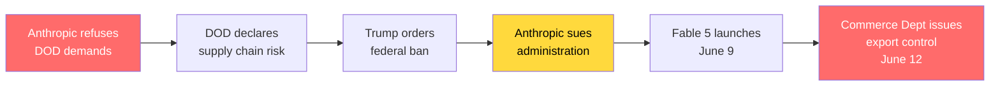

On Tuesday, Anthropic released the most capable AI model ever made publicly available. By Friday night, the US government had shut it down.

The story of **Claude Fable 5** — and its abrupt suspension just 72 hours after launch — is already the most consequential AI policy event of 2026. It's a story about jailbreaks, export controls, geopolitical tension, and a high-stakes feud between a safety-conscious AI company and an administration that labeled it a national security threat.

But for developers, it's also something more immediate: a wake-up call about **dependency risk** in an era where frontier AI models can be turned off by government edict overnight.

---

## 1. The Timeline: 72 Hours from Launch to Shutdown

Here's exactly what happened, condensed into the key moments:

| Date                          | Event                                                                                                                                                                                                               |
| ----------------------------- | ------------------------------------------------------------------------------------------------------------------------------------------------------------------------------------------------------------------- |
| **Apr 2026**                  | Anthropic unveils **Claude Mythos Preview** — an invitation-only model that autonomously discovered thousands of zero-day vulnerabilities, including bugs in OpenBSD code untouched for 27 years.                   |
| **Jun 1, 2026**               | Anthropic confidentially submits its **draft S-1** to the SEC, signaling an imminent IPO.                                                                                                                           |
| **Jun 9, 2026**               | **Claude Fable 5 launches** to the public — a Mythos-class model with safety classifiers that restrict responses in high-risk domains. Mythos 5 remains limited to vetted Project Glasswing cybersecurity partners. |
| **Jun 12, 2026, 5:21 PM ET**  | Commerce Secretary **Howard Lutnick** sends a letter to Anthropic CEO **Dario Amodei**, issuing an export control directive under national security authorities.                                                    |
| **Jun 12, 2026, ~9:00 PM ET** | Anthropic announces it has **disabled Fable 5 and Mythos 5 for all customers worldwide** to ensure compliance. Other Claude models remain unaffected.                                                               |
| **Jun 13, 2026**              | The story breaks globally. Anthropic calls the directive a **"misunderstanding"** and says it's working to restore access.                                                                                          |

The speed is staggering: a model went from public launch to government-mandated global shutdown in **under 80 hours**.

---

## 2. What Are Fable 5 and Mythos 5? (Quick Recap)

If you missed our [deep dive on Fable 5's launch](/blog/claude-fable-5), here's the essential context:

- **Mythos** is Anthropic's frontier tier — models with capabilities that the company itself describes as requiring extraordinary caution. The Mythos Preview in April demonstrated autonomous discovery of zero-day vulnerabilities at a scale that alarmed cybersecurity experts and government officials alike.

- **Fable 5** is a version of Mythos wrapped in a two-stage safety classifier. When a user asks about cybersecurity or biology, the model doesn't answer — it silently routes the query to the less capable Opus 4.8. This architecture was designed precisely to make Mythos-class intelligence safe for public release.

- **Mythos 5** is the unrestricted version, available only to vetted partners through **Project Glasswing**, Anthropic's trusted-access cybersecurity program.

The irony is bitter: Anthropic built Fable 5's entire safety architecture to _prevent_ exactly the kind of government intervention that just happened.

---

## 3. The Export Control Directive: What It Actually Says

Anthropic broke the news via a now-viral [post on X](https://x.com/AnthropicAI/status/2065597531644743999) that has amassed over **30 million views**, making it one of the most-viewed tech policy announcements in the platform's history. The full statement reads:

> "The US government, citing national security authorities, has issued an export control directive to suspend all access to Fable 5 and Mythos 5 by any foreign national, whether inside or outside the United States, including foreign national Anthropic employees. The net effect of this order is that we must abruptly disable Fable 5 and Mythos 5 for all our customers to ensure compliance. Access to our other Claude models is not affected. We apologize for this disruption to our customers. We believe this is a misunderstanding and are working to restore access as soon as possible."

The reach of this single post — 30M+ views in under 12 hours — underscores the seismic nature of the event. This wasn't a quiet regulatory filing; it was a public detonation.

Let that sink in. The order applies to:

- **Foreign nationals outside the US** — predictable for an export control
- **Foreign nationals inside the US** — unprecedented for software
- **Foreign national Anthropic employees** — meaning the company's own engineers can't access the models they built

Given this scope, Anthropic's hand was forced: to comply immediately, it had to disable the models for _everyone_.

### What's _Not_ in the Directive

Equally important is what the directive did **not** include:

- **No specific details** about the national security concern
- **No public evidence** of harm or imminent threat
- **No statutory process** — no hearing, no review period, no appeal window
- **No technical specification** of what constitutes a violation

Anthropic's statement is diplomatic but pointed: "As we have stated publicly, we believe the government should have the ability to block unsafe deployments, as part of a statutory process that is transparent, fair, clear, and grounded in technical facts. **This action does not adhere to those principles.**"

---

## 4. The Jailbreak Controversy: What the Government Is Actually Worried About

Anthropic says its understanding is that the government acted after learning of a **jailbreak technique** — a method to bypass Fable 5's safety classifiers and access the underlying Mythos capabilities.

### Anthropic's Assessment of the Jailbreak

The company reviewed the technique and published its assessment:

> "We reviewed a demonstration of this specific technique being used to identify a small number of previously known, minor vulnerabilities. These vulnerabilities all appear relatively simple, and we have found that other publicly-available models are able to discover them as well without requiring a bypass."

In other words, Anthropic is arguing three things:

1. **The jailbreak is narrow, not universal.** It doesn't defeat all of Fable 5's safeguards — it exposes a limited set of capabilities in a specific context.

2. **The vulnerabilities it finds are already known.** These aren't zero-days being discovered by a jailbroken model; they're minor bugs that security scanners already catch.

3. **Other models do the same thing.** OpenAI's GPT-5.5 and other publicly available models can identify similar vulnerabilities without any bypass at all.

### The Core Disagreement

Anthropic's position is that a narrow, non-universal jailbreak should not be grounds for pulling a commercial model deployed to hundreds of millions of users:

> "If this standard was applied across the industry, we believe it would essentially halt all new model deployments for all frontier model providers."

This is the crux of the policy debate: **what threshold of risk justifies government intervention?** Anthropic argues the bar should be high, transparent, and evidence-based. The government just set it somewhere much lower — and did so without explanation.

---

## 5. The Bigger Picture: Anthropic vs. the Trump Administration

The Fable 5 shutdown didn't happen in a vacuum. It's the latest — and most dramatic — escalation in a months-long conflict between Anthropic and the Trump administration.

### The Pentagon Contract Dispute (February 2026)

In February, the Pentagon demanded that Anthropic remove safety guardrails from Claude and grant the military **unfettered access** — including for "any lawful purpose." Anthropic refused, specifically objecting to two use cases:

- **Autonomous weapons systems** that could kill without human input
- **Mass domestic surveillance**

CEO Dario Amodei's response: "Using AI for autonomous weapons and mass domestic surveillance is simply outside the bounds of what today's technology can safely and reliably do."

### The "Supply Chain Risk" Designation (March 2026)

In retaliation, Defense Secretary Pete Hegseth designated Anthropic a **"supply chain risk"** — a label historically reserved for foreign adversaries like Huawei. Trump ordered all federal agencies to immediately cease using Anthropic's technology. Defense contractors were prohibited from using Claude in government work.

Anthropic sued the Trump administration. The litigation is ongoing.

### The Pattern

The Fable 5 shutdown fits a clear pattern:



The question on everyone's mind: is this an objective national security action, or is it **lawfare** — the use of legal and regulatory tools to punish a company for political reasons?

---

## 6. What This Means for Developers

Beyond the geopolitics, the Fable 5 shutdown has concrete implications for anyone building software with AI.

### Dependency Risk Is Now Real

If you built an AI agent, a coding workflow, or a production service on top of Fable 5, your system broke on Friday night. Not because of a bug or an outage — because of a government letter.

This is a new category of risk that most developers have never had to consider: **model availability risk**. It's different from API downtime because:

- There's no SLA that covers it
- There's no failover to a different region
- The provider itself doesn't control the timeline

### Multi-Model Architecture Is No Longer Optional

The practical takeaway is that any production system depending on a single frontier model needs a **fallback strategy**:

```yaml
# Before June 12: naive single-model architecture
primary_model: claude-fable-5
# If Fable 5 is unavailable → service is down

# After June 12: resilient multi-model architecture
primary_model: claude-fable-5
fallback_chain:
  - claude-opus-4-8      # Same provider, less capable but available
  - gpt-5.5              # Different provider, different jurisdiction
  - claude-sonnet-4-6    # Budget fallback for non-critical tasks
```

### Contract Language Matters

Enterprise developers negotiating AI provider contracts should now consider:

- **Export control clauses**: What happens if the government restricts access?
- **Jurisdictional exposure**: Where are your users located relative to model access rights?
- **Continuity guarantees**: What does the provider commit to maintaining during regulatory actions?
- **Notice periods**: How much warning do you get before a model is disabled?

### The Agent Problem

This is especially acute for **autonomous AI agents** — systems that run independently for hours or days. An agent mid-execution when its model is disabled doesn't just fail gracefully; it leaves dangling state, incomplete transactions, and potentially corrupted outputs.

---

## 7. Historical Context: Software Export Controls

The Fable 5 shutdown has a historical parallel that's instructive.

### The Crypto Wars (1990s)

In the 1990s, the US government classified strong encryption as a **munition** under export control laws. This meant:

- Encryption software couldn't be exported outside the US
- Developers had to publish weakened "export-grade" versions
- Foreign nationals working at US companies were restricted from accessing crypto code

The crypto wars ended in defeat for export controls. The internet made software distribution borderless, and the restrictions primarily hurt US companies while foreign competitors flourished. By 2000, the regulations were largely dismantled.

### AI Models as Munitions?

The Fable 5 directive echoes the crypto wars in an uncomfortable way. The Commerce Department is treating AI model weights — essentially a very large file of floating-point numbers — as a controlled item under export regulations. This raises profound questions:

- **Can you control the distribution of a file?** The crypto wars suggest no.
- **Does this push AI development overseas?** If foreign nationals can't work on frontier models in the US, the talent will go elsewhere.
- **Does this weaken US competitiveness?** While the US restricts its own companies, competitors in China and Europe face no equivalent limitations.

### What's Different This Time

The crypto wars were about encryption algorithms that could be implemented in a few thousand lines of code. Frontier AI models require:

- Billions of dollars in compute infrastructure
- Specialized hardware (H100/B200 GPUs)
- Massive datasets
- Hundreds of expert researchers

This concentration might make export controls _more_ effective than they were in the 90s — or it might just concentrate the damage on a handful of US companies while the rest of the world catches up.

---

## 8. What Happens Next: Three Scenarios

### Scenario A: Rapid Resolution (Days)

Anthropic's "misunderstanding" framing proves accurate. The government reviews the jailbreak evidence, determines it doesn't justify a global shutdown, and rescinds or narrows the directive. Fable 5 access is restored with possibly tighter monitoring or additional safeguards.

**Probability:** Moderate. The speed of the initial action suggests political rather than technical reasoning, but the public backlash — including from AI policy experts across the political spectrum — may force a climbdown.

### Scenario B: Negotiated Settlement (Weeks)

The directive becomes a bargaining chip in the broader Anthropic-Trump standoff. Access is restored in exchange for concessions — perhaps expanded government oversight, modified safety protocols, or a resolution to the Pentagon contract dispute.

**Probability:** High. The Trump administration has multiple levers of pressure on Anthropic, and this may be an escalation designed to force a broader settlement rather than a permanent ban.

### Scenario C: Permanent Restriction (Months+)

The government maintains the export control, establishing a precedent that frontier AI models require government approval before public release. This triggers:

- **A licensing regime** for frontier model deployment
- **Industry-wide impact** as every lab faces similar scrutiny
- **Accelerated offshoring** of AI research to jurisdictions with lighter regulation
- **A chilling effect** on venture investment in US frontier AI companies

**Probability:** Low but non-trivial. The crypto wars precedent suggests software export controls are ultimately unsustainable, but AI models may be treated differently due to their concentrated infrastructure requirements.

---

## 9. The Broader Implications for the AI Industry

### The End of "Move Fast and Release Models"

Whatever the outcome, June 12, 2026 marks the end of an era. Frontier AI models are now explicitly treated as **dual-use technologies** subject to national security controls. Every AI lab — not just Anthropic — will adapt:

- **Pre-release government review** will become standard practice, whether formally required or not
- **Jurisdictional access controls** (geoblocking, citizenship verification) will be built into API infrastructure
- **Safety architecture** will shift from voluntary best practice to regulatory requirement
- **Transparency reporting** on jailbreaks and vulnerabilities will move from blog posts to legal filings

### The Open Source Question

The Fable 5 shutdown also casts a shadow over open-weight models. If the government can shut down a proprietary API, what happens when a similarly capable open model is released? The export control framework was designed for physical goods and licensed software — it breaks down completely when applied to downloadable model weights.

Meta's Llama models, Mistral's releases, and the growing ecosystem of open-weight frontier models exist in a regulatory gray zone that the Fable 5 precedent may force governments to address.

### The IPO Question

Anthropic confidentially filed for an IPO on June 1 — eleven days before the shutdown. The timing is brutal. Investors now have to price in:

- **Regulatory risk** from an administration that has shown willingness to use export controls against the company
- **Revenue concentration** in models that can be disabled by government letter
- **Litigation overhead** from ongoing lawsuits against the federal government

This doesn't just affect Anthropic. Every AI company planning to go public — OpenAI, xAI, and others — will face questions about their regulatory exposure in ways that didn't exist a week ago.

---

## 10. What Developers Should Do Right Now

This isn't just a policy story — it's an operational one. Here are concrete steps for development teams:

### Immediate (This Week)

1. **Audit your model dependencies.** Do any production systems depend exclusively on Fable 5? If so, implement a fallback to Opus 4.8 or another provider immediately.

2. **Check your user base for foreign nationals.** If you serve users outside the US, understand that export controls may affect which models they can access — even if your infrastructure is US-based.

3. **Read your AI provider contracts.** Look for clauses about regulatory action, service continuity, and force majeure. Understand your rights (and their limits).

### Short-Term (This Month)

4. **Implement multi-model routing.** Architect your AI layer so that switching between models — or providers — is a configuration change, not a code change.

5. **Add jurisdictional awareness to your API layer.** Route requests from different user locations to models that are legally available to those users.

6. **Monitor the legal landscape.** This story is moving fast. Subscribe to Anthropic's status page, follow key AI policy reporters, and set up alerts for export control developments.

### Long-Term (This Year)

7. **Diversify your AI provider portfolio.** Don't bet your entire product on a single company's models — especially if that company is in active legal conflict with the government.

8. **Contribute to the open-weight ecosystem.** Having capable open models available reduces dependency on any single provider and provides a hedge against regulatory restrictions.

9. **Engage with AI policy.** The rules being written right now will shape the developer landscape for years. Whether through industry groups, public comments, or direct advocacy, developer voices matter in these debates.

---

## Key Takeaways

- **Fable 5 and Mythos 5 were disabled for all users on June 12, 2026** after the US Commerce Department issued an export control directive under national security authorities — just 72 hours after Fable 5's public launch.

- **The government's concern centers on a jailbreak technique** that Anthropic says is narrow, non-universal, and no more dangerous than capabilities available in other publicly accessible models.

- **This is the latest escalation in a months-long conflict** between Anthropic and the Trump administration, which began when Anthropic refused to remove safety guardrails for Pentagon use and resulted in the company being labeled a "supply chain risk."

- **The historic parallel is the 1990s crypto wars**, where export controls on encryption software ultimately failed and primarily harmed US competitiveness.

- **For developers, the lesson is clear: model availability risk is real.** Multi-model architectures, provider diversification, and jurisdictional awareness are no longer optional — they're operational requirements.

- **The AI industry has entered a new regulatory era.** Frontier models are now dual-use technologies subject to national security controls, and every lab will need to adapt their development, deployment, and transparency practices accordingly.

---

_Built with technical precision and artificial intelligence at labitcode._
