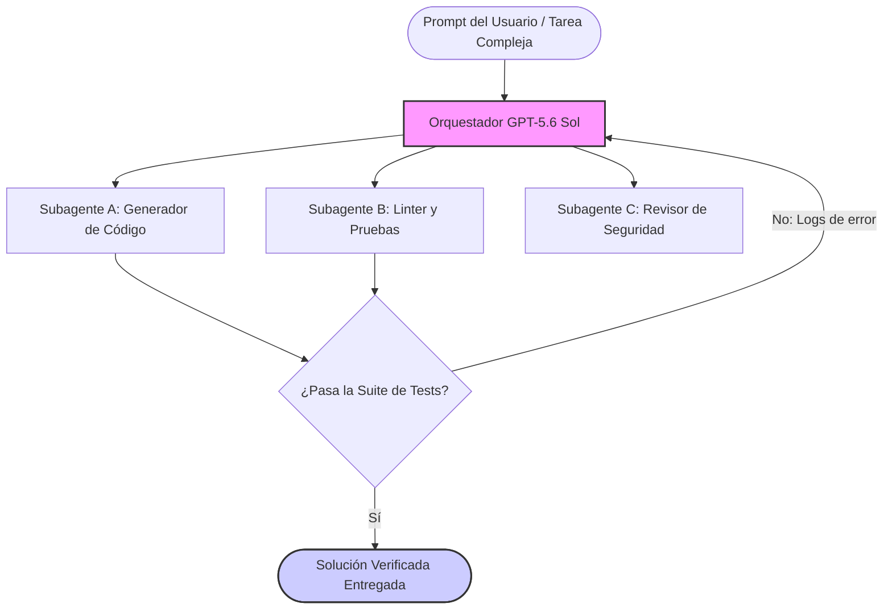

El 26 de junio de 2026, OpenAI presentó una vista previa limitada de su familia de modelos frontera de próxima generación: la **serie GPT-5.6**. Liderada por su buque insignia **Sol**, esta versión representa un cambio fundamental en el modo en que los modelos frontera resuelven tareas complejas y de largo recorrido.

En lugar de centrarse únicamente en el escalado masivo de parámetros, GPT-5.6 Sol introduce capacidades estructurales para la resolución autónoma de problemas mediante sus nuevas configuraciones de "Ultra Mode" y "Max Reasoning Effort".

Actualmente, el modelo está disponible como vista previa limitada coordinada con el gobierno estadounidense, con un despliegue público generalizado en ChatGPT y la API para desarrolladores previsto en las próximas semanas.

En este artículo, analizamos en profundidad las nuevas variantes, examinamos los benchmarks del estado del arte (SOTA), su capa de seguridad y exploramos qué supone para el futuro de la ingeniería de software agéntica.

---

## La Familia GPT-5.6: Sol, Terra y Luna

OpenAI mantiene su estrategia de nomenclatura por niveles, dividiendo la generación GPT-5.6 en tres modelos especializados según coste, velocidad y capacidades:

| Modelo            | Nivel Objetivo             | Caso de Uso Principal y Características                                                                                                                 |
| :---------------- | :------------------------- | :------------------------------------------------------------------------------------------------------------------------------------------------------ |
| **GPT-5.6 Sol**   | Buque Insignia / Frontera  | El modelo más potente de la serie. Optimizado para razonamiento extremo, programación compleja, criptografía e investigación científica.                |
| **GPT-5.6 Terra** | Intermedio / Equilibrado   | El caballo de batalla principal. Ofrece rendimiento equiparable o superior a GPT-5.5, pero a **la mitad del coste de ejecución** y el doble de rapidez. |
| **GPT-5.6 Luna**  | Ultraligero / Alto Volumen | La opción más veloz y económica. Pensada para tareas rutinarias de alto rendimiento como resúmenes, limpieza de datos y generación de borradores.       |

Mientras que Terra y Luna están diseñados para maximizar la eficiencia en los backends de aplicaciones cotidianas, **Sol** es donde OpenAI ha empujado la frontera de las capacidades de un modelo de lenguaje.

---

## Max Reasoning y Ultra Mode: El Salto Agéntico

Durante años, los modelos de IA han operado bajo un paradigma de "turno único": proporcionas un prompt y el modelo genera una respuesta en una sola pasada. Con modelos como GPT-o1 presenciamos la llegada del razonamiento mediante Chain-of-Thought (CoT). GPT-5.6 Sol va un paso más allá gracias a dos nuevas modalidades de ejecución:

### 1. Max Reasoning Effort (Máximo Esfuerzo de Razonamiento)

Este modo permite al modelo escalar dinámicamente su proceso interno de razonamiento. Ante desafíos matemáticos complejos o escenarios críticos de ciberseguridad, el modelo puede dedicar varios minutos a elaborar y refinar su cadena interna de pensamiento antes de entregar una respuesta final.

Esta modalidad prioriza la exactitud sobre la inmediatez, permitiendo a Sol resolver problemas lógicos y diseñar arquitecturas que harían descarrilar de inmediato a modelos estándar.

### 2. Ultra Mode (Orquestación de Subagentes)

La innovación definitoria de GPT-5.6 Sol es el **Ultra Mode**. Al activarlo, el modelo no solo reflexiona durante más tiempo; actúa como un **orquestador completo**.

Internamente, Ultra Mode crea y administra una red de subagentes especializados para abordar cada parte de un flujo de trabajo complejo de múltiples pasos:

Este bucle agéntico integrado gestiona la descomposición de tareas, la ejecución en paralelo, las pruebas y la autocorrección sin exigir que el desarrollador programe frameworks multiagente desde cero.

---

## Benchmarks: Redefiniendo el SOTA en Terminal-Bench 2.1

Para medir la eficacia de Ultra Mode en situaciones reales de ingeniería, los investigadores recurren a **Terminal-Bench 2.1**. Este benchmark evalúa la aptitud de una IA como ingeniero de software dentro de un terminal real: navegando estructuras de archivos, ejecutando comandos bash, solventando errores de compilación y superando suites de tests.

GPT-5.6 Sol establece un récord absoluto, especialmente al desplegar sus facultades multiagente:

| Configuración del Modelo        | Puntuación Terminal-Bench 2.1 | Paradigma                  |
| :------------------------------ | :---------------------------: | :------------------------- |
| **GPT-5.6 Sol (Ultra)**         |           **91.9%**           | Orquestación Multi-Agente  |
| **GPT-5.6 Sol (Max Reasoning)** |           **88.8%**           | Chain-of-Thought Extendido |
| Claude Mythos 5                 |             88.0%             | Chain-of-Thought Extendido |
| GPT-5.5                         |             83.4%             | Turno Único / CoT Estándar |

Una tasa de éxito del **91.9%** en Terminal-Bench 2.1 es un hito técnico extraordinario. Significa que, con acceso a un entorno de terminal, GPT-5.6 Sol en Ultra Mode es capaz de diagnosticar, codificar, verificar y solucionar flujos complejos de forma autónoma casi el 92% de las veces sin intervención humana. Supone un salto sustancial frente a GPT-5.5 y Claude Mythos 5 de Anthropic.

---

## Seguridad Coordinada y Contexto Geopolítico

Uno de los detalles más particulares del lanzamiento previo de GPT-5.6 Sol es su esquema de publicación. OpenAI no liberó el modelo globalmente el primer día; inició una **vista previa restringida** en coordinación con el gobierno de Estados Unidos.

Según OpenAI, esta coordinación responde a un procedimiento conjunto de evaluación comparativa para analizar capacidades de alto riesgo antes de su apertura pública. El modelo incorpora lo que OpenAI define como su **pila de seguridad más rigurosa hasta la fecha**:

- **Más de 700.000 horas equivalentes de GPU A100:** Dedicadas exclusivamente a red-teaming automatizado, evaluando jailbreaks, inyección de prompts y posibles fugas de información.
- **Barreras para Tecnología de Doble Uso:** Las salvaguardas diferencian operaciones defensivas de ciberseguridad (ej. parcheado automático de vulnerabilidades) frente a explotación ofensiva. El modelo colabora en detectar y reparar fallos, pero tiene bloqueada la generación de exploits activos.
- **Supervisión de Umbrales Gubernamentales:** Este despliegue acotado actúa como un banco de pruebas temporal para que reguladores y equipos de seguridad verifiquen las garantías del Ultra Mode.

OpenAI ha aclarado que, si bien este proceso conjunto es necesario para un nivel de potencia como el de Sol, representa una fase transitoria y no sentará el protocolo habitual para futuros modelos estándar.

---

## Qué Implica para Desarrolladores e Ingenieros de IA

La llegada de GPT-5.6 Sol confirma que nos adentramos de lleno en la **era agéntica del desarrollo de software**. Las conclusiones para los desarrolladores son directas:

1. **La orquestación pasa a la capa del modelo:** En lugar de invertir semanas programando y depurando flujos de subagentes en librerías como LangGraph o CrewAI, el propio modelo gestiona la coordinación interna. Los ingenieros pueden centrarse en formular requerimientos nítidos y suites de validación exhaustivas (como tests unitarios y de integración) en vez de en la fontanería de comunicación entre agentes.
2. **Equilibrio entre latencia y precisión:** Con Luna, Terra, Sol (Max Reasoning) y Sol (Ultra), disponemos de un abanico diverso de cómputo. Habrá que concebir arquitecturas que deriven tareas rutinarias a modelos ágiles y económicos (Luna/Terra), reservando Sol para situaciones críticas donde el coste y la latencia del razonamiento profundo estén plenamente justificados.
3. **El auge de la ingeniería de verificación:** A medida que los modelos superan el 90% de éxito en tareas terminales complejas, la labor del programador evoluciona de escribir el código a **verificar el código**. Contar con suites de tests integrales, reglas estrictas de linter y límites definidos de seguridad será la manera primordial de dirigir y controlar estos sistemas agénticos.

A medida que GPT-5.6 Sol pase de la fase preliminar a la disponibilidad general, evaluaremos su rendimiento en nuestras propias canalizaciones de desarrollo en labitcode. ¡Sigue atento a nuestros análisis técnicos prácticos!
