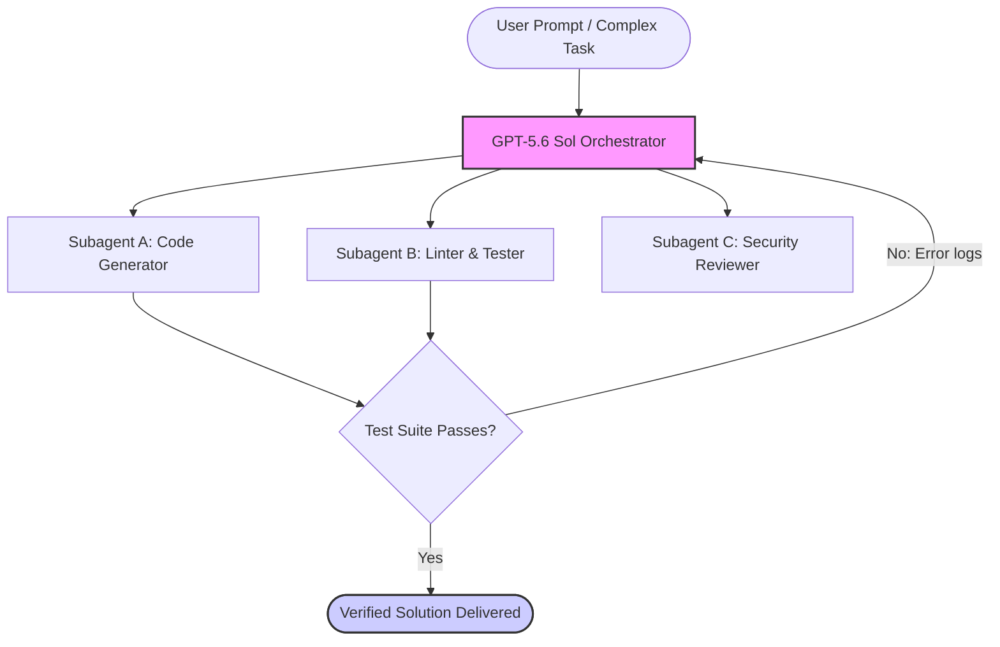

On June 26, 2026, OpenAI launched a limited preview of its next-generation frontier model family: the **GPT-5.6 series**. Headlined by the flagship model **Sol**, this release represents a fundamental shift in how frontier models approach complex, long-horizon tasks.

Instead of focusing solely on raw parameter scaling, GPT-5.6 Sol introduces structural capabilities for autonomous problem-solving through its new "Ultra Mode" and "Max Reasoning Effort" settings.

Currently, the model is available as a limited preview coordinated with the U.S. government, with a broader public rollout to ChatGPT and the developer API scheduled in the coming weeks.

In this post, we’ll dive deep into the new model versions, look at the SOTA benchmarks, examine the security stack, and explore what this means for the future of agentic software engineering.

---

## The GPT-5.6 Family: Sol, Terra, and Luna

OpenAI is continuing its tiered naming strategy, dividing the GPT-5.6 generation into three specialized models designed for different cost, speed, and capability profiles:

| Model             | Target Tier               | Primary Use Case & Characteristics                                                                                                                  |
| :---------------- | :------------------------ | :-------------------------------------------------------------------------------------------------------------------------------------------------- |
| **GPT-5.6 Sol**   | Flagship / Frontier       | The most capable model in the series. Optimized for maximum reasoning, complex coding, cryptography, and scientific research.                       |
| **GPT-5.6 Terra** | Mid-Tier / Balanced       | The mainstream workhorse. Delivers performance matching or exceeding GPT-5.5, but at **half the runtime cost** and twice the speed.                 |
| **GPT-5.6 Luna**  | Lightweight / High-Volume | The fastest and most affordable tier. Built for high-throughput, routine tasks like text summarization, simple data cleaning, and draft generation. |

While Terra and Luna are designed to optimize efficiency and cost for standard application backends, **Sol** is where OpenAI has pushed the frontier of what a language model can do.

---

## Max Reasoning & Ultra Mode: The Agentic Leap

For years, AI models have operated under a "single-turn" paradigm: you provide a prompt, and the model generates a response in a single forward pass. With models like GPT-o1, we saw the introduction of Chain-of-Thought (CoT) reasoning. GPT-5.6 Sol takes this a step further with two new execution options:

### 1. Max Reasoning Effort

This mode allows the model to scale its internal reasoning process dynamically. For highly complex tasks in cybersecurity or mathematics, the model can spend minutes generating and refining its internal chain of thought before delivering the final output.

This trades speed for correctness, allowing Sol to crack logic problems and design architectures that would immediately derail standard models.

### 2. Ultra Mode (Subagent Orchestration)

The defining feature of GPT-5.6 Sol is **Ultra Mode**. When enabled, the model doesn't just think longer; it _acts_ as an orchestrator.

Under the hood, Ultra Mode automatically spawns and manages a network of specialized subagents to tackle different parts of a complex, multi-step workflow:

This built-in agentic loop handles task decomposition, parallel execution, testing, and self-correction without requiring the developer to build complex multi-agent frameworks from scratch.

---

## Benchmarks: Redefining the SOTA on Terminal-Bench 2.1

To evaluate the effectiveness of Ultra Mode on real-world engineering, researchers have turned to **Terminal-Bench 2.1**. This benchmark tests an AI's ability to act as a software engineer in an active terminal environment—navigating file structures, executing bash commands, fixing compilation errors, and passing test suites.

GPT-5.6 Sol sets a new high-water mark, particularly when utilizing its multi-agent capabilities:

| Model Configuration             | Terminal-Bench 2.1 Score | Paradigm                   |
| :------------------------------ | :----------------------: | :------------------------- |
| **GPT-5.6 Sol (Ultra)**         |        **91.9%**         | Multi-agent Orchestration  |
| **GPT-5.6 Sol (Max Reasoning)** |        **88.8%**         | Extended Chain-of-Thought  |
| Claude Mythos 5                 |          88.0%           | Extended Chain-of-Thought  |
| GPT-5.5                         |          83.4%           | Standard Single-Turn / CoT |

An execution score of **91.9%** on Terminal-Bench 2.1 is landmark. It means that when given access to a terminal environment, GPT-5.6 Sol in Ultra Mode can successfully diagnose, code, test, and resolve complex workflows almost 92% of the time without human intervention. This represents a substantial leap over both GPT-5.5 and Anthropic's Claude Mythos 5.

---

## Coordinated Safety & Geopolitical Context

One of the most unusual aspects of the GPT-5.6 Sol preview is its release structure. OpenAI did not release the model globally on day one. Instead, it was initiated as a **limited preview** in coordination with the U.S. government.

According to OpenAI, this coordination is part of a joint benchmarking process to evaluate high-risk capabilities before public exposure. The model features what OpenAI describes as its **most robust safety stack to date**:

- **700k+ A100-Equivalent GPU Hours:** Dedicated purely to automated red-teaming, testing for jailbreaks, prompt injection, and output vulnerabilities.
- **Dual-Use Guardrails:** The safety stack is calibrated to distinguish between defensive cybersecurity operations (e.g., automated vulnerability patching) and offensive exploitation. The model will assist in finding and fixing bugs but is restricted from generating active exploits.
- **Government-Assessed Thresholds:** The limited rollout serves as a short-term benchmark evaluation step, allowing policymakers and safety teams to review the agentic safeguards of Ultra Mode.

OpenAI has explicitly noted that while this coordinated preview is necessary for models of Sol's capability tier, it is a temporary safety phase and is not intended to represent the default release protocol for all future models.

---

## What This Means for Developers and AI Engineers

The arrival of GPT-5.6 Sol signals that we are firmly entering the **agentic era of software development**. For developers, the takeaways are clear:

1.  **Orchestration is Moving to the Model Layer:** Instead of spending engineering hours building, debugging, and maintaining custom subagent loops in frameworks like LangGraph or CrewAI, the model can now handle this internally. Developers can focus on defining clear objectives and robust verification suites (like unit tests) rather than the plumbing of agent communication.
2.  **Latency vs. Correctness Tradeoffs:** With options like Luna, Terra, Sol (Max Reasoning), and Sol (Ultra), we now have a spectrum of compute. Developers will need to design systems that use cheap, fast models (Luna/Terra) for routine operations, and route complex, high-risk tasks to Sol only when the higher cost and latency of deep reasoning are justified.
3.  **The Rise of Verification Engineering:** As models achieve >90% success rates on autonomous terminal tasks, the developer's role shifts from writing the code to **verifying the code**. Having comprehensive test suites, strict linting rules, and clear security boundaries will be the primary way we guide and control these agentic systems.

As GPT-5.6 Sol transitions from limited preview to general availability, we’ll be testing its performance inside our own developer pipelines here at labitcode. Stay tuned for our hands-on review and configuration guides!
