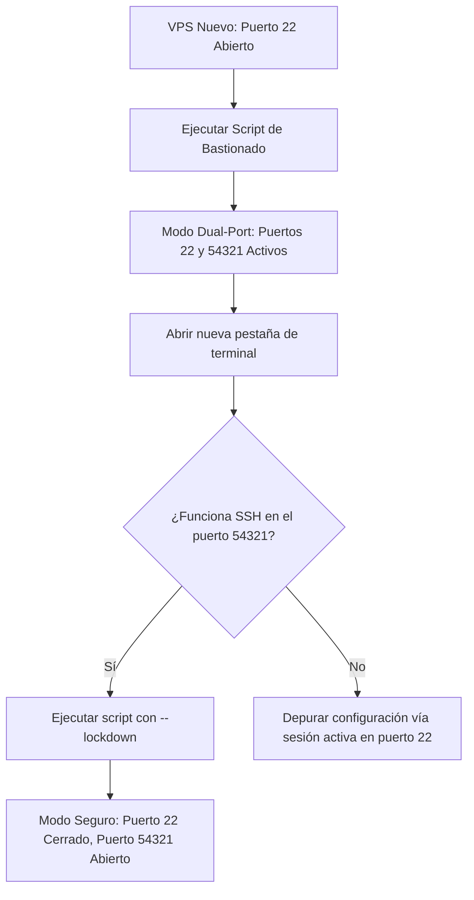

Cuando aprovisionas un nuevo Servidor Privado Virtual (VPS) en cualquier proveedor cloud (DigitalOcean, Hetzner, AWS u OVH), suele entregarse con configuraciones iniciales estándar: cuentas por defecto (como `ubuntu`, `debian` o `admin`), autenticación por contraseña habilitada y el puerto `22` expuesto a internet.

En cuestión de minutos tras ponerse en marcha, botnets automatizadas y escáneres maliciosos comenzarán a bombardear el puerto 22 con ataques de fuerza bruta. Dejar un VPS con su configuración básica no es una cuestión de _si_ será comprometido, sino de _cuándo_.

En esta guía desgranamos un script de **Bastionado y Puesta a Punto de VPS para Entornos de Producción**. Este script automatiza la configuración de servidores desde cero, transformando una instancia limpia de Ubuntu 22.04 o 24.04 LTS en un entorno blindado. Explicamos la justificación técnica de cada comprobación, regla de cortafuegos y parámetro del kernel, mostrando cómo ejecutar una **transición segura de doble puerto** para no perder el acceso en ningún momento.

---

## El Flujo de Transición Segura (Estrategia Dual-Port)

El mayor temor al bastionar el servicio SSH o ajustar cortafuegos es quedarse fuera del propio servidor. Si desactivas la contraseña, modificas el puerto SSH y activas el firewall en una sola operación, cualquier error de sintaxis desconectará tu sesión y bloqueará el acceso de forma permanente.

Para evitarlo, empleamos un **Flujo de Transición de Doble Puerto**:



1. **Fase de Configuración (Dual-Port)**: El script crea un nuevo usuario administrador, configura SSH para escuchar en **ambos** puertos (el estándar `22` y uno personalizado, ej. `54321`), y permite ambos en el cortafuegos.
2. **Fase de Verificación**: Abres una nueva terminal y compruebas que puedes conectarte sin problemas en el puerto nuevo utilizando tu clave pública SSH.
3. **Fase de Cierre (Lockdown)**: Confirmada la conexión, ejecutas el script con el flag `--lockdown`, que elimina la configuración del puerto 22, lo cierra en el firewall y actualiza los monitores anti-fuerza bruta.

---

## Desglose Paso a Paso del Proceso de Blindaje

### Paso 0: Verificaciones Previas y Garantías de Seguridad

Antes de aplicar cambios, el script valida que se ejecuta con privilegios de `root` y comprueba la existencia de claves SSH funcionales.

Si necesita crear un nuevo usuario administrador, verifica primero que el usuario origen (ej. `ubuntu`) posee un archivo `authorized_keys` con claves válidas. Clona estas claves al nuevo usuario para garantizar el acceso inmediato. Si no detecta claves públicas, el script se detiene de inmediato para evitar bloqueos accidentales.

---

### Paso 1: Actualización de Paquetes del Sistema

Mantener los paquetes al día es la primera barrera contra vulnerabilidades conocidas del kernel o de OpenSSH:

```bash
export DEBIAN_FRONTEND=noninteractive
apt-get update -y
apt-get upgrade -y
apt-get install -y curl wget git ca-certificates gnupg ufw fail2ban \
                   unattended-upgrades apt-listchanges \
                   htop ncdu jq rsync
```

---

### Paso 2: Aprovisionamiento del Usuario Administrador

Iniciar sesión directamente como `root` entraña graves riesgos. Creamos una cuenta administrativa dedicada, con permisos `sudo` y límites de recursos calibrados:

```bash
# Crear usuario administrador
adduser --disabled-password --gecos "" "$SSH_USER"
usermod -aG sudo "$SSH_USER"

# Desplegar claves SSH
install -d -m 700 -o "$SSH_USER" -g "$SSH_USER" "/home/${SSH_USER}/.ssh"
cp "/home/${SOURCE_USER}/.ssh/authorized_keys" "/home/${SSH_USER}/.ssh/authorized_keys"
chown "$SSH_USER:$SSH_USER" "/home/${SSH_USER}/.ssh/authorized_keys"
chmod 600 "/home/${SSH_USER}/.ssh/authorized_keys"
```

#### Límites de Recursos (Ulimits)

Para proteger al servidor de ataques de Denegación de Servicio (DoS) o procesos descontrolados, fijamos topes máximos de ficheros abiertos (`nofile`) y procesos concurrentes (`nproc`) en `/etc/security/limits.d/`:

```ini
admin_user  soft  nofile  65536
admin_user  hard  nofile  131072
admin_user  soft  nproc   4096
admin_user  hard  nproc   8192
```

---

### Paso 3: Gestión de Zona Horaria y Nombre de Servidor

Fijar la hora correcta con `systemd-timesyncd` es crucial para correlacionar logs y depurar incidentes. Además, se instruye a `cloud-init` para no sobrescribir el hostname al reiniciar:

```bash
# /etc/cloud/cloud.cfg.d/99-hostname.cfg
preserve_hostname: true
```

---

### Paso 4: Asignación de Memoria Swap

Instancias VPS con 1 GB o 2 GB de RAM pueden sufrir el temido Out-Of-Memory (OOM) killer del kernel ante picos de demanda. Asignar un archivo swap proporciona memoria virtual de emergencia. Fijamos `vm.swappiness=10` para que el kernel solo recurra al swap en situaciones críticas, evitando degradar los discos SSD con escrituras continuas.

---

### Paso 5: Blindaje de OpenSSH

SSH es el acceso principal a la máquina. El script aplica una configuración de máxima seguridad en `/etc/ssh/sshd_config.d/99-hardening.conf`:

```ini
Port 54321
AddressFamily any

# Seguridad en la autenticación
PasswordAuthentication no
PermitEmptyPasswords no
PermitRootLogin no
KbdInteractiveAuthentication no
PubkeyAuthentication yes
AuthenticationMethods publickey
MaxAuthTries 3
LoginGraceTime 30s
MaxSessions 5

# Restricción exclusiva al usuario admin
AllowUsers admin_user

# Desactivación de funciones innecesarias
X11Forwarding no
AllowAgentForwarding no
AllowTcpForwarding local
ClientAliveInterval 300
ClientAliveCountMax 2
Banner /etc/ssh/banner.txt
```

> **Aviso para Ubuntu 24.04:** Ubuntu 24.04 introduce activación por socket (`ssh.socket`), que desoye configuraciones estándar de puerto en `sshd_config`. El script desactiva explícitamente `ssh.socket` y levanta `ssh.service` para garantizar el respeto íntegro de las directivas.

---

### Paso 6: Cortafuegos UFW y la Evasión Crítica de Docker

Configuramos `ufw` para rechazar todo el tráfico entrante salvo puertos imprescindibles (80, 443, 22 y 54321).

#### ⚠️ El Agujero de Seguridad de Docker con UFW

Muchos administradores desconocen que **Docker elude UFW por defecto**. Al mapear un puerto en un contenedor (`docker run -p 8080:80`), Docker inyecta reglas directamente en `iptables` antes de que UFW las procese, **exponiendo el puerto a internet aunque UFW lo prohíba**.

El script integra `ufw-docker` para enrutar el tráfico de los contenedores a través de las tablas de filtrado de UFW:

```bash
ufw-docker install
ufw route allow proto tcp from any to any port 80
ufw route allow proto tcp from any to any port 443
systemctl restart ufw
```

---

### Paso 7: Prevención de Intrusiones con Fail2ban

Fail2ban monitoriza los logs de autenticación y bloquea dinámicamente IPs sospechosas en el firewall tras 3 intentos fallidos en 10 minutos.

---

### Paso 8: Endurecimiento del Kernel Linux (Sysctl)

A través de `/etc/sysctl.d/99-hardening.conf`:

- **`rp_filter = 1`**: Activa el filtrado de ruta inversa para evitar falsificación de IPs (IP Spoofing).
- **`tcp_syncookies = 1`**: Mitiga ataques DoS por inundación SYN (SYN Flood).
- **`accept_redirects = 0`**: Previene ataques Man-in-the-Middle por redirecciones de red.
- **`kptr_restrict = 2` & `dmesg_restrict = 1`**: Oculta punteros de memoria y logs del kernel a usuarios no privilegiados.

---

### Paso 9 y 10: Rotación de Logs y Actualizaciones Automáticas

Se acotan los logs de `journald` a un máximo de 500 MB y 30 días, evitando el colapso del almacenamiento. Con `unattended-upgrades`, las actualizaciones de seguridad se aplican de forma desatendida, programando reinicios automáticos a las **04:00 AM** si una actualización del kernel lo requiere.

---

### Paso 11: Bloqueo de Cuentas por Defecto

Verificado el nuevo usuario administrador, la cuenta original del proveedor (ej. `ubuntu`) se bloquea y se le retira la shell de login (`/usr/sbin/nologin`).

---

## Instrucciones de Ejecución

1. **Copia tu clave pública SSH** al servidor:
   ```bash
   ssh-copy-id -i ~/.ssh/id_ed25519.pub ubuntu@tu_vps_ip
   ```
2. **Ejecuta el script de instalación**:
   ```bash
   sudo bash setup_vps.sh
   ```
3. **Verifica el acceso en una nueva terminal sin cerrar la sesión actual**:
   ```bash
   ssh -p 54321 admin_user@tu_vps_ip
   ```
4. **Aplica el cierre definitivo del puerto 22**:
   ```bash
   sudo bash setup_vps.sh --lockdown
   ```

Con esta arquitectura de transición en doble puerto y blindaje a nivel de kernel y servicios, tu servidor Linux queda protegido frente al ruido y las amenazas habituales de la red pública.
