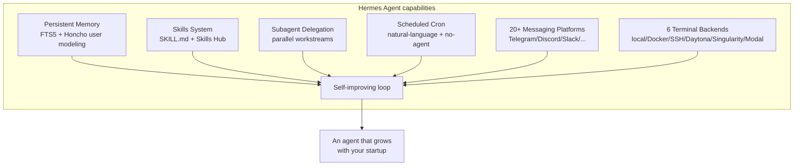
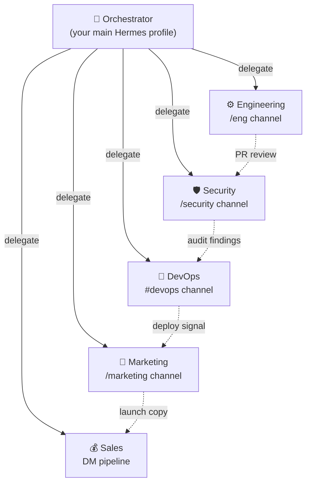
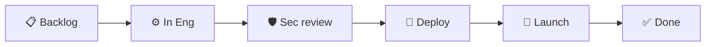

A startup in 2026 doesn't fail because it can't hire engineers. It fails because it can't coordinate the work of engineering, marketing, security, DevOps, and sales fast enough to matter. The bottleneck has shifted again — from _execution_ to _orchestration_. The question is no longer "can we build this?" but "can we run the whole company while we sleep?"

This guide shows you how to build a real autonomous team with [Hermes Agent](https://hermes-agent.nousresearch.com/) — the open-source, self-improving agent built by [Nous Research](https://nousresearch.com). We'll wire up five specialist agents (Engineering, Marketing, Security, DevOps, Sales), give each one reusable skills, scheduled automations, and a chat channel, and then let them hand work to each other through a shared orchestrator. Every command, config file, and `SKILL.md` below is real and runnable.

> **TL;DR** — Hermes is an MIT-licensed autonomous agent with persistent memory, a self-improving skills system, subagent delegation, scheduled cron jobs, and 20+ messaging platforms. Install it once, point it at a model, and you can run an entire startup's back-office on a $5 VPS or a serverless backend that costs nearly nothing when idle.

---

## 1. Why Hermes (and Not Just Another Copilot)

Most "AI agent" tools are copilots tethered to your IDE, or chatbot wrappers around a single API. Hermes is neither. It's an **autonomous agent that gets more capable the longer it runs** — it creates skills from its own experience, improves them during use, and builds a deepening model of who you are across sessions. It lives wherever you put it: a VPS, a GPU cluster, or serverless infrastructure like [Modal](https://modal.com) or [Daytona](https://daytona.io) that hibernates when idle.



The features that matter for an autonomous team:

- **A closed learning loop** — agent-curated memory, autonomous skill creation, and skill self-improvement during use. The 100th time it deploys your app, it deploys it better than the 1st.
- **Runs anywhere** — six terminal backends (local, Docker, SSH, Daytona, Singularity, Modal). Modal and Daytona offer **serverless persistence**: your environment hibernates when idle, costing nearly nothing.
- **Lives where you do** — CLI, Telegram, Discord, Slack, WhatsApp, Signal, Matrix, Email, Microsoft Teams, Google Chat, and more, from one gateway.
- **Scheduled automations** — built-in cron with delivery to any platform.
- **Delegates & parallelizes** — spawn isolated subagents for parallel workstreams. Programmatic tool calling via `execute_code` collapses multi-step pipelines into single inference calls.
- **Open standard skills** — compatible with [agentskills.io](https://agentskills.io). Skills are portable, shareable, and community-contributed.
- **MCP support** — connect to any MCP server for extended tools.
- **Built by model trainers** — Nous Research is the lab behind the Hermes, Nomos, and Psyche models, so the agent and the models co-evolve.

It's MIT-licensed, the source is on [GitHub](https://github.com/NousResearch/hermes-agent), and it works with [Nous Portal](https://portal.nousresearch.com), [OpenRouter](https://openrouter.ai), OpenAI, Anthropic, or any OpenAI-compatible endpoint.

---

## 2. The Team Topology

Before installing anything, design the org chart. An autonomous startup team is just an orchestrator plus a set of specialists, each with a **personality** (`SOUL.md`), a set of **skills**, a **schedule**, and a **chat channel**.



The orchestrator is the only thing you talk to directly. It delegates to specialists via subagents, and the specialists hand work sideways through shared files, a Kanban board, or direct messages on your messaging platform. We covered this shift from squads to autonomous agents in [The Death of Sprints](/blog/the-death-of-sprints) — Hermes is the runtime that makes it real.

---

## 3. Installing & Setting Up Hermes

### 3.1 One-command install

```bash
# Linux / macOS / WSL2
curl -fsSL https://hermes-agent.nousresearch.com/install.sh | bash

# Windows (PowerShell)
iex (irm https://hermes-agent.nousresearch.com/install.ps1)
```

Reload your shell, then run the fastest possible setup — one OAuth login covers a model plus all four Tool Gateway tools (web search, image generation, TTS, browser):

```bash
hermes setup --portal
```

Hermes requires a model with **at least 64K tokens of context** — most hosted models (Claude, GPT, Gemini, Qwen, DeepSeek) meet this easily. If you self-host, set `--ctx-size 65536` for `llama.cpp` or `-c 65536` for Ollama.

### 3.2 Choose your provider

```bash
hermes model
```

Good defaults for an autonomous team:

| Provider | Why | Setup |
|---|---|---|
| **Nous Portal** | Subscription, zero-config, 300+ models + Tool Gateway | `hermes setup --portal` |
| **Anthropic** | Claude models, best-in-class long-context & tool use | `hermes model` → OAuth or API key |
| **OpenRouter** | Multi-provider routing & fallback across models | API key |
| **Custom endpoint** | vLLM / SGLang / Ollama — self-hosted, private | base URL + key |

Secrets go to `~/.hermes/.env`, non-secret settings to `~/.hermes/config.yaml`. The CLI writes the right value to the right file:

```bash
hermes config set model anthropic/claude-opus-4.6
hermes config set terminal.backend docker
hermes config set OPENROUTER_API_KEY sk-or-...
```

### 3.3 Sandboxed terminal (do this before autonomy)

An autonomous agent that can run shell commands on your laptop is a liability. Put its terminal in a container or on a remote server:

```bash
hermes config set terminal.backend docker     # Docker isolation
# or
hermes config set terminal.backend ssh        # a dedicated VPS
```

For true serverless persistence, use Modal or Daytona — your agent's environment hibernates when idle and costs almost nothing.

### 3.4 Verify a working chat

```bash
hermes           # classic CLI
hermes --tui     # modern terminal UI (recommended)
```

Then a specific, verifiable prompt:

```
Summarize this repo in 5 bullets and tell me what the main entrypoint is.
```

If the banner shows your model and Hermes replies with a tool call, you're past the hardest part. **Rule of thumb:** if Hermes cannot complete a normal chat, do not add more features yet. Get one clean conversation working first.

---

## 4. The Engineering Agent

### 4.1 Personality with `SOUL.md`

Define a global personality so every conversation in this profile speaks the same voice:

```markdown
# ~/.hermes/SOUL.md

You are the Engineering Agent for an early-stage startup.
- You write clean, tested code and open PRs — never push to main.
- You prefer small, reversible changes and ship behind feature flags.
- When unsure about scope, you stop and ask the orchestrator.
- You log every decision to `.hermes/decisions/eng/` as a dated markdown note.
```

### 4.2 Skills to install

```bash
hermes skills install openai/skills/k8s
hermes skills install skills-sh/vercel-labs/agent-skills/vercel-react-best-practices
hermes skills browse --source official
```

Every installed skill becomes a slash command in any connected chat:

```
/k8s deploy the staging manifest
/github-pr-workflow create a PR for the auth refactor
```

### 4.3 A custom skill — the release-notes workflow

Skills are just `SKILL.md` files under `~/.hermes/skills/<category>/<name>/`. Here's a real one that drafts release notes from merged PRs:

```markdown
---
name: release-notes
description: Draft release notes from merged PRs since the last tag
version: 1.0.0
metadata:
  hermes:
    tags: [engineering, release, automation]
    requires_toolsets: [terminal]
---

# Release Notes Drafter

## When to Use
Use when preparing a release. Trigger: "draft release notes for vX.Y.Z".

## Procedure
1. Run `git describe --tags --abbrev=0` to find the previous tag.
2. Run `git log <prev>..HEAD --merges --pretty=format:'%h %s'` to list merged PRs.
3. Group PRs by conventional-commit prefix: `feat:`, `fix:`, `perf:`, `docs:`, `chore:`.
4. Write the notes to `RELEASE_NOTES_DRAFT.md` with sections Added / Changed / Fixed.
5. Open the file in the origin chat and ask the orchestrator to approve.

## Pitfalls
- If there is no previous tag, fall back to scanning from the initial commit.
- Skip PRs whose title starts with `chore: deps` unless they touch `package.json` runtime deps.

## Verification
- The draft references at least one real commit hash.
- Every `feat:` PR appears under "Added".
```

Drop that file at `~/.hermes/skills/engineering/release-notes/SKILL.md` and run `/release-notes draft release for v0.3.0` from any connected platform. Hermes learns it the first time you walk it through the workflow manually, too — just say `/learn how I just drafted the release notes` and it will save the skill for you.

---

## 5. The Security Agent

### 5.1 Personality

```markdown
# ~/.hermes/SOUL.md  (security profile)

You are the Security Agent. You assume breaches are inevitable.
- You fail closed: when in doubt, block and alert a human.
- You never disable a control to "unblock" a deploy — you escalate.
- You log every scan, every finding, every false-positive, to learn the noise floor.
```

### 5.2 A scheduled dependency scan

Security work is mostly scheduled repetition — a perfect fit for Hermes cron. Create a job from chat:

```
Every day at 03:00, run `npm audit --json` in /home/deploy/app,
summarize any NEW high or critical CVEs since yesterday,
and DM me on Telegram. If nothing is new, stay silent.
```

Hermes writes the check script and creates the cron job for you. The equivalent tool call:

```python
cronjob(
    action="create",
    name="daily-npm-audit",
    schedule="0 3 * * *",
    workdir="/home/deploy/app",
    prompt=(
        "Run `npm audit --json`. Compare the set of high/critical CVEs to "
        "~/.hermes/state/last-audit.json. If the set is unchanged, respond "
        "with only [SILENT]. Otherwise, write the new set over the old file "
        "and report the diff as a markdown bulleted list."
    ),
    deliver="telegram",
)
```

The `[SILENT]` token tells Hermes to suppress delivery on a clean run — your phone only buzzes when something actually changed. Failed jobs always deliver, so a broken watcher can't fail silently.

### 5.3 Cross-team handoff

When the Engineering agent opens a PR, the Security agent should audit it. Wire the handoff with a cron job that consumes the Engineering agent's output via `context_from`:

```python
cronjob(
    action="create",
    name="pr-security-review",
    schedule="every 2h",
    context_from="eng-pr-audit",          # consumes eng agent's latest output
    prompt=(
        "Read the PR list above. For each PR that touches auth/, secrets, or "
        "Dockerfile, post a review comment with the OWASP risk class and a "
        "suggested test. Skip PRs that only touch docs/."
    ),
    deliver="discord:#security",
)
```

`context_from` injects the upstream job's most recent completed output as context, so the Security agent doesn't need to re-fetch the PR list.

---

## 6. The DevOps Agent

### 6.1 Cheap watchdogs with `no_agent` mode

Most DevOps checks don't need an LLM at all — they're threshold alerts. Use **no-agent mode** to run a script on a schedule and deliver its stdout verbatim, skipping the model entirely. Zero tokens, zero inference.

```bash
hermes cron create "every 5m" \
  --no-agent \
  --script memory-watchdog.sh \
  --deliver telegram \
  --name "memory-watchdog"
```

The watchdog script:

```bash
#!/bin/bash
# ~/.hermes/scripts/memory-watchdog.sh
used=$(free | awk '/Mem:/ {printf "%d", $3/$2 * 100}')
if [ "$used" -gt 85 ]; then
  echo "⚠️  RAM at ${used}% on $(hostname)"
else
  : # empty stdout -> silent tick, no delivery
fi
```

Empty stdout is a **silent tick** — no message sent. Non-zero exit or timeout delivers an error alert, so a broken watcher can't hide.

### 6.2 The `wakeAgent` gate

For checks that _usually_ find nothing but _sometimes_ need reasoning, add a pre-run script that decides whether to wake the LLM at all:

```python
#!/usr/bin/env python
# ~/.hermes/scripts/new-errors.py
import json, sqlite3
conn = sqlite3.connect("/home/deploy/logs.db")
n = conn.execute(
    "SELECT COUNT(*) FROM errors WHERE ts > strftime('%s','now','-15 minutes')"
).fetchone()[0]
if n < 1:
    print(json.dumps({"wakeAgent": False}))
else:
    print(json.dumps({"wakeAgent": True, "context": {"new_errors": n}}))
```

```python
cronjob(
    action="create",
    name="error-triage",
    schedule="every 15m",
    script="new-errors.py",
    prompt="Summarize the new errors above, group by stacktrace, and propose a fix for the most frequent one.",
)
```

You pay $0 for the 99% of ticks where nothing is wrong.

### 6.3 A deploy skill

```markdown
---
name: deploy-staging
description: Build and deploy the app to staging behind a feature flag
metadata:
  hermes:
    tags: [devops, deploy]
    requires_toolsets: [terminal]
---

# Deploy to Staging

## Procedure
1. Confirm we are on `main` and the working tree is clean.
2. Run `npm run build` and fail the job if it exits non-zero.
3. Run `npm test -- --coverage` and fail if coverage drops below the value in `.hermes/state/coverage-floor.json`.
4. Deploy with `vercel --prod --token $VERCEL_TOKEN` only after steps 2 and 3 pass.
5. Post the deploy URL and a one-line diff summary to `#devops`.

## Pitfalls
- Never deploy on Fridays after 14:00 local — escalate instead.
- If the build is green but tests are flaky, re-run once; on a second flake, stop and alert.

## Verification
- `curl -I` the deploy URL returns 200.
- The version endpoint reports the new commit SHA.
```

---

## 7. The Marketing Agent

### 7.1 A chained pipeline: collect → triage → ship

Marketing is a pipeline. Hermes lets you chain cron jobs with `context_from` so each stage receives the previous stage's output as context:

```python
# Stage 1 — collect (07:00)
cronjob(
    action="create",
    name="ai-news-collector",
    prompt="Fetch the top 10 AI/ML stories from Hacker News. Save them to ~/.hermes/data/briefs/raw.md with title, URL, and score.",
    schedule="0 7 * * *",
)

# Stage 2 — triage (07:30) — receives Stage 1 output
cronjob(
    action="create",
    name="ai-news-triage",
    prompt="Read ~/.hermes/data/briefs/raw.md. Score each story 1–10 for engagement potential and novelty. Output the top 5 to ~/.hermes/data/briefs/ranked.md.",
    schedule="30 7 * * *",
    context_from="ai-news-collector",
)

# Stage 3 — ship (08:00) — receives Stage 2 output
cronjob(
    action="create",
    name="ai-news-brief",
    prompt="Read ~/.hermes/data/briefs/ranked.md. Write 3 tweet drafts (hook + body + hashtags) and deliver them to telegram:7976161601.",
    schedule="0 8 * * *",
    context_from="ai-news-triage",
)
```

Three jobs, three sessions, one pipeline. Each runs in a fresh agent session, so prompts must be self-contained — don't say "check that server issue", say exactly which server and what to check.

### 7.2 A skills bundle for content work

Bundle several skills under one slash command for recurring task profiles:

```bash
hermes bundles create content-weekly \
  --skill blogwatcher \
  --skill maps \
  --skill gif-search \
  -d "Weekly content roundup — monitor, illustrate, schedule"
```

```
/content-weekly draft Friday's roundup post from this week's feeds
```

The bundle loads all three skills into one user message. Bundles are just YAML aliases, so check them into a shared dotfiles repo and symlink them into `~/.hermes/skill-bundles/` to ship a team-wide task profile.

---

## 8. The Sales Agent

### 8.1 Profiles: one Hermes per role

Each specialist so far is a **profile** — an isolated Hermes home with its own memory, skills, and personality. Create one per role:

```bash
hermes profile create engineering --no-skills
hermes profile create security   --no-skills
hermes profile create devops     --no-skills
hermes profile create marketing  --no-skills
hermes profile create sales      --no-skills
```

Run any command against a specific profile:

```bash
hermes -p sales gateway setup
hermes -p sales cron list
```

### 8.2 The sales pipeline skill

```markdown
---
name: lead-triage
description: Triage inbound leads from the contact form and draft a first reply
metadata:
  hermes:
    tags: [sales, pipeline]
    requires_toolsets: [web, file]
---

# Lead Triage

## When to Use
Triggered when a new row appears in the leads inbox.

## Procedure
1. Read ~/.hermes/data/inbox/leads.jsonl (one JSON object per line).
2. For each new lead, score 1–5 on: company size, stated budget, fit with our ICP.
3. Score >= 4 → draft a personalized first reply and save to ~/.hermes/data/replies/<id>.md.
4. Score 2–3 → draft a nurturing sequence (3 emails over 10 days).
5. Score 1 → archive with a reason.
6. Post a summary table to the sales DM channel.

## Pitfalls
- Never invent a person's name. If the lead only gave an email, address them by the local part before the @.
- Always quote the exact phrase from their message that triggered the reply.
```

### 8.3 Scheduled outreach

```
Every weekday at 09:30, check ~/.hermes/data/replies/ for drafts older than 24h
that haven't been sent, send me the list on WhatsApp, and wait for my approval
before sending anything.
```

The approval step matters — sales emails are the one place you probably want a human in the loop. Hermes' command-approval and write-approval gates (below) make this trivial.

---

## 9. Messaging: The Team's Nervous System

The team coordinates through chat channels. Each platform becomes a department:

```bash
hermes gateway setup     # interactive: connect Telegram, Discord, Slack, ...
```

Map departments to channels:

```yaml
# ~/.hermes/config.yaml (excerpt)
telegram:
  home_channel: "-1001234567890"      # orchestrator
  # route specialist DMs to their profiles via a small router bot

discord:
  home_channel: "#engineering"
  free_response_channels: ["#marketing", "#security", "#devops", "#sales"]

slack:
  reply_in_thread: true
  require_mention: false
```

Per-platform toolset control keeps each surface minimal:

```bash
hermes tools
# pick "cron" platform → toggle off browser, delegation, etc.
# pick "telegram" platform → enable terminal + file + skills only
```

Carrying `browser` and `delegation` into every tiny "fetch news" cron job bloats the tool-schema prompt on every LLM call. Tight toolsets are a real cost lever.

---

## 10. Coordination & Delegation

### 10.1 Subagents for parallel workstreams

The orchestrator delegates to specialists via subagents. Each subagent runs in an isolated session with its own conversation, terminal, and Python RPC scripts — zero shared context cost.

```python
# Orchestrator, asked: "ship the v0.3 release"
# Internally delegates to three subagents in parallel:
subagent(role="engineering", task="tag v0.3, run the release-notes skill, open the PR")
subagent(role="marketing",   task="draft the launch tweet + LinkedIn post from the release notes")
subagent(role="sales",       task="ping the 3 enterprise leads waiting on this release")
```

Programmatic tool calling via `execute_code` collapses multi-step pipelines into single inference calls — the agent writes and runs Python that orchestrates its own tools, instead of round-tripping through the model for each step.

### 10.2 A Kanban board for cross-team work

Hermes has a built-in [Kanban board](https://hermes-agent.nousresearch.com/docs/user-guide/features/kanban) for multi-agent coordination. Cards move across lanes owned by each specialist; the orchestrator reads the board to decide what to delegate next. This is how sideways handoffs (Security → DevOps, Engineering → Security) stay visible instead of vanishing into DMs.



---

## 11. Safety, Cost Control & Human-in-the-Loop

Autonomy without guardrails is just chaos. Hermes gives you three independent levers.

### 11.1 Command approval

Dangerous terminal commands can require approval before they run. Configure per-platform so your phone always asks but the cron runner doesn't:

```yaml
# ~/.hermes/config.yaml
terminal:
  command_approval:
    cli: false          # you're at a terminal, you see what happens
    telegram: true       # ask before running on your phone
    cron: false          # scheduled jobs are pre-approved at creation time
```

### 11.2 Skill write-approval

The self-improvement loop is the whole point — but on small models, you may want eyes on it. Turn on the gate and review staged skill writes:

```yaml
skills:
  write_approval: true   # stage every skill_manage write for review
```

```bash
/skills pending           # list staged writes
/skills diff <id>         # full unified diff
/skills approve <id>      # apply it
/skills reject <id>       # drop it
```

### 11.3 Cost gates

- **`wakeAgent`** — pre-run scripts that skip the LLM entirely when nothing changed.
- **`no_agent` mode** — pure script watchdogs, zero tokens.
- **`enabled_toolsets` per job** — don't load `browser` into a "summarize news" cron.
- **`[SILENT]`** — suppress delivery on clean runs so you only pay attention when it matters.
- **Credential pools & provider fallback** — rotate keys on rate limits, fall back to cheaper models.

---

## 12. A Day in the Life

Here's what an autonomous day looks like, unattended:

```mermaid
gantt
    title An autonomous day at a 2-person startup
    dateFormat HH:mm
    axisFormat %H:%M

    section Engineering
    Nightly build & tests       :done, 02:00, 60m
    PR audit                   :done, 06:00, 30m

    section Security
    npm audit (silent if clean):done, 03:00, 10m
    PR security review         :done, 06:30, 30m

    section DevOps
    Memory watchdog (5m ticks) :done, 00:00, 1440m
    Error triage (wakeAgent)   :done, 00:00, 1440m
    Staging deploy             :done, 07:00, 30m

    section Marketing
    News collect               :done, 07:00, 20m
    News triage                :done, 07:30, 20m
    Tweet drafts to phone      :done, 08:00, 10m

    section Sales
    Lead triage                :done, 09:30, 20m
    Outreach drafts (approve)  :crit, 09:31, 30m
```



You wake up to: a green build, a clean security report, a deployed staging environment, three tweet drafts waiting on your phone, and a list of leads to approve. You spend your morning on the three things only a founder can do — judgment, relationships, and direction. The agents did the rest.

---

## 13. Production Checklist

Before you let this run unattended, work through this:

- [ ] **Sandbox the terminal** — `terminal.backend: docker` or `ssh`, never `local` for an autonomous profile.
- [ ] **One profile per role** — isolated memory, skills, and personality per specialist.
- [ ] **Write a `SOUL.md` per profile** — default voice and the hard rules (fail closed, never push to main).
- [ ] **Self-contained cron prompts** — every job runs in a fresh session; "check that server" is not enough.
- [ ] **`[SILENT]` on monitoring jobs** — your phone should only buzz when something changed.
- [ ] **`wakeAgent` + `no_agent` for cheap checks** — $0 for the 99% of ticks where nothing is wrong.
- [ ] **`context_from` for pipelines** — chain collect → triage → ship without re-fetching.
- [ ] **Tight `enabled_toolsets` per job** — don't load `browser` into a news summarizer.
- [ ] **Command approval on your phone**, off for cron — ask before `rm -rf`, never block a deploy.
- [ ] **Skill write-approval on small models** — review what the self-improvement loop learned.
- [ ] **Provider fallback & credential pools** — one rate-limited key shouldn't fail a daily job.
- [ ] **Back up `~/.hermes/`** — your agent's memory and skills are the real IP; version-control them.
- [ ] **A human in the loop for irreversible actions** — sends money, emails customers, merges to main.

---

## 14. Going Further

- **[Hermes Agent docs](https://hermes-agent.nousresearch.com/docs)** — the full reference.
- **[GitHub: NousResearch/hermes-agent](https://github.com/NousResearch/hermes-agent)** — source, issues, contributing.
- **[Skills Hub](https://agentskills.io)** — browse community skills; install with `hermes skills browse`.
- **[Nous Portal](https://portal.nousresearch.com)** — 300+ models + the Tool Gateway in one subscription.
- **Publish your own tap** — a GitHub repo of `SKILL.md` files becomes a team-wide registry with `hermes skills tap add your-org/skills-repo`. That's how your startup's runbooks become portable, shareable, and version-controlled.

The autonomous startup isn't a demo or a thought experiment anymore. It's a `curl | bash`, a `SOUL.md`, and a cron schedule. The only remaining question is what your two-person team chooses to build with the thirty hours a week it just got back.

---

_Hermes Agent is MIT-licensed and built by [Nous Research](https://nousresearch.com). This guide is based on the public [Hermes Agent documentation](https://hermes-agent.nousresearch.com/docs); all commands and config snippets above are real and current as of publication._