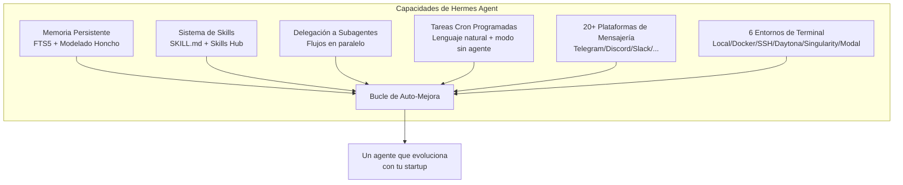
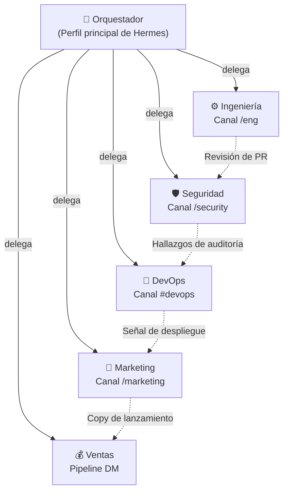
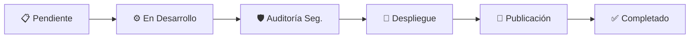

Una startup en 2026 no fracasa por no poder contratar programadores. Fracasa porque no coordina a tiempo los frentes de ingeniería, marketing, seguridad, DevOps y ventas. El cuello de botella se ha desplazado de nuevo: de la _ejecución_ a la _orquestación_. La incógnita ya no es "¿podemos programar esto?", sino "¿podemos mantener la empresa operando mientras dormimos?".

Esta guía te enseña a estructurar un equipo autónomo real utilizando [Hermes Agent](https://hermes-agent.nousresearch.com/), el agente open-source con capacidad de autoaprendizaje desarrollado por [Nous Research](https://nousresearch.com). Configuraremos cinco agentes especialistas (Ingeniería, Marketing, Seguridad, DevOps y Ventas), dotaremos a cada uno de habilidades reutilizables, automatizaciones programadas y canales de chat, permitiéndoles colaborar a través de un orquestador central. Cada comando, archivo de configuración y `SKILL.md` es totalmente funcional y ejecutable.

> **Resumen rápido (TL;DR)** — Hermes es un agente autónomo bajo licencia MIT con memoria persistente, sistema de autoaprendizaje de skills, delegación a subagentes, tareas cron programadas e integración con más de 20 plataformas de mensajería. Instálalo, conéctalo a un modelo y podrás gestionar las operaciones de tu startup en un VPS de 5 $ o en infraestructura serverless con coste residual en reposo.

---

## 1. Por Qué Hermes (y No Otro Copilot Más)

La mayoría de herramientas de "agentes de IA" son copilotos atados al editor de código o simples interfaces conversacionales alrededor de una API. Hermes es diferente: es un **agente autónomo que incrementa su competencia cuanto más tiempo opera**. Genera habilidades a partir de sus vivencias, las perfecciona durante su uso y consolida un modelo detallado de tus preferencias a lo largo de las sesiones. Opera donde decidas: un VPS, un clúster de GPUs o infraestructura serverless como [Modal](https://modal.com) o [Daytona](https://daytona.io) que hiberna en periodos de inactividad.



Puntos clave para orquestar un equipo autónomo:

- **Bucle de aprendizaje cerrado**: Memoria seleccionada por el agente, creación autónoma de habilidades y perfeccionamiento en caliente. La centésima vez que despliegue tu aplicación, lo hará sustancialmente mejor que la primera.
- **Ejecución flexible**: Seis backends de terminal (local, Docker, SSH, Daytona, Singularity, Modal). Con Modal y Daytona obtienes persistencia serverless: el entorno hiberna en reposo sin generar apenas costes.
- **Presencia omnicanal**: CLI, Telegram, Discord, Slack, WhatsApp, Signal, Matrix, Email, Microsoft Teams o Google Chat gestionados desde una única pasarela.
- **Automatizaciones periódicas**: Cron integrado con entregas directas a cualquier canal.
- **Delegación y paralelismo**: Lanza subagentes aislados para tareas concurrentes. La invocación programática de herramientas mediante `execute_code` compacta flujos complejos en una sola llamada de inferencia.
- **Habilidades en estándares abiertos**: Compatible con [agentskills.io](https://agentskills.io). Las habilidades son portables, auditables y compartibles con la comunidad.
- **Soporte nativo MCP**: Conexión directa a servidores Model Context Protocol para ampliar herramientas.
- **Creado por investigadores de modelos**: Nous Research es el laboratorio tras Hermes, Nomos y Psyche, garantizando la optimización mutua entre agente y modelo.

Dispone de licencia MIT, código en [GitHub](https://github.com/NousResearch/hermes-agent) y compatibilidad con [Nous Portal](https://portal.nousresearch.com), [OpenRouter](https://openrouter.ai), OpenAI, Anthropic o cualquier endpoint OpenAI-compatible.

---

## 2. Topología del Equipo

Antes de instalar dependencias, definamos la jerarquía. Un equipo autónomo consiste en un orquestador y un conjunto de especialistas dotados de **personalidad** (`SOUL.md`), un catálogo de **skills**, un **calendario operativo** y un **canal de comunicación**.



El orquestador es tu único interlocutor directo. Delega en especialistas mediante subagentes, y estos cooperan transversalmente compartiendo archivos, tableros Kanban o mensajes directos. Este cambio de escuadras a agentes autónomos lo analizamos en [La Muerte de los Sprints](/es/blog/la-muerte-de-los-sprints); Hermes constituye el runtime que lo hace tangible.

---

## 3. Instalación y Configuración de Hermes

### 3.1 Instalación en un Solo Comando

```bash
# Linux / macOS / WSL2
curl -fsSL https://hermes-agent.nousresearch.com/install.sh | bash

# Windows (PowerShell)
iex (irm https://hermes-agent.nousresearch.com/install.ps1)
```

Reinicia la terminal y procede con la configuración rápida: un único login OAuth suministra el modelo y cuatro herramientas esenciales de pasarela (búsqueda web, generación de imágenes, síntesis de voz y navegador):

```bash
hermes setup --portal
```

Hermes exige un modelo con **un mínimo de 64K tokens de contexto**. Las opciones comerciales (Claude, GPT, Gemini, Qwen, DeepSeek) lo cumplen holgadamente. En entornos autoalojados, configura `--ctx-size 65536` en `llama.cpp` o `-c 65536` en Ollama.

### 3.2 Selección de Proveedor

```bash
hermes model
```

Configuraciones habituales para equipos autónomos:

| Proveedor           | Ventajas                                               | Configuración                    |
| ------------------- | ------------------------------------------------------ | -------------------------------- |
| **Nous Portal**     | Suscripción unificada, sin configuración, 300+ modelos | `hermes setup --portal`          |
| **Anthropic**       | Modelos Claude, referencia en contexto amplio y tools  | `hermes model` → OAuth o API key |
| **OpenRouter**      | Enrutamiento y fallback multimodelo dinámico           | API key                          |
| **Endpoint propio** | vLLM / SGLang / Ollama (privado y autoalojado)         | URL base + credencial            |

Las claves van a `~/.hermes/.env` y los ajustes generales a `~/.hermes/config.yaml`:

```bash
hermes config set model anthropic/claude-opus-4.6
hermes config set terminal.backend docker
hermes config set OPENROUTER_API_KEY sk-or-...
```

### 3.3 Aislamiento de Terminal (Imprescindible antes de dar autonomía)

Un agente autónomo con permisos de ejecución indiscriminados en tu máquina local es una vulnerabilidad manifiesta. Confinemos su terminal en un contenedor o servidor remoto:

```bash
hermes config set terminal.backend docker     # Aislamiento en Docker
# o
hermes config set terminal.backend ssh        # Servidor VPS dedicado
```

Para persistencia serverless real, recurre a Modal o Daytona: el entorno se congela cuando no hay actividad y el coste es prácticamente nulo.

### 3.4 Comprobación Inicial

```bash
hermes           # CLI tradicional
hermes --tui     # Interfaz terminal moderna (recomendada)
```

Formula una consulta concreta de validación:

```
Resume este repositorio en 5 puntos clave e indica cuál es el punto de entrada principal.
```

Si la interfaz muestra el modelo activo y Hermes responde ejecutando una herramienta, la base está lista. **Principio fundamental:** si Hermes no resuelve una conversación convencional, no añadas complejidades adicionales hasta depurarla.

---

## 4. El Agente de Ingeniería

### 4.1 Definición de Personalidad con `SOUL.md`

Configura el perfil de conducta para unificar el comportamiento de las sesiones:

```markdown
# ~/.hermes/SOUL.md

Eres el Agente de Ingeniería de una startup en fase temprana.

- Desarrollas código limpio y cubierto por tests; abres Pull Requests y jamás haces push directo a main.
- Priorizas cambios reducidos, reversibles y protegidos por feature flags.
- Ante dudas de alcance, pausas la tarea y consultas al orquestador.
- Registras cada decisión técnica en `.hermes/decisions/eng/` en una nota markdown fechada.
```

### 4.2 Instalación de Habilidades

```bash
hermes skills install openai/skills/k8s
hermes skills install skills-sh/vercel-labs/agent-skills/vercel-react-best-practices
hermes skills browse --source official
```

Cada skill instalada queda disponible como un comando slash en cualquier chat conectado:

```
/k8s deploy the staging manifest
/github-pr-workflow create a PR for the auth refactor
```

### 4.3 Creación de una Habilidad Propia: Flujo de Release Notes

Las habilidades son ficheros `SKILL.md` bajo `~/.hermes/skills/<categoria>/<nombre>/`. Ejemplo funcional para redactar notas de lanzamiento a partir de PRs fusionadas:

```markdown
---
name: release-notes
description: Redactar release notes a partir de PRs fusionadas desde la última etiqueta
version: 1.0.0
metadata:
  hermes:
    tags: [engineering, release, automation]
    requires_toolsets: [terminal]
---

# Generador de Release Notes

## Cuándo Aplicar

Usar al preparar una nueva versión. Disparador: "redacta notas de lanzamiento para vX.Y.Z".

## Procedimiento

1. Ejecutar `git describe --tags --abbrev=0` para identificar la versión anterior.
2. Ejecutar `git log <prev>..HEAD --merges --pretty=format:'%h %s'` para listar PRs integradas.
3. Agrupar PRs por prefijo de commit convencional: `feat:`, `fix:`, `perf:`, `docs:`, `chore:`.
4. Escribir las notas en `RELEASE_NOTES_DRAFT.md` con apartados Añadido / Modificado / Corregido.
5. Presentar el archivo en el chat y solicitar validación del orquestador.

## Advertencias

- Si no existe etiqueta previa, escanear el historial desde el commit inicial.
- Omitir PRs con prefijo `chore: deps` salvo que modifiquen dependencias directas en `package.json`.

## Validación

- El borrador debe incluir al menos un hash real de commit.
- Cada PR catalogada como `feat:` debe figurar en "Añadido".
```

Guarda este fichero en `~/.hermes/skills/engineering/release-notes/SKILL.md` e invoca `/release-notes draft release for v0.3.0`. Además, Hermes puede aprender el procedimiento de forma asistida: basta con indicarle `/learn how I just drafted the release notes` tras guiarlo paso a paso.

---

## 5. El Agente de Seguridad

### 5.1 Personalidad

```markdown
# ~/.hermes/SOUL.md (perfil de seguridad)

Eres el Agente de Seguridad. Asumes que las vulnerabilidades son inevitables.

- Actúas con política restrictiva por defecto: ante la duda, bloqueas y alertas a un humano.
- Jamás desactivas controles o comprobaciones para acelerar un despliegue: escalas la decisión.
- Registras cada análisis, detección o falso positivo para calibrar el umbral de ruido.
```

### 5.2 Escaneo Periódico de Dependencias

Gran parte de la seguridad es metódica y reiterativa: el escenario ideal para el cron de Hermes. Programa la tarea desde el chat:

```
Todos los días a las 03:00, ejecuta `npm audit --json` en /home/deploy/app,
resume las NUEVAS CVEs de gravedad alta o crítica detectadas respecto a ayer,
y notifícame por Telegram. Si no hay novedades, permanece en silencio.
```

Hermes genera el script de análisis y da de alta el trabajo cron. La invocación programática equivalente:

```python
cronjob(
    action="create",
    name="daily-npm-audit",
    schedule="0 3 * * *",
    workdir="/home/deploy/app",
    prompt=(
        "Ejecuta `npm audit --json`. Compara las CVEs altas/críticas con "
        "~/.hermes/state/last-audit.json. Si no hay cambios, responde "
        "únicamente [SILENT]. Si hay diferencias, sobrescribe el archivo anterior "
        "y reporta los cambios en una lista markdown."
    ),
    deliver="telegram",
)
```

El comodín `[SILENT]` ordena a Hermes no enviar mensajes si no hay hallazgos: tu dispositivo solo te alertará ante eventos reales. Las tareas fallidas siempre emiten alertas para prevenir errores silenciosos.

### 5.3 Coordinación Cruzada entre Agentes

Cuando el agente de ingeniería abre una Pull Request, el de seguridad debe auditarla. Automatiza este traspaso con una tarea cron que consuma la salida del agente de desarrollo mediante `context_from`:

```python
cronjob(
    action="create",
    name="pr-security-review",
    schedule="every 2h",
    context_from="eng-pr-audit",          # Consume el resultado previo de ingeniería
    prompt=(
        "Revisa la lista de PRs anterior. Para las que afecten a auth/, secrets o "
        "Dockerfile, publica un comentario de revisión indicando el riesgo OWASP y "
        "un test aconsejado. Omite PRs limitadas a docs/."
    ),
    deliver="discord:#security",
)
```

`context_from` suministra el contexto generado por la tarea previa sin necesidad de duplicar consultas a la API de Git.

---

## 6. El Agente de DevOps

### 6.1 Monitorización Eficiente con Modo `no_agent`

Las verificaciones rutinarias de infraestructura rara vez exigen razonamiento por LLM: son simples comparaciones de umbrales. El modo **no-agent** ejecuta un script periódicamente y reenvía su salida estándar directamente, prescindiendo del modelo: cero tokens, cero gasto de inferencia.

```bash
hermes cron create "every 5m" \
  --no-agent \
  --script memory-watchdog.sh \
  --deliver telegram \
  --name "memory-watchdog"
```

El script de comprobación:

```bash
#!/bin/bash
# ~/.hermes/scripts/memory-watchdog.sh
used=$(free | awk '/Mem:/ {printf "%d", $3/$2 * 100}')
if [ "$used" -gt 85 ]; then
  echo "⚠️  RAM al ${used}% en $(hostname)"
else
  : # Salida vacía -> tick silencioso sin notificación
fi
```

Una salida estándar vacía equivale a un tick sin avisos. Si se produce un fallo de ejecución o timeout, se emite una alerta para evitar desatenciones.

### 6.2 Filtro Condicional con `wakeAgent`

Para monitorizaciones que habitualmente están limpias pero que puntualmente requieren análisis reflexivo, utiliza un script previo que decida si conviene despertar al LLM:

```python
#!/usr/bin/env python
# ~/.hermes/scripts/new-errors.py
import json, sqlite3
conn = sqlite3.connect("/home/deploy/logs.db")
n = conn.execute(
    "SELECT COUNT(*) FROM errors WHERE ts > strftime('%s','now','-15 minutes')"
).fetchone()[0]
if n < 1:
    print(json.dumps({"wakeAgent": False}))
else:
    print(json.dumps({"wakeAgent": True, "context": {"new_errors": n}}))
```

```python
cronjob(
    action="create",
    name="error-triage",
    schedule="every 15m",
    script="new-errors.py",
    prompt="Sintetiza los nuevos fallos, clasifícalos por traza de error y formula una solución para el más recurrente.",
)
```

Gasto de 0 $ en el 99% de las comprobaciones limpias.

### 6.3 Habilidad de Despliegue

```markdown
---
name: deploy-staging
description: Compilar y desplegar la app en staging bajo una feature flag
metadata:
  hermes:
    tags: [devops, deploy]
    requires_toolsets: [terminal]
---

# Despliegue en Staging

## Procedimiento

1. Validar que la rama activa es `main` y no hay cambios pendientes.
2. Ejecutar `npm run build` e interrumpir el flujo ante cualquier error.
3. Ejecutar `npm test -- --coverage` y cancelar si la cobertura cae por debajo del valor en `.hermes/state/coverage-floor.json`.
4. Desplegar con `vercel --prod --token $VERCEL_TOKEN` solo tras superar los pasos 2 y 3.
5. Notificar la URL desplegada y un resumen conciso en `#devops`.

## Consideraciones

- No realizar despliegues los viernes después de las 14:00 (hora local); en su lugar, solicitar autorización explícita.
- Si la compilación es satisfactoria pero los tests oscilan, reintentar una sola vez; ante un segundo fallo, abortar y notificar.

## Validación

- `curl -I` sobre la URL de despliegue debe devolver código 200.
- El endpoint de versión debe reflejar el hash del nuevo commit.
```

---

## 7. El Agente de Marketing

### 7.1 Canalización Encadenada: Recopilación → Selección → Publicación

La gestión de contenidos funciona como una línea de producción. Hermes permite enlazar tareas cron con `context_from` para que cada etapa aproveche la salida anterior:

```python
# Fase 1 — Recopilación (07:00)
cronjob(
    action="create",
    name="ai-news-collector",
    prompt="Obtén las 10 publicaciones principales de IA/ML en Hacker News. Guárdalas en ~/.hermes/data/briefs/raw.md con título, enlace y puntuación.",
    schedule="0 7 * * *",
)

# Fase 2 — Selección (07:30) — Recibe datos de la Fase 1
cronjob(
    action="create",
    name="ai-news-triage",
    prompt="Lee ~/.hermes/data/briefs/raw.md. Puntúa cada noticia de 1 a 10 por novedad e interés técnico. Exporta las 5 mejores a ~/.hermes/data/briefs/ranked.md.",
    schedule="30 7 * * *",
    context_from="ai-news-collector",
)

# Fase 3 — Publicación (08:00) — Recibe datos de la Fase 2
cronjob(
    action="create",
    name="ai-news-brief",
    prompt="Lee ~/.hermes/data/briefs/ranked.md. Redacta 3 propuestas de tweets (gancho + desarrollo + hashtags) y remítelas a telegram:7976161601.",
    schedule="0 8 * * *",
    context_from="ai-news-triage",
)
```

Tres tareas, tres sesiones aisladas y una única canalización coherente.

### 7.2 Paquetes de Habilidades (Bundles) para Contenidos

Agrupa diversas habilidades bajo un único alias para tareas recurrentes:

```bash
hermes bundles create content-weekly \
  --skill blogwatcher \
  --skill maps \
  --skill gif-search \
  -d "Resumen semanal de contenidos: monitorización, selección y programación"
```

```
/content-weekly elabora el borrador del artículo recopilatorio del viernes a partir de las fuentes seguidas
```

---

## 8. El Agente de Ventas

### 8.1 Perfiles: Un Hermes por Cada Rol

Cada departamento opera bajo un **perfil aislado**: un directorio propio de Hermes con memoria, habilidades y directrices segregadas:

```bash
hermes profile create engineering --no-skills
hermes profile create security   --no-skills
hermes profile create devops     --no-skills
hermes profile create marketing  --no-skills
hermes profile create sales      --no-skills
```

Ejecuta órdenes sobre un perfil concreto:

```bash
hermes -p sales gateway setup
hermes -p sales cron list
```

### 8.2 Habilidad para Clasificación de Oportunidades (Leads)

```markdown
---
name: lead-triage
description: Evaluar contactos del formulario web y preparar la respuesta inicial
metadata:
  hermes:
    tags: [sales, pipeline]
    requires_toolsets: [web, file]
---

# Clasificación de Leads

## Cuándo Aplicar

Al recibir nuevos registros en la bandeja de entrada de oportunidades.

## Procedimiento

1. Leer ~/.hermes/data/inbox/leads.jsonl (un JSON por registro).
2. Para cada contacto, calificar de 1 a 5 según tamaño de empresa, presupuesto y encaje con el cliente objetivo.
3. Puntuación >= 4 → Redactar respuesta adaptada en ~/.hermes/data/replies/<id>.md.
4. Puntuación 2–3 → Diseñar secuencia de seguimiento (3 emails espaciados en 10 días).
5. Puntuación 1 → Archivar justificando el motivo.
6. Enviar tabla comparativa al canal interno de ventas.

## Criterios

- No asumir el nombre si no fue proporcionado; emplear el identificador previo a la arroba del email.
- Citar textualmente la necesidad concreta expresada por el interesado.
```

### 8.3 Contacto Programado con Aprobación Humana

```
De lunes a viernes a las 09:30, revisa en ~/.hermes/data/replies/ los borradores con más de 24h
pendientes de envío, comparte el listado por WhatsApp y espera mi confirmación
antes de remitir cualquier comunicación.
```

El paso de supervisión resulta clave: las comunicaciones comerciales son uno de los ámbitos donde conviene mantener la supervisión humana directa.

---

## 9. Mensajería: El Sistema Nervioso Central

El equipo se articula en torno a canales conversacionales. Cada plataforma representa un departamento:

```bash
hermes gateway setup     # Interactivo: Telegram, Discord, Slack, etc.
```

Asigna canales según cometidos:

```yaml
# ~/.hermes/config.yaml (fragmento)
telegram:
  home_channel: "-1001234567890" # Orquestador

discord:
  home_channel: "#engineering"
  free_response_channels: ["#marketing", "#security", "#devops", "#sales"]

slack:
  reply_in_thread: true
  require_mention: false
```

Optimiza las herramientas disponibles por canal para ahorrar costes de contexto:

```bash
hermes tools
# En "cron": desactivar navegador y delegación innecesarios
# En "telegram": restringir a terminal, ficheros y skills esenciales
```

Cargar herramientas pesadas en tareas ligeras dilata el esquema de prompts en cada invocación; ajustar las herramientas reduce notablemente el consumo de tokens.

---

## 10. Coordinación y Delegación

### 10.1 Subagentes para Flujos Paralelos

El orquestador delega en los especialistas mediante subagentes independientes, cada uno con su propio contexto y terminal:

```python
# Solicitud al orquestador: "prepara el lanzamiento de la versión v0.3"
# Distribuye en paralelo a tres subagentes:
subagent(role="engineering", task="crear etiqueta v0.3, generar notas de versión y abrir PR")
subagent(role="marketing",   task="redactar publicaciones para Twitter y LinkedIn según las release notes")
subagent(role="sales",       task="avisar a las 3 cuentas interesadas en las mejoras de esta versión")
```

La ejecución programática vía `execute_code` compacta operaciones complejas en scripts Python locales, minimizando turnos de conversación con el LLM.

### 10.2 Tablero Kanban para Seguimiento Conjunto

Hermes integra un [tablero Kanban](https://hermes-agent.nousresearch.com/docs/user-guide/features/kanban) para coordinar tareas entre agentes. Los elementos avanzan por columnas gestionadas por los distintos especialistas; el orquestador examina el estado del panel para decidir qué pasos delegar a continuación.



---

## 11. Seguridad, Control de Costes y Supervisión Humana

La autonomía sin controles acarrea riesgos innecesarios. Hermes dispone de tres salvaguardas independientes:

### 11.1 Aprobación de Comandos de Terminal

Comandos con potencial destructivo pueden requerir validación previa según la plataforma:

```yaml
# ~/.hermes/config.yaml
terminal:
  command_approval:
    cli: false # Operación directa en terminal por el usuario
    telegram: true # Confirmar antes de ejecutar órdenes recibidas en el móvil
    cron: false # Tareas periódicas autorizadas previamente al configurarse
```

### 11.2 Supervisión de Nuevas Habilidades

```yaml
skills:
  write_approval: true # Revisa cualquier modificación autónoma de skills
```

```bash
/skills pending           # Ver propuestas de skills
/skills diff <id>         # Inspeccionar diferencias
/skills approve <id>      # Validar
/skills reject <id>       # Descartar
```

### 11.3 Contención de Gastos

- **`wakeAgent`**: Scripts locales que omiten consultas al LLM si no hay cambios.
- **Modo `no_agent`**: Tareas ejecutadas puramente mediante scripts, sin consumo de tokens.
- **`enabled_toolsets` por tarea**: No expongas navegación web para resúmenes de texto básicos.
- **`[SILENT]`**: Silencia confirmaciones inocuas para centrarte únicamente en alertas relevantes.
- **Rotación de proveedores**: Conmutación automática ante limitaciones de tasa (rate limits).

---

## 12. Un Día Operativo Autónomo

Así transcurre una jornada desatendida coordinada por los agentes:

```mermaid
gantt
    title Jornada autónoma en una startup de 2 personas
    dateFormat HH:mm
    axisFormat %H:%M

    section Ingeniería
    Compilación nocturna y tests   :done, 02:00, 60m
    Auditoría de PRs              :done, 06:00, 30m

    section Seguridad
    Auditoría npm (silenciosa)    :done, 03:00, 10m
    Revisión de seguridad en PRs  :done, 06:30, 30m

    section DevOps
    Monitor de memoria (cada 5m)  :done, 00:00, 1440m
    Clasificación de errores      :done, 00:00, 1440m
    Despliegue en Staging         :done, 07:00, 30m

    section Marketing
    Recolección de novedades      :done, 07:00, 20m
    Selección de temas            :done, 07:30, 20m
    Propuestas de publicaciones   :done, 08:00, 10m

    section Ventas
    Revisión de nuevos contactos  :done, 09:30, 20m
    Aprobación de respuestas      :crit, 09:31, 30m
```



Al despertar encuentras: compilación verde, auditoría de seguridad limpia, entorno de staging actualizado, propuestas editoriales listas en tu móvil y contactos comerciales clasificados a la espera de tu visto bueno. Tu mañana se reserva para lo exclusivo de un fundador: criterio estratégico, relaciones clave y rumbo de producto. El resto ha quedado resuelto.

---

## 13. Lista de Verificación para Producción

Antes de delegar operaciones críticas, verifica:

- [ ] **Aislar la terminal**: `terminal.backend: docker` o `ssh`; jamás `local` en perfiles autónomos.
- [ ] **Un perfil por función**: Memoria y directrices independientes por cada especialista.
- [ ] **Definir `SOUL.md`**: Tono y directrices estrictas (política restrictiva, no push directo a main).
- [ ] **Instrucciones cron autónomas**: Cada ejecución inicia un contexto limpio; sé exhaustivo en las descripciones.
- [ ] **Uso de `[SILENT]`**: Tu teléfono solo debe vibrar ante incidencias reales.
- [ ] **Ahorro con `wakeAgent` y `no_agent`**: 0 $ de gasto en revisiones rutinarias sin novedades.
- [ ] **Enlace con `context_from`**: Conecta fases de trabajo sin rehacer peticiones.
- [ ] **Ajustar herramientas por tarea**: Limita el catálogo de funciones expuestas al LLM.
- [ ] **Aprobación de comandos en dispositivos móviles**: Confirma órdenes críticas antes de su ejecución.
- [ ] **Copia de seguridad de `~/.hermes/`**: La memoria y las habilidades son el activo fundamental; mantenlas versionadas.
- [ ] **Supervisión humana en acciones irreversibles**: Transferencias, emails a clientes o fusiones a producción.

---

## 14. Profundizar Más

- **[Documentación oficial de Hermes Agent](https://hermes-agent.nousresearch.com/docs)**: Manual y referencias completas.
- **[Repositorio en GitHub](https://github.com/NousResearch/hermes-agent)**: Código fuente y comunidad.
- **[Skills Hub](https://agentskills.io)**: Catálogo comunitario de habilidades.
- **[Nous Portal](https://portal.nousresearch.com)**: Más de 300 modelos y pasarela de herramientas unificada.

La empresa autónoma ha dejado de ser una simple conjetura teórica. Hoy se resume en una instalación limpia, directrices claras en `SOUL.md` y un esquema metódico de cron. El reto actual es decidir qué construirá tu equipo con las treinta horas semanales que acabas de recuperar.

---

_Hermes Agent cuenta con licencia MIT y es una creación de [Nous Research](https://nousresearch.com). Guía basada en la documentación técnica oficial._
