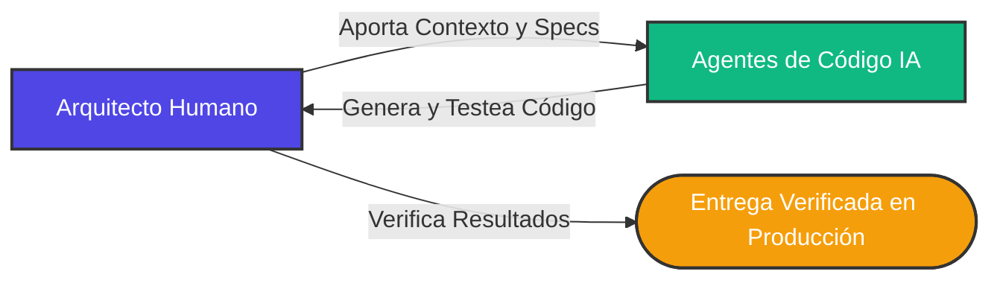

Durante casi dos décadas, la industria de la ingeniería de software ha operado bajo un dogma compartido: **Agile**. Concretamente, los marcos Scrum y Kanban —con sus sprints de dos semanas, daily standups, estimaciones en story points y sesiones de refinamiento de backlog— se convirtieron en el sistema operativo por defecto para entregar software.

Sin embargo, estamos presenciando un cambio tectónico. Con la integración de agentes de código y modelos de razonamiento avanzado como GPT-5.6 Sol, **los marcos ágiles tradicionales y las jerarquías rígidas de squads se están volviendo obsoletos.**

Los sprints, los rituales de estimación y el seguimiento pormenorizado de tareas ya no se perciben como motores de productividad, sino como **cuellos de botella de coordinación humana.**

Analicemos por qué Agile tradicional fracasa en la era de la IA, cómo se define el nuevo paradigma del "software por resultados" y por qué metodologías como **Shape Up** (creada por Basecamp) emergen como la forma dominante de liderar equipos de ingeniería aumentados por IA.

---

## 1. El Desajuste de Velocidad en Agile

Scrum y Kanban nacieron para gestionar una limitación física: **la coordinación y la velocidad a escala humana.** Las personas necesitamos cadencias predecibles, sincronizaciones periódicas y fronteras nítidas para evitar el agotamiento y mantener la alineación. Se eligieron los sprints de dos semanas porque representan un ciclo razonable para que un grupo de personas se comprometa con un alcance, escriba el código, haga pruebas manuales y prepare un despliegue.

Los agentes de IA no tienen esas restricciones. Operan a velocidad de máquina:

```yaml
Ingeniero Humano: Diseña y escribe una migración de base de datos + endpoints API en 2 días.
Agente de IA (Modo Ultra): Escribe la misma migración, endpoints, genera tests unitarios y compila el código en 4 minutos.
```

Cuando la velocidad de ingeniería se multiplica por órdenes de magnitud, un ciclo de dos semanas parece una eternidad. Los Product Managers acaban redactando historias de usuario para funcionalidades que los agentes programan en el tiempo que cuesta abrir el ticket en Jira. El sprint backlog se transforma en un "libro de historia": un registro de lo que ya se construyó, más que un plan de lo que se va a construir.

---

## 2. Transición a la Gestión del Contexto y Autonomía Absoluta

En los squads convencionales, la jerarquía sirve para canalizar la comunicación. Un Product Owner fija los requisitos, un Tech Lead define la arquitectura, un project manager hace seguimiento y los desarrolladores ejecutan tickets aislados.

En un equipo potenciado por IA, esta pirámide se desmorona. El cuello de botella ya no es la capacidad bruta de picar código; es la **gestión precisa del contexto.**



La responsabilidad principal del ingeniero pasa de escribir líneas de código a **alimentar el contexto exacto del repositorio, delimitar especificaciones y auditar resultados.**

Dado que los agentes resuelven tareas complejas con autonomía si cuentan con restricciones claras, los ingenieros humanos necesitan **autonomía técnica absoluta** para iterar con rapidez. La microgestión, las reuniones diarias obligatorias y la asignación manual de subtareas generan una fricción inasumible que frena el bucle de retroalimentación de la máquina.

---

## 3. El Paradigma de "Software por Resultados"

El Agile clásico mide el progreso mediante **velocidad** (story points completados por sprint) o **actividad** (horas imputadas). En la era de la IA, estas métricas pierden todo sentido:

- **Los story points son irrelevantes** cuando una refactorización compleja de 13 puntos la resuelve un modelo en segundos.
- **Las líneas de código son contraproducentes** cuando un agente puede escupir miles de líneas redundantes que incrementan la deuda técnica sin aportar valor real.

Entramos de lleno en la era del **Software por Resultados**.

Bajo este enfoque, el rendimiento se juzga con un criterio binario: _¿El código compila, supera las auditorías de seguridad, pasa la suite de tests y resuelve el problema del usuario final?_

Al ser la ejecución (código y tests) rápida y económica, el valor del equipo humano reside en el **juicio crítico y la verificación.** El éxito se mide por la solidez de las pruebas diseñadas para contrastar los resultados y la agilidad con la que el valor llega a producción.

---

## 4. Por qué "Shape Up" Encaja a la Perfección con la IA

Si Scrum y Kanban languidecen, ¿qué los sustituye?

Cada vez más organizaciones técnicas adoptan **Shape Up**, el marco diseñado por Basecamp para otorgar autonomía radical a los equipos manteniendo los proyectos acotados en tiempo. Shape Up divide el ciclo de desarrollo en dos fases bien diferenciadas:

### Fase 1: Dar Forma (Shaping)

Un núcleo reducido de arquitectos senior y líderes de producto dedican unas semanas a "dar forma" al proyecto. No redactan historias de usuario minuciosas ni dibujan wireframes definitivos; definen límites, restricciones técnicas, riesgos críticos y decisiones arquitectónicas esenciales a alto nivel. Fijan un **apetito** (ej. "a esto le dedicamos 2 semanas" o "6 semanas") en lugar de estimar horas de trabajo.

### Fase 2: Construcción (Building)

El proyecto se entrega a un equipo pequeño y multidisciplinar (1 o 2 desarrolladores y un diseñador). Durante el ciclo, **el equipo goza de autonomía total.** No hay daily standups, ni ceremonias de refinamiento, ni tickets de Jira. El equipo decide cómo edificar la solución, utilizando agentes de IA para acelerar la implementación, generar tests y resolver el boilerplate.

### Razones por las que Shape Up triunfa con la IA:

1. **Los Humanos Dan Forma, la IA Construye**: La fase de _Shaping_ requiere intuición de negocio, visión arquitectónica y empatía con el cliente: terrenos donde los humanos destacan. La fase de _Building_ es donde los agentes multiplican la velocidad de ejecución por diez.
2. **Iteración Sin Interrupciones**: Elimina el ruido administrativo constante de las ceremonias ágiles, permitiendo a los ingenieros concentrarse en dirigir a los modelos y validar código en estado de flujo profundo.
3. **Tiempo Fijo, Alcance Variable**: Si un proyecto no concluye en el plazo fijado, no se prolonga indefinidamente: se descarta o reevalúa. Esto obliga a la dupla humano-IA a priorizar la esencia del valor y escribir soluciones minimalistas y limpias, evitando el inflado desmedido de funcionalidades.

---

## 5. Estructura del Squad Nativo de IA

El clásico equipo "Two-Pizza" (6–10 personas) se compacta. El apalancamiento que proporciona la IA permite que 2 o 3 ingenieros entreguen lo que antes requería un departamento entero. Un squad nativo de IA se compone hoy así:

| Rol                                  | Foco Humano                                                              | Foco del Agente / Herramienta IA                                             |
| :----------------------------------- | :----------------------------------------------------------------------- | :--------------------------------------------------------------------------- |
| **Experto de Producto y Dominio**    | Definición de contexto, necesidades de usuario, delimitación de alcance  | Generación de especificaciones, prospección de mercado, borradores iniciales |
| **Arquitecto de Sistemas / Revisor** | Diseño de arquitectura, auditorías de seguridad, verificación de calidad | Refactorización, código boilerplate, generación automatizada de tests        |
| **Líder de Verificación**            | Diseño de suites de prueba para casos límite, salvaguardas CI/CD         | Ejecución de tests, análisis estático (linting), scripts de despliegue       |

Agile cumplió su cometido cuando la coordinación entre humanos era la principal restricción. A medida que los agentes de IA asumen la mecánica de escribir, verificar y desplegar código, el foco debe pasar de **gestionar actividades** a **orquestar la intención.**

Es momento de desterrar la división artificial del trabajo en bloques rígidos de dos semanas, desmontar el sobrecoste ceremonial y empoderar a equipos pequeños y autónomos para entregar software por resultados.
