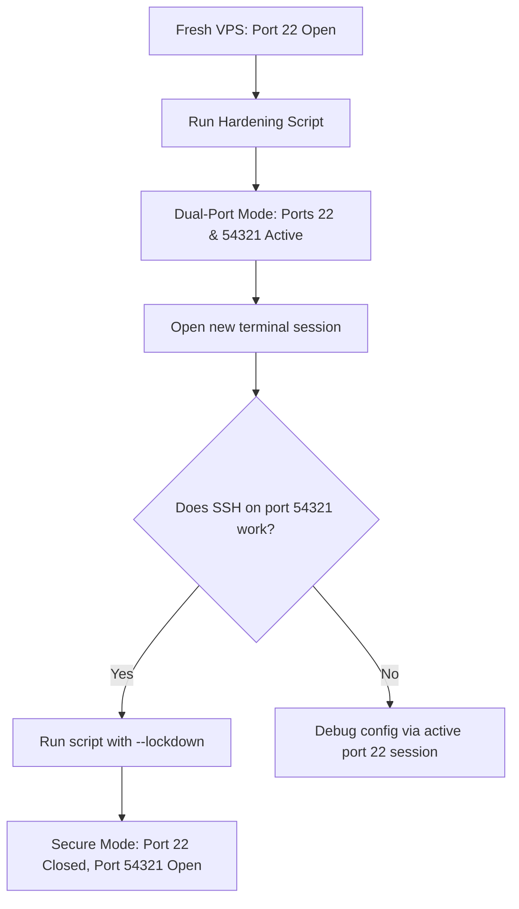

When you provision a new Virtual Private Server (VPS) from a cloud provider (such as DigitalOcean, Hetzner, AWS, or OVH), it is typically delivered with a default configuration. Often, this means a default user account (like `ubuntu`, `debian`, or `admin`), password-based authentication enabled, and port `22` completely exposed to the public internet.

Within minutes of a server going online, automated botnets and malicious scanners will begin targeting port 22 with brute-force attacks. If you leave your VPS in its default state, it is not a matter of _if_ it will be compromised, but _when_.

In this guide, we will break down a production-grade **VPS Hardening and Setup Script**. This script automates server configuration from scratch, transforming a fresh Ubuntu 22.04 or 24.04 LTS instance into a secure, production-ready environment. We will explain the rationale behind every safety check, firewall rule, and kernel parameter, and show you how to execute a safe **dual-port transition** to ensure you never lock yourself out.

---

## The Secure Transition Workflow (Dual-Port Strategy)

One of the greatest fears when hardening SSH or modifying firewalls is locking yourself out of your own server. If you disable password authentication, change the SSH port, and enable a firewall in a single step, any syntax error or configuration mismatch could disconnect your active session and lock you out permanently.

To solve this, the script uses a **Dual-Port Transition Flow**:



1. **Setup Phase (Dual-Port)**: The script provisions a new admin user, configures SSH to listen on **both** the legacy port `22` and a new custom port (e.g., `54321`), and configures the firewall to allow both.
2. **Verification Phase**: You open a new terminal tab and verify that you can connect successfully via the new port using your SSH key.
3. **Lockdown Phase**: Once connection is confirmed, you execute the script with the `--lockdown` flag, which removes the legacy port configuration, closes port `22` on the firewall, and updates brute-force monitors.

---

## Detailed Breakdown of the Hardening Process

Let's go through the 11 core steps executed by the hardening script to see exactly how each layer of security is constructed.

### Step 0: Pre-checks and Safety Assurances

Before making any changes, the script validates that the running user has `root` privileges and checks that SSH keys are correctly in place.

If it needs to create a new administrator user, it first verifies that the source user (e.g. `ubuntu`) has an active `authorized_keys` file. It will clone these public keys to the new user to ensure you can log in immediately. If no keys are detected, the script aborts immediately to prevent passwordless accounts from being locked out.

---

### Step 1: System Packages Update

Keeping system packages up to date is the first line of defense against vulnerabilities (such as kernel exploits or OpenSSH bugs).

```bash
export DEBIAN_FRONTEND=noninteractive
apt-get update -y
apt-get upgrade -y
apt-get install -y curl wget git ca-certificates gnupg ufw fail2ban \
                   unattended-upgrades apt-listchanges \
                   htop ncdu jq rsync
```

By exporting `DEBIAN_FRONTEND=noninteractive`, the script ensures that updates install silently without prompting for human input (which would pause automated scripts). We also install fundamental system management tools like `htop` (process monitor), `ncdu` (disk usage analyzer), `ufw` (firewall), and `fail2ban` (brute-force protection).

---

### Step 2: Provisioning the Administrator User

Logging in directly as the `root` user is a major security risk. Instead, the script creates a dedicated administrator account, configures it for passwordless `sudo` execution, and applies resource limits.

```bash
# Add administrator user
adduser --disabled-password --gecos "" "$SSH_USER"
usermod -aG sudo "$SSH_USER"

# Deploy SSH Keys
install -d -m 700 -o "$SSH_USER" -g "$SSH_USER" "/home/${SSH_USER}/.ssh"
cp "/home/${SOURCE_USER}/.ssh/authorized_keys" "/home/${SSH_USER}/.ssh/authorized_keys"
chown "$SSH_USER:$SSH_USER" "/home/${SSH_USER}/.ssh/authorized_keys"
chmod 600 "/home/${SSH_USER}/.ssh/authorized_keys"
```

#### Why configure resource limits (Ulimits)?

To protect the server from Denial of Service (DoS) attacks or runaway processes that exhaust system resources, we set limits on the maximum number of open files (`nofile`) and active processes (`nproc`) in `/etc/security/limits.d/`:

```ini
admin_user  soft  nofile  65536
admin_user  hard  nofile  131072
admin_user  soft  nproc   4096
admin_user  hard  nproc   8192
```

This prevents database engines or application runtimes (like Node.js or Go) running under the admin user from crashing because they ran out of file descriptors under heavy load.

---

### Step 3: Hostname and Timezone Management

A consistent system time is vital for reading logs and debugging network requests. The script sets the correct timezone (e.g., `Europe/Madrid`) and configures systemd's network time synchronization (`systemd-timesyncd`).

Additionally, it configures cloud-init to preserve the custom hostname across server restarts. In many virtualized cloud environments, cloud-init will overwrite `/etc/hostname` on reboot unless explicitly instructed not to:

```bash
# /etc/cloud/cloud.cfg.d/99-hostname.cfg
preserve_hostname: true
```

---

### Step 4: Swap File Allocation

Many entry-level VPS instances have limited RAM (1GB or 2GB). If your applications spike in memory consumption, the Linux kernel's Out-Of-Memory (OOM) killer will trigger and start terminating crucial processes (like your database or web server).

Allocating a swap file provides emergency virtual memory. The script creates a swap file, configures it to load on boot, and sets `vm.swappiness=10`:

```bash
fallocate -l 4G /swapfile
chmod 600 /swapfile
mkswap /swapfile
swapon /swapfile
echo 'vm.swappiness=10' > /etc/sysctl.d/99-swappiness.conf
```

> **What is Swappiness?** The `vm.swappiness` parameter controls how aggressively the kernel moves memory pages to swap. A default value of `60` will write to disk too often, slowing down SSD performance. Setting it to `10` tells the kernel to only use swap when absolutely necessary to prevent OOM crashes.

---

### Step 5: SSH Hardening

SSH is the primary gateway to your server, making it the most critical component to secure. The script writes a dedicated SSH hardening configuration to `/etc/ssh/sshd_config.d/99-hardening.conf`:

```ini
Port 54321
AddressFamily any

# Authentication Hardening
PasswordAuthentication no
PermitEmptyPasswords no
PermitRootLogin no
KbdInteractiveAuthentication no
PubkeyAuthentication yes
AuthenticationMethods publickey
MaxAuthTries 3
LoginGraceTime 30s
MaxSessions 5

# Allow only the designated admin user
AllowUsers admin_user

# Disable unused features
X11Forwarding no
AllowAgentForwarding no
AllowTcpForwarding local
ClientAliveInterval 300
ClientAliveCountMax 2
Banner /etc/ssh/banner.txt
```

#### Key settings explained:

- **`Port 54321`**: Moves SSH away from the standard port 22, stopping 99% of automated scan bots.
- **`PasswordAuthentication no`**: Completely disables passwords. Only users possessing a registered private key matching `authorized_keys` can connect.
- **`PermitRootLogin no`**: Prevents root login. Attackers must guess your custom username first, doubling the difficulty of an attack.
- **`MaxAuthTries 3`**: Terminates connections after 3 failed key attempts, blocking aggressive brute-force clients.
- **`ClientAliveInterval 300`**: Disconnects inactive SSH clients after 5 minutes of inactivity to prevent abandoned sessions from remaining open.

> **Ubuntu 24.04 Socket Activation Warning:** Ubuntu 24.04 introduces systemd SSH socket activation. By default, `ssh.service` is disabled, and `ssh.socket` listens for connections. This ignores standard port settings in `sshd_config`. The script explicitly disables `ssh.socket` and enables `ssh.service` to ensure port configurations are respected.

---

### Step 6: Firewall Setup & The Docker Bypass Vulnerability

The script configures `ufw` (Uncomplicated Firewall) to block all incoming traffic except HTTP (80), HTTPS (443), and SSH (22 and 54321).

```bash
ufw default deny incoming
ufw default allow outgoing
ufw allow 22/tcp
ufw allow 54321/tcp
ufw allow 80/tcp
ufw allow 443/tcp
ufw --force enable
```

#### ⚠️ The Docker Firewall Bypass Vulnerability

Many developers are unaware that **Docker completely bypasses UFW by default**.

When Docker starts a container with a mapped port (e.g., `docker run -p 8080:80`), it inserts forwarding rules directly into the system's raw `iptables` rules _before_ UFW's rules are evaluated. This means that even if UFW is configured to block port 8080, **it will remain open to the public web**.

To fix this, the script integrates `ufw-docker`, an open-source utility that inserts custom routing rules into the iptables chain. This forces all Docker network traffic to filter through UFW before reaching containers:

```bash
# Apply ufw-docker rules to bind Docker routing to UFW
ufw-docker install
ufw route allow proto tcp from any to any port 80
ufw route allow proto tcp from any to any port 443
systemctl restart ufw
```

Now, mapping a port in Docker will not expose it to the internet unless you explicitly allow it through UFW.

---

### Step 7: Fail2ban Intrusion Prevention

`Fail2ban` scans authentication log files (like `/var/log/auth.log`) for suspicious activity and dynamically updates firewall rules to ban offending IP addresses. The script sets up a local configuration file (`/etc/fail2ban/jail.local`):

```ini
[DEFAULT]
ignoreip = 127.0.0.1/8 ::1
bantime  = 1h
findtime = 10m
maxretry = 3
backend  = systemd
banaction = ufw

[sshd]
enabled  = true
port     = 22,54321
filter   = sshd
```

If an IP address fails to authenticate 3 times within 10 minutes, Fail2ban calls UFW to drop all incoming packets from that IP for 1 hour.

---

### Step 8: Linux Kernel Hardening (Sysctl)

The Linux kernel contains networking parameters that can be tuned to defend against network attacks and TCP/IP stack exploits. The script applies these hardening settings via `/etc/sysctl.d/99-hardening.conf`:

```ini
# Prevent IP Spoofing (Reverse Path Filtering)
net.ipv4.conf.all.rp_filter = 1
net.ipv4.conf.default.rp_filter = 1

# Ignore ICMP Echo Broadcasts (Smurf Attack protection)
net.ipv4.icmp_echo_ignore_broadcasts = 1

# Ignore Redirects (Mitigates Man-in-the-Middle attacks)
net.ipv4.conf.all.accept_redirects = 0
net.ipv4.conf.default.accept_redirects = 0
net.ipv4.conf.all.send_redirects = 0
net.ipv4.conf.default.send_redirects = 0

# Disable Source Routing (Prevents attackers from routing packets)
net.ipv4.conf.all.accept_source_route = 0

# Enable SYN Cookies (Mitigates SYN Flood DoS attacks)
net.ipv4.tcp_syncookies = 1

# Restrict Kernel Pointer Access (Shields memory addresses from exploits)
kernel.kptr_restrict = 2
kernel.dmesg_restrict = 1
kernel.randomize_va_space = 2
```

#### Key protections:

- **`rp_filter` (Reverse Path Filter)**: Verifies that the source IP address of an incoming packet is reachable via the interface it arrived on. This blocks spoofed source IP packets.
- **`tcp_syncookies`**: When the server experiences a SYN flood attack (fake connections designed to fill up the connection queue), it stops allocating resources to new connections. Instead, it embeds connection details in the response packet's sequence number (a "cookie"), verifying the connection only when the client responds.
- **`kptr_restrict` & `dmesg_restrict`**: Restricts regular users from viewing kernel memory pointers or kernel logs, preventing local users from finding vulnerabilities to perform privilege escalation.

---

### Step 9: Systemd Journald Log Rotation

If your application experiences an error loop or is targeted by a high-volume request attack, log files can grow rapidly and consume all available disk space. When disk space reaches 100%, services like databases will immediately halt or corrupt.

The script limits `journald` logs to a maximum of **500MB** and retains them for a maximum of **30 days**:

```ini
# /etc/systemd/journald.conf.d/99-size-limit.conf
[Journal]
SystemMaxUse=500M
SystemKeepFree=1G
MaxRetentionSec=30day
```

---

### Step 10: Automated Security Upgrades

Manual patching is easily forgotten. The script configures `unattended-upgrades` to automatically install security updates as soon as they are published.

Furthermore, it configures automated, non-disruptive reboots at **04:00 AM** if an installed security update requires a system reboot (such as a kernel update):

```ini
// /etc/apt/apt.conf.d/51-auto-reboot.conf
Unattended-Upgrade::Automatic-Reboot "true";
Unattended-Upgrade::Automatic-Reboot-WithUsers "true";
Unattended-Upgrade::Automatic-Reboot-Time "04:00";
Unattended-Upgrade::Remove-Unused-Dependencies "true";
```

---

### Step 11: Locking Default Accounts

Once the new administrator account is verified, the default provider account is no longer needed. Leaving it active is an unnecessary risk. The script locks the default user password and disables its login shell:

```bash
usermod -L "$SOURCE_USER"
usermod -s /usr/sbin/nologin "$SOURCE_USER"
```

This ensures that only your secure admin user can log into the server.

---

## How to Implement this Script on Your Server

Here is the complete, generalized setup script. Save this code as `setup_vps.sh` on your server.

### The Complete Hardening Script

```bash
#!/bin/bash

# =============================================================================
#  DevSecOps Hardening Script for Ubuntu VPS (22.04 / 24.04 LTS)
# =============================================================================

set -euo pipefail

# ========= CONFIGURATION =========
NEW_SSH_PORT=54321              # Custom SSH port (1024-65535)
SSH_USER="admin_user"          # New administrative username
SOURCE_USER="ubuntu"           # Default provider user (e.g., ubuntu, debian)
HOSTNAME_NEW="vps.yourdomain.com"
TIMEZONE="UTC"
SWAP_SIZE_GB=4                 # 0 to disable swap file creation
FAIL2BAN_IGNOREIP=""           # Set your home/office IP to prevent accidental bans
LOCK_SOURCE_USER=true          # Lock out default provider user after setup
# =================================

SSHD_HARDENING_CONF="/etc/ssh/sshd_config.d/99-hardening.conf"
SSHD_LEGACY22_CONF="/etc/ssh/sshd_config.d/98-legacy-port22.conf"

log()  { echo -e "\n\033[1;36m➡️  $*\033[0m"; }
ok()   { echo -e "\033[1;32m✅ $*\033[0m"; }
warn() { echo -e "\033[1;33m⚠️  $*\033[0m"; }
err()  { echo -e "\033[1;31m❌ $*\033[0m" >&2; }

need_root() {
  if [ "$EUID" -ne 0 ]; then
    err "Please run as root: sudo bash setup_vps.sh $*"
    exit 1
  fi
}

port_listening() {
  ss -tlnH 2>/dev/null | awk '{print $4}' | grep -qE "[:.]$1\$"
}

# =============================================================================
#  MEMBER: STATUS check
# =============================================================================
if [ "${1:-}" = "--status" ]; then
  echo "=============================================="
  echo "🔍 VPS Security Status Overview"
  echo "=============================================="
  echo "  Hostname     : $(hostname -f 2>/dev/null || hostname)"
  echo "  Admin User   : $(getent passwd "$SSH_USER" >/dev/null && echo "$SSH_USER ✓" || echo "NOT CREATED")"
  echo "  Source User  : $(getent passwd "$SOURCE_USER" | awk -F: '{print $7}' 2>/dev/null || echo "-")"
  echo "  Timezone     : $(timedatectl show -p Timezone --value 2>/dev/null || echo '-')"
  echo "  Swap Space   : $(swapon --show=NAME,SIZE --noheadings 2>/dev/null | tr '\n' ' ')"
  echo "  ssh.service  : $(systemctl is-active ssh 2>/dev/null || echo '-')"
  echo "  Port 22      : $(port_listening 22 && echo 'LISTEN' || echo 'closed')"
  echo "  Port ${NEW_SSH_PORT}  : $(port_listening "$NEW_SSH_PORT" && echo 'LISTEN' || echo 'closed')"
  echo "  Firewall UFW : $(ufw status 2>/dev/null | head -1)"
  echo "  Fail2ban     : $(systemctl is-active fail2ban 2>/dev/null || echo '-')"
  echo "  SSHD Hardened: $([ -f "$SSHD_HARDENING_CONF" ] && echo 'yes' || echo 'no')"
  echo "  Port 22 Open : $([ -f "$SSHD_LEGACY22_CONF" ] && echo 'yes (fallback active)' || echo 'no (lockdown applied)')"
  echo "  ufw-docker   : $([ -x /usr/local/bin/ufw-docker ] && echo 'installed' || echo 'not installed')"
  echo "  Docker status: $(command -v docker &>/dev/null && echo 'installed' || echo 'not detected')"
  echo "=============================================="
  exit 0
fi

# =============================================================================
#  MEMBER: LOCKDOWN mode
# =============================================================================
if [ "${1:-}" = "--lockdown" ]; then
  need_root "$@"
  log "LOCKDOWN: Removing fallback port 22..."

  if ! port_listening "$NEW_SSH_PORT"; then
    err "SSH is NOT listening on ${NEW_SSH_PORT}. Aborting lockdown."
    exit 1
  fi

  if [ -f "$SSHD_LEGACY22_CONF" ]; then
    rm -f "$SSHD_LEGACY22_CONF"
    ok "Fallback SSH port config removed."
  fi

  if ! sshd -t; then
    err "SSH configuration validation failed. Reverting."
    exit 1
  fi

  systemctl restart ssh
  sleep 2

  if ! port_listening "$NEW_SSH_PORT"; then
    err "SSH stopped listening on ${NEW_SSH_PORT}! Restoring port 22 access."
    echo "Port 22" > "$SSHD_LEGACY22_CONF"
    systemctl restart ssh
    exit 1
  fi

  if port_listening 22; then
    warn "Port 22 is still active. Please check if another service uses it."
  else
    ok "Port 22 SSH connection closed."
  fi

  if command -v ufw &>/dev/null && ufw status | grep -q "Status: active"; then
    yes | ufw delete allow 22/tcp 2>/dev/null || true
    ok "UFW rule for Port 22 deleted."
  fi

  if [ -f /etc/fail2ban/jail.local ]; then
    sed -i "s/port     = 22,${NEW_SSH_PORT}/port     = ${NEW_SSH_PORT}/" /etc/fail2ban/jail.local
    systemctl restart fail2ban
    ok "Fail2ban updated to monitor port ${NEW_SSH_PORT} only."
  fi

  ok "Lockdown complete. Only secure port ${NEW_SSH_PORT} is open."
  exit 0
fi

# =============================================================================
#  MEMBER: SETUP mode (default)
# =============================================================================
need_root "$@"

log "[0/12] Verifying prerequisites..."
SOURCE_KEYS="/home/${SOURCE_USER}/.ssh/authorized_keys"
TARGET_KEYS="/home/${SSH_USER}/.ssh/authorized_keys"

if ! id "$SSH_USER" &>/dev/null && ! id "$SOURCE_USER" &>/dev/null; then
  err "Neither admin user nor source user exists. Check config variables."
  exit 1
fi

if ! id "$SSH_USER" &>/dev/null; then
  if [ ! -s "$SOURCE_KEYS" ]; then
    err "Creating '${SSH_USER}' failed: source user lacks authorized_keys."
    exit 1
  fi
  ok "Admin user '${SSH_USER}' will be created. Cloning public SSH keys..."
else
  ok "Admin user '${SSH_USER}' already exists."
fi

# 1. Package updates
log "[1/12] Upgrading system packages..."
export DEBIAN_FRONTEND=noninteractive
apt-get update -y
apt-get -o Dpkg::Options::="--force-confdef" -o Dpkg::Options::="--force-confold" upgrade -y
apt-get install -y curl wget git ca-certificates gnupg ufw fail2ban \
                   unattended-upgrades apt-listchanges htop ncdu jq rsync
apt-get autoremove -y

# 2. Setup Admin User
log "[2/12] Creating admin user..."
if ! id "$SSH_USER" &>/dev/null; then
  adduser --disabled-password --gecos "" "$SSH_USER"
fi
usermod -aG sudo "$SSH_USER"

install -d -m 700 -o "$SSH_USER" -g "$SSH_USER" "/home/${SSH_USER}/.ssh"
if [ ! -s "$TARGET_KEYS" ] && [ -s "$SOURCE_KEYS" ]; then
  cp "$SOURCE_KEYS" "$TARGET_KEYS"
fi
chown "$SSH_USER:$SSH_USER" "$TARGET_KEYS"
chmod 600 "$TARGET_KEYS"

echo "${SSH_USER} ALL=(ALL) NOPASSWD:ALL" > "/etc/sudoers.d/90-${SSH_USER}"
chmod 440 "/etc/sudoers.d/90-${SSH_USER}"
visudo -cf "/etc/sudoers.d/90-${SSH_USER}" >/dev/null

# Set ulimits
cat > /etc/security/limits.d/99-${SSH_USER}.conf <<EOF
${SSH_USER}  soft  nofile  65536
${SSH_USER}  hard  nofile  131072
${SSH_USER}  soft  nproc   4096
${SSH_USER}  hard  nproc   8192
root         soft  nofile  65536
root         hard  nofile  131072
EOF
ok "User provisioned and limits set."

# 3. Hostname & Timezone
log "[3/12] Setting hostname and time configuration..."
if [ -d /etc/cloud/cloud.cfg.d ]; then
  cat > /etc/cloud/cloud.cfg.d/99-hostname.cfg <<EOF
preserve_hostname: true
EOF
fi
hostnamectl set-hostname "$HOSTNAME_NEW"
sed -i '/^127\.0\.1\.1[[:space:]]/d' /etc/hosts
echo "127.0.1.1 ${HOSTNAME_NEW} ${HOSTNAME_NEW%%.*}" >> /etc/hosts
timedatectl set-timezone "$TIMEZONE"
systemctl enable --now systemd-timesyncd

# 4. Swap allocation
log "[4/12] Allocating swap memory..."
if [ "$SWAP_SIZE_GB" -gt 0 ] && ! swapon --show | grep -q '/swapfile'; then
  fallocate -l "${SWAP_SIZE_GB}G" /swapfile
  chmod 600 /swapfile
  mkswap /swapfile
  swapon /swapfile
  grep -q '^/swapfile' /etc/fstab || echo '/swapfile none swap sw 0 0' >> /etc/fstab
  echo 'vm.swappiness=10' > /etc/sysctl.d/99-swappiness.conf
fi

# 5. SSH Hardening (Dual-port transition)
log "[5/12] Hardening OpenSSH Server..."
if systemctl is-enabled ssh.socket &>/dev/null; then
  systemctl stop ssh.socket || true
  systemctl disable ssh.socket || true
fi
systemctl enable ssh >/dev/null 2>&1 || true

install -d -m 0755 /run/sshd
cat > /etc/tmpfiles.d/sshd.conf <<'EOF'
d /run/sshd 0755 root root -
EOF

# Disable default cloud config overrides
CL_SSH="/etc/ssh/sshd_config.d/50-cloud-init.conf"
[ -f "$CL_SSH" ] && mv "$CL_SSH" "${CL_SSH}.bak"

# Write Banner
cat > /etc/ssh/banner.txt <<'EOF'
*******************************************************************
  WARNING: Authorized Access Only. All connections are logged.
*******************************************************************
EOF

# Primary hardened drop-in
cat > "$SSHD_HARDENING_CONF" <<EOF
Port ${NEW_SSH_PORT}
AddressFamily any
PasswordAuthentication no
PermitEmptyPasswords no
PermitRootLogin no
KbdInteractiveAuthentication no
PubkeyAuthentication yes
AuthenticationMethods publickey
MaxAuthTries 3
LoginGraceTime 30s
MaxSessions 5
AllowUsers ${SSH_USER}
X11Forwarding no
AllowAgentForwarding no
AllowTcpForwarding local
ClientAliveInterval 300
ClientAliveCountMax 2
Banner /etc/ssh/banner.txt
EOF

# Active fallback port 22
cat > "$SSHD_LEGACY22_CONF" <<'EOF'
Port 22
EOF

if ! sshd -t; then
  err "SSH configuration error. Aborting setup changes."
  rm -f "$SSHD_HARDENING_CONF" "$SSHD_LEGACY22_CONF"
  exit 1
fi
systemctl restart ssh
sleep 2

# 6. Firewall Configuration (UFW)
log "[6/12] Implementing firewall rules..."
ufw --force reset >/dev/null
ufw default deny incoming
ufw default allow outgoing
ufw allow 22/tcp comment 'SSH Legacy Fallback'
ufw allow "${NEW_SSH_PORT}/tcp" comment 'SSH Secured Custom Port'
ufw allow 80/tcp comment 'HTTP Default Web Server'
ufw allow 443/tcp comment 'HTTPS Secure Web Server'
ufw --force enable

# Apply Docker patch if Docker is present
if command -v docker &>/dev/null; then
  log "Docker detected, installing UFW routing rules patch..."
  wget -qO /usr/local/bin/ufw-docker https://raw.githubusercontent.com/chaifeng/ufw-docker/master/ufw-docker
  chmod +x /usr/local/bin/ufw-docker
  ufw-docker install
  ufw route allow proto tcp from any to any port 80
  ufw route allow proto tcp from any to any port 443
  systemctl restart ufw
fi

# 7. Fail2ban setup
log "[7/12] Configuring Fail2ban daemon..."
IP_IGNORE="ignoreip = 127.0.0.1/8 ::1"
[ -n "$FAIL2BAN_IGNOREIP" ] && IP_IGNORE="${IP_IGNORE} ${FAIL2BAN_IGNOREIP}"

cat > /etc/fail2ban/jail.local <<EOF
[DEFAULT]
${IP_IGNORE}
bantime  = 1h
findtime = 10m
maxretry = 3
backend  = systemd
banaction = ufw

[sshd]
enabled  = true
port     = 22,${NEW_SSH_PORT}
filter   = sshd
EOF
systemctl enable fail2ban
systemctl restart fail2ban

# 8. Sysctl Kernel Hardening
log "[8/12] Applying kernel security tweaks..."
cat > /etc/sysctl.d/99-hardening.conf <<'EOF'
net.ipv4.conf.all.rp_filter = 1
net.ipv4.conf.default.rp_filter = 1
net.ipv4.icmp_echo_ignore_broadcasts = 1
net.ipv4.conf.all.accept_redirects = 0
net.ipv4.conf.default.accept_redirects = 0
net.ipv4.conf.all.send_redirects = 0
net.ipv4.conf.default.send_redirects = 0
net.ipv4.conf.all.accept_source_route = 0
net.ipv4.tcp_syncookies = 1
kernel.kptr_restrict = 2
kernel.dmesg_restrict = 1
kernel.randomize_va_space = 2
fs.file-max = 2097152
EOF
sysctl --system >/dev/null

# 9. Log Rotations (journald limits)
log "[9/12] Limiting system logs limits..."
mkdir -p /etc/systemd/journald.conf.d
cat > /etc/systemd/journald.conf.d/99-size-limit.conf <<'EOF'
[Journal]
SystemMaxUse=500M
SystemKeepFree=1G
MaxRetentionSec=30day
EOF
systemctl restart systemd-journald

# 10. Automated security updates
log "[10/12] Scheduling automatic upgrades..."
dpkg-reconfigure -f noninteractive unattended-upgrades
cat > /etc/apt/apt.conf.d/51-auto-reboot.conf <<'EOF'
Unattended-Upgrade::Automatic-Reboot "true";
Unattended-Upgrade::Automatic-Reboot-Time "04:00";
Unattended-Upgrade::Remove-Unused-Dependencies "true";
EOF
systemctl enable --now unattended-upgrades

# 11. Lock source user
log "[11/12] Securing default system users..."
if [ "$LOCK_SOURCE_USER" = "true" ] && id "$SOURCE_USER" &>/dev/null && [ "$SOURCE_USER" != "$SSH_USER" ]; then
  usermod -L "$SOURCE_USER"
  usermod -s /usr/sbin/nologin "$SOURCE_USER"
fi

# 12. Final Overview
log "[12/12] VPS Hardening complete!"
echo "=============================================="
echo "  Secure Port SSH : ${NEW_SSH_PORT}"
echo "  Temporary Port  : 22 (Fallback)"
echo "  Created Admin   : ${SSH_USER}"
echo "=============================================="
warn "CRITICAL STEP:"
echo "1. Verify login from another session: ssh -p ${NEW_SSH_PORT} ${SSH_USER}@$(curl -s https://api.ipify.org)"
echo "2. Once verified, close legacy access: sudo bash setup_vps.sh --lockdown"
echo "=============================================="
```

### Steps to Run

1. **Upload your SSH public key** to the server's default user from your local machine:
   ```bash
   ssh-copy-id -i ~/.ssh/id_ed25519.pub ubuntu@your_vps_ip
   ```
2. **Execute the Setup script** as root:
   ```bash
   sudo bash setup_vps.sh
   ```
3. **Verify the new connection** in a separate terminal window without closing your current session:
   ```bash
   ssh -p 54321 admin_user@your_vps_ip
   ```
4. **Initiate Lockdown** to close port 22 and delete default users:
   ```bash
   sudo bash setup_vps.sh --lockdown
   ```

By implementing this dual-port transition flow along with automated kernel tuning, firewall routing patches, and fail2ban rules, you can feel confident that your Linux infrastructure is fully secured against the noise of the public internet.
