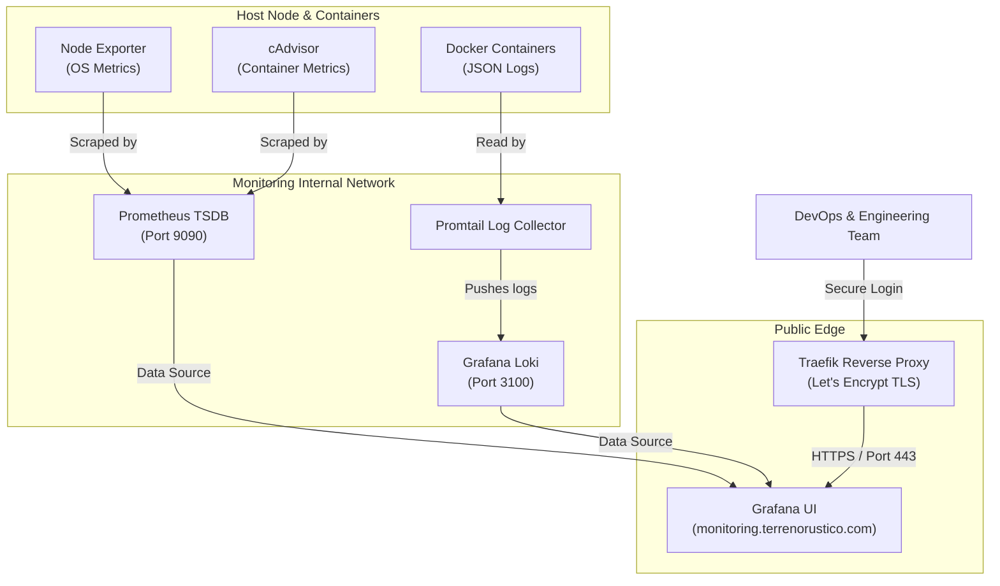

When running high-performance geospatial applications like **[Terreno Rústico](https://terrenorustico.com)**—which processes complex spatial PostGIS queries, Cadastral UTM reprojections, and SIGPAC agricultural data on the fly—system visibility is not optional. A single sluggish database query or unexpected CPU spike during peak usage can directly impair user experience and degrade map rendering performance.

To guarantee maximum availability and sub-second response times, we designed and deployed a centralized, self-hosted observability platform at `monitoring.terrenorustico.com`.

In this article, we break down the exact architecture behind our telemetry stack—combining **Prometheus**, **Loki**, **Promtail**, **Node Exporter**, **cAdvisor**, and **Grafana** behind **Traefik TLS**—and provide a sanitized, production-ready blueprint so you can deploy a similar monitoring infrastructure for your own side projects and production systems.

---

## Observability Goals & Architecture Overview

Our observability setup addresses three core operational pillars:

1. **Host & OS Metrics**: Tracking CPU utilization, RAM pressure, disk I/O, and network bandwidth on the physical VPS.
2. **Container Metrics**: Monitoring individual Docker container resource limits, memory consumption, and restart frequencies.
3. **Centralized Log Aggregation**: Ingesting and querying logs across Fastify/NestJS APIs, PostgreSQL databases, and Traefik reverse proxies without manually SSHing into servers.
4. **Network Security & Isolation**: Ensuring internal metrics and log streams are strictly isolated and never exposed to the public internet.

### Data Flow Diagram

The diagram below illustrates how telemetry data flows securely from host nodes and containers into our centralized Grafana dashboard:



---

## Core Components Breakdown

### 1. Metrics Collection: Prometheus, Node Exporter & cAdvisor

- **Prometheus**: Acts as the central Time Series Database (TSDB). It actively scrapes metrics endpoints at configured intervals (e.g., every 15 seconds) and retains historical data for 30 days.
- **Node Exporter**: A lightweight exporter running on the host OS. It exposes hardware and OS-level statistics (CPU load averages, memory fragmentation, swap usage, disk filesystem capacity).
- **cAdvisor (Container Advisor)**: Developed by Google, cAdvisor auto-discovers all running Docker containers and measures their resource usage, memory limits, network throughput, and CPU throttling.

### 2. Log Aggregation: Loki & Promtail

Instead of indexing every word like Elasticsearch (which consumes massive RAM), **Grafana Loki** indexes metadata labels (such as `container_name`, `environment`, and `log_level`). This makes it exceptionally fast and lightweight.

- **Promtail**: The log shipping agent. It mounts the Docker socket (`/var/run/docker.sock`) and container log paths (`/var/lib/docker/containers`), parses JSON log structures, attaches relevant labels, and streams log lines to Loki.
- **Loki**: Stores compressed log chunks in disk volumes, allowing instant querying via **LogQL** inside Grafana.

### 3. Visualization & Alerting: Grafana UI

**Grafana** serves as the single pane of glass. It connects to both Prometheus and Loki data sources, rendering real-time dashboards for:

- System load & CPU core utilization.
- Real-time HTTP request counts & response latency percentiles ($p_{50}$, $p_{95}$, $p_{99}$).
- Container memory usage vs. memory limits.
- Live log tailing with filter capabilities.

---

## Security First: Hardening the Telemetry Stack

Exposing raw Prometheus or Loki ports (`9090`, `3100`) to the public internet poses severe security risks, as telemetry data can reveal internal infrastructure blueprints and sensitive system details.

We implemented strict security constraints:

### A. Strict Network Isolation

The stack uses two decoupled Docker bridge networks:

1. `monitoring-internal`: Private network containing Prometheus, Loki, Promtail, Node Exporter, and cAdvisor. **No host ports are exposed to the outside world.**
2. `traefik-public`: Public-facing network connected _only_ to the Grafana container and the Traefik edge proxy.

### B. HTTPS TLS & Reverse Proxy Rules

Grafana is routed through **Traefik**, which automatically provisions and renews SSL/TLS certificates via **Let's Encrypt**. HTTP traffic is automatically upgraded to HTTPS, enforcing modern TLS 1.3 encryption and HSTS headers.

### C. Authentication & Access Controls

- Anonymous user signups are explicitly disabled (`GF_USERS_ALLOW_SIGN_UP: "false"`).
- Organization creation is restricted (`GF_USERS_ALLOW_ORG_CREATE: "false"`).
- Strong administrative passwords are injected via server environment variables (`.env`), keeping secrets out of version control.

---

## Deployment Blueprint: Step-by-Step Setup

Here is a sanitized, modular `docker-compose.yml` you can use to launch your own production monitoring stack:

```yaml
# docker-compose.yml — Production Monitoring Stack
services:
  prometheus:
    image: prom/prometheus:v2.53.4
    container_name: monitoring_prometheus
    restart: unless-stopped
    command:
      - --config.file=/etc/prometheus/prometheus.yml
      - --storage.tsdb.path=/prometheus
      - --storage.tsdb.retention.time=30d
      - --storage.tsdb.retention.size=5GB
      - --web.enable-lifecycle
    volumes:
      - ./prometheus/prometheus.yml:/etc/prometheus/prometheus.yml:ro
      - prometheus_data:/prometheus
    networks:
      - monitoring-internal
    healthcheck:
      test: ["CMD", "wget", "--spider", "-q", "http://localhost:9090/-/healthy"]
      interval: 30s
      timeout: 10s
      retries: 3

  node-exporter:
    image: prom/node-exporter:v1.8.2
    container_name: monitoring_node_exporter
    restart: unless-stopped
    command:
      - --path.rootfs=/host
    volumes:
      - /proc:/host/proc:ro
      - /sys:/host/sys:ro
      - /:/host:ro,rslave
    networks:
      - monitoring-internal
    pid: host

  cadvisor:
    image: gcr.io/cadvisor/cadvisor:v0.55.1
    container_name: monitoring_cadvisor
    restart: unless-stopped
    privileged: true
    devices:
      - /dev/kmsg
    volumes:
      - /:/rootfs:ro
      - /var/run:/var/run:ro
      - /sys:/sys:ro
      - /var/lib/docker/:/var/lib/docker:ro
    networks:
      - monitoring-internal

  loki:
    image: grafana/loki:3.5.0
    container_name: monitoring_loki
    restart: unless-stopped
    command: -config.file=/etc/loki/config.yml
    volumes:
      - ./loki/loki-config.yml:/etc/loki/config.yml:ro
      - loki_data:/loki
    networks:
      - monitoring-internal

  promtail:
    image: grafana/promtail:3.5.0
    container_name: monitoring_promtail
    restart: unless-stopped
    command: -config.file=/etc/promtail/config.yml
    volumes:
      - ./promtail/promtail-config.yml:/etc/promtail/config.yml:ro
      - /var/log:/var/log:ro
      - /var/lib/docker/containers:/var/lib/docker/containers:ro
      - /var/run/docker.sock:/var/run/docker.sock:ro
    networks:
      - monitoring-internal

  grafana:
    image: grafana/grafana:11.6.1
    container_name: monitoring_grafana
    restart: unless-stopped
    environment:
      GF_SECURITY_ADMIN_USER: ${GRAFANA_ADMIN_USER:-admin}
      GF_SECURITY_ADMIN_PASSWORD: ${GRAFANA_ADMIN_PASSWORD}
      GF_USERS_ALLOW_SIGN_UP: "false"
      GF_USERS_ALLOW_ORG_CREATE: "false"
    volumes:
      - grafana_data:/var/lib/grafana
    networks:
      - monitoring-internal
      - traefik-public
    labels:
      - traefik.enable=true
      - traefik.http.routers.grafana.rule=Host(`monitoring.yourdomain.com`)
      - traefik.http.routers.grafana.tls.certresolver=letsencrypt
      - traefik.http.services.grafana.loadbalancer.server.port=3000

volumes:
  prometheus_data:
  loki_data:
  grafana_data:

networks:
  monitoring-internal:
    external: true
  traefik-public:
    external: true
```

---

## Minimal Prometheus Configuration

Create `prometheus/prometheus.yml` to define scrape jobs for Node Exporter and cAdvisor:

```yaml
global:
  scrape_interval: 15s
  evaluation_interval: 15s

scrape_configs:
  - job_name: "node-exporter"
    static_configs:
      - targets: ["node-exporter:9100"]

  - job_name: "cadvisor"
    static_configs:
      - targets: ["cadvisor:8080"]
```

---

## Key Benefits & Lessons Learned

Deploying an integrated observability stack for **Terreno Rústico** yielded immediate engineering benefits:

1. **Proactive Issue Detection**: Automated memory & CPU threshold alerts prevent silent server crashes before users experience degradation.
2. **PostGIS Query Optimization**: Combining container CPU metrics with Fastify logs allowed us to pinpoint slow spatial queries and optimize spatial PostGIS indexes (`GIST`).
3. **Zero Maintenance Overhead**: Thanks to Loki's efficient label indexing and automatic log rotation, system log storage remains under control with minimal memory usage.

---

## Conclusion

Observability is a cornerstone of modern software engineering. By unifying metrics and logs under Grafana with Prometheus and Loki, you gain complete operational intelligence over your infrastructure—all while keeping hosting costs minimal and data privacy completely in your hands.

To see Terreno Rústico in action or explore our spatial marketplace platform, visit **[terrenorustico.com](https://terrenorustico.com)** or check out our project showcase on **[labitcode.com](https://labitcode.com/projects/terreno-rustico)**.
