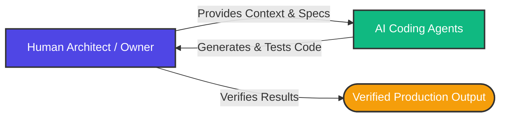

For nearly two decades, the software engineering industry has operated under a shared religion: **Agile**. Specifically, the Scrum and Kanban frameworks, with their two-week sprints, daily standups, story point estimations, and backlog grooming sessions, became the default operating system for product delivery.

But a tectonic shift is underway. With the integration of AI-driven coding agents and advanced reasoning models like GPT-5.6 Sol, **traditional Agile frameworks and rigid squad hierarchies are becoming obsolete.**

Sprints, estimation rituals, and step-by-step task tracking are increasingly viewed not as productivity drivers, but as **human coordination bottlenecks.**

Let's explore why traditional Agile is failing in the age of AI, what the new paradigm of "software by results" looks like, and why methodologies like Basecamp's **Shape Up** are emerging as the dominant way to manage AI-augmented engineering squads.

---

## 1. The Agile Velocity Mismatch

Scrum and Kanban were designed to solve a human constraint: **coordination and velocity at human speed.** Humans need predictable cadences, regular syncs, and clear boundaries to prevent burnout and ensure alignment. Sprints of two weeks were chosen because they represent a healthy duration for a group of humans to commit to a scope, write the code, run manual testing, and deliver a release.

AI agents do not have these constraints. They operate at machine speed:

```yaml
Human Engineer: Writes a complex database migration + API route in 2 days.
AI Agent (Ultra Mode): Writes the same migration, API route, generates unit tests, and compiles the code in 4 minutes.
```

When engineering velocity accelerates by orders of magnitude, a two-week sprint cycle feels like an eternity. Product Managers find themselves writing user stories for features that coding agents could build in the time it takes to write the Jira ticket. The sprint backlog turns into a "history book"—a record of what has already been built, rather than a plan for what will be built.

---

## 2. Shift to Context Management & Absolute Autonomy

In traditional squads, hierarchy is used to manage communication. A Product Owner decides the requirements, a Tech Lead designs the architecture, a project manager tracks progress, and developers execute isolated tickets.

In an AI-augmented squad, this hierarchy collapses. The fundamental bottleneck is no longer coding capacity; it is **context management.**



An engineer's primary job is shifting from writing lines of code to **feeding the correct codebase context, defining specifications, and validating outputs.**

Because AI agents can execute tasks autonomously if given clear constraints, human engineers require **absolute technical autonomy** to iterate rapidly. Micro-management, daily check-ins, and ticket assignment become massive friction points that slow down the machine-speed feedback loop.

---

## 3. The Paradigm of "Software by Results"

Traditional Agile often measures success by **velocity** (story points completed per sprint) or **activity** (hours logged). In the AI era, these metrics are completely broken:

- **Story points are meaningless** when a 13-point task (complex refactoring) can be resolved by a model in seconds.
- **Lines of code are counterproductive** when an agent can spit out thousands of lines of boilerplate that increase technical debt rather than solving the problem.

We are entering the era of **Software by Results (Software por Resultados).**

Under this paradigm, performance is judged strictly by **working, verified outcomes.** The metric is binary: _Does the code compile, pass security audits, pass the test suites, and solve the user's problem?_

Because execution (coding, testing) is cheap and automated, the human team's value lies in **judgment and verification.** Success is defined by the quality of the tests written to verify the results, and the speed at which value is integrated into the product.

---

## 4. Why Basecamp's "Shape Up" fits the AI Era

If Scrum and Kanban are dying, what replaces them?

A growing number of engineering organizations are adopting **Shape Up**, a framework developed by Basecamp. Shape Up is designed to give teams absolute autonomy while keeping projects bounded and structured. It splits the product lifecycle into two distinct phases:

### Phase 1: Shaping

A small group of senior engineers and product strategists spend a few weeks "shaping" a project. They don't write detailed user stories or draw wireframes; instead, they define the project's boundaries, constraints, critical risks, and key architectures at a high level. They set a **appetite** (e.g., "this is a 2-week project" or "this is a 6-week project") rather than estimating hours.

### Phase 2: Building

The project is handed off to a small, cross-functional team (usually 1-2 human developers and a designer). During the cycle, **the team has absolute autonomy.** There are no daily standups, no backlog grooming sessions, and no Jira tickets. The team decides how to build the project, utilizing AI agents to accelerate execution, write tests, and manage boilerplate.

### Why Shape Up matches AI-driven development:

1.  **Humans Shape, AI Builds:** Shaping requires domain expertise, customer understanding, and architectural vision—areas where humans excel. Building (the execution phase) is where AI coding agents can be leveraged to accelerate development by 10x.
2.  **Autonomous Iteration:** Shape Up eliminates the daily interruption of Agile ceremonies, allowing developers to enter a deep state of flow where they can direct AI agents and verify code without administrative overhead.
3.  **Fixed Time, Variable Scope:** If a project isn't finished within the cycle, it is dropped. This forces the human+AI squad to focus on the absolute core value and write clean, minimal solutions rather than getting bogged down in endless feature creep.

---

## 5. Structuring the AI-Native Squad

The "Two-Pizza Team" (6–10 people) is shrinking. The high leverage of AI means that a team of 2–3 humans can deliver the output of a 10-person department. A modern, AI-native squad typically looks like this:

| Role                            | Human Focus                                                  | AI Agent / Tool Focus                                 |
| :------------------------------ | :----------------------------------------------------------- | :---------------------------------------------------- |
| **Product & Domain Expert**     | Context Definition, User Needs, Scope Boundaries             | Generating specs, market research, initial drafts     |
| **System Architect / Reviewer** | Architecture Design, Security Audits, Quality Verification   | Refactoring, boilerplate code, automated test writing |
| **Verification Lead**           | Designing edge-case test suites, defining CI/CD safety rails | Running test suites, linting, deployment scripting    |

Traditional Agile served its purpose when human coordination was the primary constraint. But as AI agents take over the mechanics of writing, linting, and testing code, the focus must shift from **managing activities** to **orchestrating intent.**

It's time to stop slicing our work into arbitrary two-week blocks, dismantle the overhead of sprint ceremonies, and empower small, autonomous teams to ship software by results.
