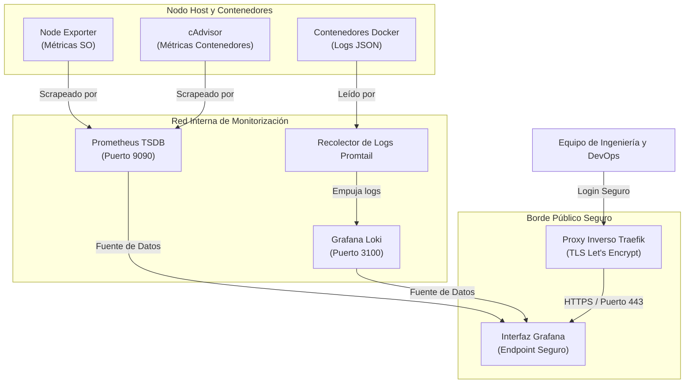

> ⚡ **Stack de Telemetría Autoalojado (Línea Base V1)**  
> Arquitectura de monitorización y observabilidad de infraestructura para **Terreno Rústico**. Diseñada para ofrecer recolección de métricas en submilisegundos, agregación fluida de logs y alertas en tiempo real sin exponer datos internos de infraestructura.

> ℹ️ **Nota sobre la Arquitectura V1**  
> Esta configuración representa un **prototipo inicial v1** de nuestro entorno de monitorización. Actúa como base para el stack de producción ampliado, que incorporará trazas distribuidas, enrutamiento automático de alertas y mejoras continuas de resiliencia.

---

## Visión General: Telemetría de Alta Disponibilidad

Al procesar grandes volúmenes de datos geoespaciales —como parcelas UTM del Catastro, intersecciones espaciales en PostGIS y datos agrícolas del SIGPAC—, la visibilidad del sistema es vital. Una sola consulta no indexada o un pico inesperado de CPU en horas punta degrada el rendimiento de renderizado en el mapa.

Para garantizar la máxima disponibilidad y tiempos de respuesta de API inferiores al segundo en **Terreno Rústico**, desplegamos una plataforma de monitorización autocontenida y nativa en la nube como base de referencia v1.

A continuación se detalla la arquitectura de telemetría para que la comunidad de desarrollo pueda replicar una solución similar.

---

## Paneles y Métricas del Sistema en Tiempo Real

A continuación se muestran capturas reales de los paneles de Grafana que monitorizan los recursos del host, las transacciones de PostgreSQL/PostGIS y la latencia del bucle de eventos de NestJS:

### 1. Rendimiento de Base de Datos e Infraestructura


_Métricas clave supervisadas:_

- **Estado y conexiones activas de PostgreSQL**: Visibilidad inmediata sobre sesiones activas y tamaños del pool de conexiones.
- **Tasa de transacciones y confirmaciones**: Rendimiento transaccional en tiempo real y velocidad de commits/rollbacks.
- **Ratio de aciertos en caché (Cache Hit Ratio)**: Garantía de ratios del 100% en consultas geoespaciales recurrentes.

### 2. Rendimiento de la API NestJS y Motor GIS


_Métricas clave supervisadas:_

- **Asignación de memoria Heap en Node**: Rastreo de asignaciones de memoria para eliminar fugas (_memory leaks_).
- **Latencia del Event Loop (Event Loop Lag)**: Retraso del bucle de eventos de Node.js (constantemente por debajo de 5ms).
- **Tasas de peticiones a APIs de Catastro y SIGPAC**: Supervisión de peticiones salientes a servicios espaciales externos y porcentajes de error.

---

## Arquitectura del Sistema y Flujo de Datos

Nuestra plataforma recopila métricas y flujos de registros a través de los nodos del sistema operativo y contenedores Docker aislados utilizando un modelo de red de confianza cero:



---

## Componentes Principales

### 1. Prometheus (Motor de Métricas)

- Base de datos central de series temporales (TSDB).
- Recolecta métricas de endpoints del sistema cada 15 segundos.
- Retención de datos de 30 días con un límite de almacenamiento de 5GB.

### 2. Node Exporter y cAdvisor

- **Node Exporter**: Captura estadísticas físicas de CPU, memoria RAM, I/O de disco y red del sistema operativo anfitrión.
- **cAdvisor**: Detecta automáticamente contenedores Docker en ejecución y mide estrangulamiento de CPU (_throttling_), límites de memoria y tráfico de red por contenedor.

### 3. Grafana Loki y Promtail (Motor de Logs)

- **Promtail**: Envía flujos de logs de Docker directamente desde `/var/lib/docker/containers` hacia Loki.
- **Loki**: Sistema de agregación de logs sin índices pesados que solo indexa etiquetas de metadatos (`container_name`, `log_level`), manteniendo el consumo de memoria muy por debajo de alternativas como Elasticsearch.

### 4. Cuadro de Mando en Grafana

- Visualización unificada para métricas y alertas en tiempo real.
- Incluye percentiles de latencia de respuestas HTTP (p50, p95, p99), tiempos de ejecución de consultas PostGIS, reinicios de contenedores y medias de carga de CPU.

---

## Seguridad e Infraestructura

1. **Aislamiento de Red**: Todos los servicios internos de telemetría (Prometheus, Loki, Promtail) operan estrictamente dentro de una red bridge privada de Docker (`monitoring-internal`). **Ningún puerto de métricas está expuesto a la internet pública.**
2. **Pasarela TLS**: El acceso público a Grafana se realiza exclusivamente a través de **Traefik** bajo TLS 1.3 con certificados automáticos de Let's Encrypt y cabeceras HSTS.
3. **Registro Restringido**: El registro anónimo (`GF_USERS_ALLOW_SIGN_UP`) y la creación pública de organizaciones están completamente inhabilitados.

---

## Definición Modular de Docker Compose

A continuación se presenta la topología de contenedores sanitizada que da vida a la infraestructura de observabilidad:

```yaml
# docker-compose.yml — Stack de Monitorización en Producción
services:
  prometheus:
    image: prom/prometheus:v2.53.4
    container_name: monitoring_prometheus
    restart: unless-stopped
    command:
      - --config.file=/etc/prometheus/prometheus.yml
      - --storage.tsdb.path=/prometheus
      - --storage.tsdb.retention.time=30d
      - --storage.tsdb.retention.size=5GB
      - --web.enable-lifecycle
    volumes:
      - ./prometheus/prometheus.yml:/etc/prometheus/prometheus.yml:ro
      - prometheus_data:/prometheus
    networks:
      - monitoring-internal

  node-exporter:
    image: prom/node-exporter:v1.8.2
    container_name: monitoring_node_exporter
    restart: unless-stopped
    command:
      - --path.rootfs=/host
    volumes:
      - /proc:/host/proc:ro
      - /sys:/host/sys:ro
      - /:/host:ro,rslave
    networks:
      - monitoring-internal
    pid: host

  cadvisor:
    image: gcr.io/cadvisor/cadvisor:v0.55.1
    container_name: monitoring_cadvisor
    restart: unless-stopped
    privileged: true
    devices:
      - /dev/kmsg
    volumes:
      - /:/rootfs:ro
      - /var/run:/var/run:ro
      - /sys:/sys:ro
      - /var/lib/docker/:/var/lib/docker:ro
    networks:
      - monitoring-internal

  loki:
    image: grafana/loki:3.5.0
    container_name: monitoring_loki
    restart: unless-stopped
    command: -config.file=/etc/loki/config.yml
    volumes:
      - ./loki/loki-config.yml:/etc/loki/config.yml:ro
      - loki_data:/loki
    networks:
      - monitoring-internal

  promtail:
    image: grafana/promtail:3.5.0
    container_name: monitoring_promtail
    restart: unless-stopped
    command: -config.file=/etc/promtail/config.yml
    volumes:
      - ./promtail/promtail-config.yml:/etc/promtail/config.yml:ro
      - /var/log:/var/log:ro
      - /var/lib/docker/containers:/var/lib/docker/containers:ro
      - /var/run/docker.sock:/var/run/docker.sock:ro
    networks:
      - monitoring-internal

  grafana:
    image: grafana/grafana:11.6.1
    container_name: monitoring_grafana
    restart: unless-stopped
    environment:
      GF_SECURITY_ADMIN_USER: ${GRAFANA_ADMIN_USER:-admin}
      GF_SECURITY_ADMIN_PASSWORD: ${GRAFANA_ADMIN_PASSWORD}
      GF_USERS_ALLOW_SIGN_UP: "false"
      GF_USERS_ALLOW_ORG_CREATE: "false"
    volumes:
      - grafana_data:/var/lib/grafana
    networks:
      - monitoring-internal
      - traefik-public
    labels:
      - traefik.enable=true
      - traefik.http.routers.grafana.rule=Host(`monitoring.example.com`)
      - traefik.http.routers.grafana.tls.certresolver=letsencrypt

volumes:
  prometheus_data:
  loki_data:
  grafana_data:

networks:
  monitoring-internal:
    external: true
  traefik-public:
    external: true
```
