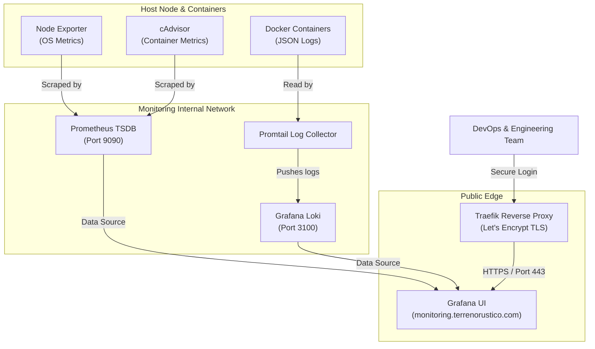

> ⚡ **Self-Hosted Production Observability**  
> The official telemetry and infrastructure monitoring hub for **[Terreno Rústico](https://terrenorustico.com)**. Engineered to deliver sub-second metrics scraping, zero-friction log aggregation, and real-time alerts without exposing private infrastructure data.

---

## Overview: High-Availability Telemetry

When processing large-scale geospatial datasets—such as Cadastral UTM parcel geometries, PostGIS spatial intersections, and SIGPAC agricultural data—system visibility is critical. A single unindexed database query or unexpected CPU spike during peak traffic can degrade map rendering performance.

To guarantee maximum availability and sub-second API response times for **Terreno Rústico**, we designed and deployed a self-hosted, cloud-native monitoring platform at `monitoring.terrenorustico.com`.

This project blueprint breaks down our entire telemetry architecture so the developer community can replicate and deploy a similar production monitoring stack.

---

## System Architecture & Data Flow

Our monitoring platform collects metrics and log streams across host OS nodes and isolated Docker containers using a secure, zero-trust network model:



---

## Core Components

### 1. Prometheus (Metrics Engine)

- Serves as the central Time Series Database (TSDB).
- Scrapes system endpoints every 15 seconds.
- Retains metrics data for 30 days up to a 5GB storage cap.

### 2. Node Exporter & cAdvisor

- **Node Exporter**: Captures physical CPU, RAM, disk I/O, and network stats from the host OS.
- **cAdvisor**: Auto-discovers running Docker containers and measures per-container CPU throttling, memory limits, and network throughput.

### 3. Grafana Loki & Promtail (Log Stream Engine)

- **Promtail**: Ships Docker log streams directly from `/var/lib/docker/containers` to Loki.
- **Loki**: Index-free log aggregation system indexing metadata labels (`container_name`, `log_level`), keeping memory overhead extremely low compared to Elasticsearch.

### 4. Grafana Dashboard UI

- Unified dashboard for real-time visualization and alerting.
- Monitored metrics include HTTP response latency percentiles ($p_{50}$, $p_{95}$, $p_{99}$), PostGIS query execution times, container restart rates, and system load averages.

---

## Security Infrastructure

1. **Network Decoupling**: All internal telemetry services (Prometheus, Loki, Promtail) run strictly inside a private Docker bridge network (`monitoring-internal`). **No metrics ports are published to the public internet.**
2. **TLS Gateway**: Public access to Grafana (`monitoring.terrenorustico.com`) is handled exclusively through **Traefik** over TLS 1.3 with automatic Let's Encrypt certificates and HSTS security headers.
3. **Restricted Signups**: Anonymous registration (`GF_USERS_ALLOW_SIGN_UP`) and public org creation are disabled.

---

## Modular Docker Compose Blueprint

Below is the sanitized container topology powering `monitoring.terrenorustico.com`:

```yaml
# docker-compose.yml — Production Monitoring Stack
services:
  prometheus:
    image: prom/prometheus:v2.53.4
    container_name: monitoring_prometheus
    restart: unless-stopped
    command:
      - --config.file=/etc/prometheus/prometheus.yml
      - --storage.tsdb.path=/prometheus
      - --storage.tsdb.retention.time=30d
      - --storage.tsdb.retention.size=5GB
      - --web.enable-lifecycle
    volumes:
      - ./prometheus/prometheus.yml:/etc/prometheus/prometheus.yml:ro
      - prometheus_data:/prometheus
    networks:
      - monitoring-internal

  node-exporter:
    image: prom/node-exporter:v1.8.2
    container_name: monitoring_node_exporter
    restart: unless-stopped
    command:
      - --path.rootfs=/host
    volumes:
      - /proc:/host/proc:ro
      - /sys:/host/sys:ro
      - /:/host:ro,rslave
    networks:
      - monitoring-internal
    pid: host

  cadvisor:
    image: gcr.io/cadvisor/cadvisor:v0.55.1
    container_name: monitoring_cadvisor
    restart: unless-stopped
    privileged: true
    devices:
      - /dev/kmsg
    volumes:
      - /:/rootfs:ro
      - /var/run:/var/run:ro
      - /sys:/sys:ro
      - /var/lib/docker/:/var/lib/docker:ro
    networks:
      - monitoring-internal

  loki:
    image: grafana/loki:3.5.0
    container_name: monitoring_loki
    restart: unless-stopped
    command: -config.file=/etc/loki/config.yml
    volumes:
      - ./loki/loki-config.yml:/etc/loki/config.yml:ro
      - loki_data:/loki
    networks:
      - monitoring-internal

  promtail:
    image: grafana/promtail:3.5.0
    container_name: monitoring_promtail
    restart: unless-stopped
    command: -config.file=/etc/promtail/config.yml
    volumes:
      - ./promtail/promtail-config.yml:/etc/promtail/config.yml:ro
      - /var/log:/var/log:ro
      - /var/lib/docker/containers:/var/lib/docker/containers:ro
      - /var/run/docker.sock:/var/run/docker.sock:ro
    networks:
      - monitoring-internal

  grafana:
    image: grafana/grafana:11.6.1
    container_name: monitoring_grafana
    restart: unless-stopped
    environment:
      GF_SECURITY_ADMIN_USER: ${GRAFANA_ADMIN_USER:-admin}
      GF_SECURITY_ADMIN_PASSWORD: ${GRAFANA_ADMIN_PASSWORD}
      GF_USERS_ALLOW_SIGN_UP: "false"
      GF_USERS_ALLOW_ORG_CREATE: "false"
    volumes:
      - grafana_data:/var/lib/grafana
    networks:
      - monitoring-internal
      - traefik-public
    labels:
      - traefik.enable=true
      - traefik.http.routers.grafana.rule=Host(`monitoring.terrenorustico.com`)
      - traefik.http.routers.grafana.tls.certresolver=letsencrypt

volumes:
  prometheus_data:
  loki_data:
  grafana_data:

networks:
  monitoring-internal:
    external: true
  traefik-public:
    external: true
```

---

## Live Monitoring Access

Explore the official monitoring hub live at **[monitoring.terrenorustico.com](https://monitoring.terrenorustico.com)** or visit the main platform at **[terrenorustico.com](https://terrenorustico.com)**.
